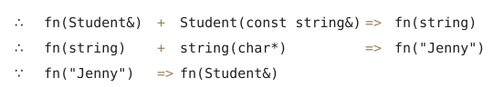

C++数据类型新增或升级

## 一、struct

### 1.1 C-struct

变量声明时需加struct关键字

```cpp
#include <stdio.h>
#include <string.h>
struct SStudent {
    char cName[ 20 ];
    int nAge;
    void (*pfnShowInfo)(struct SStudent s);
};
void showName(struct SStudent s)
{
    printf("----%s----\n",s.cName);
}
void showAge(struct SStudent s)
{
    printf("----%d----\n",s.nAge);
}
void main()
{
    struct SStudent s1;
    memset(s1.cName , 0 , sizeof( s1.cName) );
    strcat( s1.cName , "SE0600");
    s1.nAge = 15 ;
    s1.pfnShowInfo = showName;
    s1.pfnShowInfo(s1);
    s1.pfnShowInfo = showAge;
    s1.pfnShowInfo(s1);
}
```

### 1.2 C-typedef

使用typdef重定义类型

```cpp
#include <stdio.h>
#include <string.h>
typedef struct SS{
   char cName[ 20 ];
   int nAge;
   void (*pfnShowInfo)(struct SS); //Type redefine not to take effect
}SStudent;
void showName(SStudent s)
{
   printf("----%s----\n",s.cName);
}
void showAge(SStudent s)
{
   printf("----%d----\n",s.nAge);
}
void main()
{
   SStudent s1;
   memset(s1.cName , 0 , sizeof( s1.cName) );
   strcat( s1.cName , "SE0600");
   s1.nAge = 15 ;
   s1.pfnShowInfo = showName;
   s1.pfnShowInfo(s1);
   s1.pfnShowInfo = showAge;
   s1.pfnShowInfo(s1);
}
```

### 1.3 C++-struct

```cpp
#include <iostream>
#include <cstring>
using namespace std;
struct SStudent {
   char cName[20];
   int nAge;
   void (*pfnShowInfo)(SStudent);
   void show(char *pcName);
   void show(int nAge){ cout<<"[Struct Function Call]Age : "<<nAge<<endl;}
};
void show(SStudent s)
{
   cout<<"[Function Pointer Call]Name : "<<s.cName<<endl;
}
void showAge(SStudent s)
{
   cout<<"[Function Pointer Call]Age : "<<s.nAge<<endl;
}
void SStudent::show(char *pcName)
{
   cout<<"[Struct Function Call]Name : "<<cName<<endl;
}
int main()
{
   SStudent s1;
   memset( s1.cName , 0 , sizeof( s1.cName ));
   strcat( s1.cName , "SE0600");
   s1.nAge = 15;
   s1.show(s1.cName);
   s1.show(s1.nAge);
   s1.pfnShowInfo = show;
   s1.pfnShowInfo(s1);
   s1.pfnShowInfo = showAge;
   s1.pfnShowInfo(s1);
   return 0;
}
```

### 1.4 C++ stuct特性

C\++ struct与C\++ class极为类似,区别:

1. **成员的默认访问权限**

   struct 默认是public

   class 默认是 private

2. **默认的继承**

   struct 默认是public

   class默认是private

　　**建议struct成员只包含基本数据类型,其它特性用class实现.**

## 二、namespace

### 2.1 作用

　　组织和重用代码,制定标识符的使用范围,解决同名冲突.

### 2.2 使用

　　在声明一个命名空间时,花括号内不仅可以包括变量,而且还可以包括以下类型:

1. 变量(可以带有初始化)

2. 常量

3. 函数(可以是定义或声明)

4. 结构体

5. 类

6. 模板

7. 命名空间(在一个命名空间中又定义一个命名空间,即嵌套的命名空间).

**Sample**

```cpp
namespace nsl
{
    const int RATE=8； //常量
    doublepay；       //变量
    doubletax()       //函数
    {return a*RATE；}
    namespacens2       //嵌套的命名空间
    {int age；}
}
如果想输出命名空间nsl中成员的数据,可以采用下面的方法:
cout<<nsl::RATE<<endl；
cout<<nsl::pay<<endl；
cout<<nsl::tax()<<endl；
cout<<nsl::ns2::age<<endl； //需要指定外层的和内层的命名中间名
```

### 2.3 Sample

```cpp
#include <iostream>
namespace NSBus
{
    const int nMAX_CAPCITY = 50;
    int   nCurTripDistance = 0;
    void  setTripDistance(int nTripDistance);
    int   getTripDistance(){ return nCurTripDistance ; }
}
void NSBus::setTripDistance(int nTripDistance)
{
    nCurTripDistance = nTripDistance;
}
namespace NSCar
{
    const int nMAX_CAPCITY = 5;
    int   nCurTripDistance = 0;
    void  setTripDistance(int nTripDistance);
    int  getTripDistance(){ return nCurTripDistance ; }
}
void NSCar::setTripDistance(int nTripDistance)
{
    nCurTripDistance = nTripDistance;
}
namespace  //匿名命名空间,作用域为当前文件作用域,可解决多文件类型重定义.相当于static
{
	  int nPersons = 100;
}
using namespace std;
int main()
{
    const int nMAX_CAPCITY = 100;
    cout<<"[NSBus] Max Capacity "<<NSBus::nMAX_CAPCITY<<endl;
    cout<<"[NSCar] Max Capacity "<<NSCar::nMAX_CAPCITY<<endl;
    cout<<"[Main]  Max Capacity "<<nMAX_CAPCITY<<endl;
    namespace NSAutoMobile = NSCar;  //set namespace alias
    cout<<"[NSAutoMobile] Max Capacity "<<NSAutoMobile::nMAX_CAPCITY<<endl;
    using namespace NSBus;			//set NSBus globle use
    nCurTripDistance = 5000;
    cout<<"[NSBus] TripDistance "<<NSBus::nCurTripDistance<<endl;
    return 0;
}
```

## 三、string

　　**string是一种自定义的类型,可以自动调整大小.**

### 3.1 string的赋值,比较与添加

string可以像普通变量一样进行比较,赋值与添加等等.

```cpp
//=====================================
// f0305.cpp
//=====================================
#include<iostream>
#include<algorithm>
using namespace std;
//-------------------------------------
int main(){
  string a, s1 = "Hello ";
  string s2 = "123";
  a = s1;                                              // copy
  cout<<(a==s1 ? "" : " not")<<"equal\n";              // compare
  cout<<(a+=s2)<<endl;                                 // concatenate
  reverse(a.begin(), a.end());                         // reverse
  cout<<a<<endl;
  cout<<a.replace(0,9,9,'c')<<endl;                    // set
  cout<<(s1.find("ell")!= -1 ? "" : "not ")<<"found\n";// find string
  cout<<(s1.find('c')!= -1 ? "": "not ")<<"found\n";   // find char
}//====================================
output:
  equal
  Hello 123
  321 olleH
  ccccccccc
  found
  not found
```

### 3.2 string与C-String的输入输出

```cpp
#include <iostream>
#include <string>
using namespace std;
int main(){
    for( string s; cin>>s;) //string Type 1
        cout<<s<<" ";
    cout<<endl;

    for( char a[10]; cin>>a;) //C-string Type 1
        cout<<a;
    cout<<endl;

    string s;  //string Type 2
    getline(cin,s);
    cout<<s<<endl;

    char a[40];  //C-string Type 2
    cin.getline(a,30,"#");
    cout<<a<<endl;

    for(char ch;(ch=cin.get())!='\n';) //Char Type 1
        cout<<char(ch);
    cout<<endl;
    return 1;
}
```

## 四、vetor

　　vector是C++标准模板库中的部分内容,属于std命名域,头文件vector,**View** &rarr; [**More**](http://blog.chinaunix.net/uid-26000296-id-3785610.html)

### 4.1 声明(构造)

```cpp
vector v               // 创建一个空的vector.
vector c1(c2)          // 复制一个vector
vector c(n)            // 创建一个vector,含有n个数据,数据均已缺省构造产生
vector c(n, elem)      // 创建一个含有n个elem拷贝的vector
vector c(beg,end)      // 创建一个含有n个elem拷贝的vector
```

### 4.2 成员函数

```cpp
c.assign(beg,end)     //将[begin; end)区间中的数据赋值给c
c.assign(n,elem)      //将n个elem的拷贝赋值给c.
c.at(idx)             //传回索引idx所指的数据,如果idx越界,抛出out_of_range.
c.back()              // 传回最后一个数据,不检查这个数据是否存在.
c.begin()             // 传回迭代器中的第一个数据地址.
c.capacity()          // 返回容器中数据个数.
c.clear()             // 移除容器中所有数据.
c.empty()             // 判断容器是否为空.
c.end()               // 指向迭代器中末端元素的下一个,指向一个不存在元素.
c.erase(pos)          // 删除pos位置的数据,传回下一个数据的位置.
c.erase(beg,end)      //删除[beg,end)区间的数据,传回下一个数据的位置.
c.front()             // 传回第一个数据.
get_allocator         // 使用构造函数返回一个拷贝.
c.insert(pos,elem)    // 在pos位置插入一个elem拷贝,传回新数据位置.
c.insert(pos,n,elem)  // 在pos位置插入n个elem数据.无返回值.
c.insert(pos,beg,end) // 在pos位置插入在[beg,end)区间的数据.无返回值.

c.max_size()          // 返回容器中最大数据的数量.
c.pop_back()          // 删除最后一个数据.
c.push_back(elem)     // 在尾部加入一个数据.
c.rbegin()            // 传回一个逆向队列的第一个数据.
c.rend()              // 传回一个逆向队列的最后一个数据的下一个位置.
c.resize(num)         // 重新指定队列的长度.
c.reserve()           // 保留适当的容量.
c.size()              // 返回容器中实际数据的个数.
c1.swap(c2)
swap(c1,c2)           // 将c1和c2元素互换.同上操作.
operator[]            // 返回容器中指定位置的一个引用.
```

### 4.3 遍历

1. 循环控制

   ```cpp
   for( int i = 0 ; i < v.size() ; i++ ){
       cout<<v[i]<<" ";    //不做越界检查
       cout<<v.at(i)<<" "; //越界抛出out_of_range异常
   }
   ```

2. 迭代器

   ```cpp
   for( vector<int>::iterator it != v.begin() ; i < v.end() ; i++ )
       cout<<*it<<" ";
   ```

### 4.4 Sample

```cpp
//=====================================
// f0311.cpp
// 若干个向量按长短排序
//=====================================
#include<iostream>
#include<fstream>
#include<sstream>
#include<vector>
using namespace std;
//-------------------------------------
typedef vector<vector<int> > Mat;
Mat input();
void selectionSort(Mat& a);
void print(const Mat& a);
void bubbleSort(Mat &a);
//-------------------------------------
int main()
{
    Mat a = input();
    cout<<"File Content : "<<endl;
    print(a);
    selectionSort(a);
    cout<<"selectionSort Result(ASC) : "<<endl;
    print(a);
    cout<<"bubbleSort Result(DESC) : "<<endl;
    bubbleSort(a);
    print(a);
    return 0;
}//------------------------------------
Mat input()
{
    ifstream in("aaa.txt");
    Mat a;
    for(string s; getline(in, s); ){
      vector<int> b;
      istringstream sin(s); //包含在SStream头文件中,流操作
      for(int ia; sin>>ia; )
        b.push_back(ia);
      a.push_back(b);
    }
    return a;
}//------------------------------------
void bubbleSort( Mat &a )
{
    for( int i = 0 ; i < a.size() ; i++ ){
      for ( int j = 0; j < a.size() - i - 1 ; j++) {
        if( a.at( j ).size() < a.at( j + 1 ).size() )
          swap( a.at( j + 1 ) , a.at( j ) );
      }
    }
}
void selectionSort(Mat &a)
{
    for (int i = 0; i < a.size() - 1 ; i++) {
      int nMinSize = i ;
      for (int j = i + 1 ; j < a.size(); j++) {
        if( a.at( nMinSize ).size() > a.at( j ).size() )
      	   nMinSize = j;
      }
      if( nMinSize != i )
        swap( a.at( nMinSize ) , a.at( i ) );
    }
}
void print(const Mat& a)
{
    for(int i=0; i<a.size(); ++i){
      for(int j=0; j<a.at(i).size(); ++j)
        	cout<<a.at(i).at(j)<<" ";
      cout<<endl;
    }
}
```

## 五、void *

　　void\*表示“空类型指针”,与void不同,void*表示“任意类型的指针”或表示“该指针与一地址值相关,但是不清楚在此地址上的对象的类型”.

### 5.1 为什么不用void表示任意类型的数据呢？

　　大家都知道,C/C++是静态类型的语言,定义变量就会分配内存,然而,不同类型的变量所占内存不同,如果定义一个任意类型的变量,如何为其分配内存呢？

　　所以,C、C++中没有任意类型的变量.但是,所有指针类型的变量,无论是int*、char*、string*、Student*等等,他们的内存空间都是相同的(4个字节,与int相同),所以可以定义“任意类型的指针”.

### 5.2 void*指针只支持几种有限的操作*

1. 与另一个指针进行比较；向函数传递void指针或从函数返回void*指针；

2. 给另一个void*指针赋值.不允许使用void*指针操作它所指向的对象,例如,不允许对void*指针进行解引用.不允许对void*指针进行算术操作

   ```cpp
   #include <iostream>
   int main()
   {
       using namespace std;
       void *pc = 0 ;     //声明void（无类型或叫通用性）指针pc
       int i = 123;
       char c = 'a';
       pc = &i;     //将存放整型数123的变量i的地址赋给void型指针pc
       cout << *(int *) pc << endl; //输出指针值123,要进行整型数类型转换
       pc = &c;    //将存放字符a的变量c的地址赋给void型指针pc
       cout << *(char *) pc <<endl; //输出指针值a,要进行字符型数类型转换
       return 0;
   }
   ```

## 六、类型转换

　　类型转换有c风格的,当然还有c\++风格的.c风格的转换的格式很简单（TYPE）EXPRESSION,但是c风格的类型转换有不少的缺点,有的时候用c风格的转换是不合适的,因为它可以在任意类型之间转换,比如你可以把一个指向const对象的指针转换成指向非const对象的指针,把一个指向基类对象的指针转换成指向一个派生类对象的指针,这两种转换之间的差别是巨大的,但是传统的c语言风格的类型转换没有区分这些.还有一个缺点就是,c风格的转换不容易查找,他由一个括号加上一个标识符组成,而这样的东西在c\++程序里一大堆.所以c++为了克服这些缺点,引进了4新的类型转换操作符.

### 6.1 static_cast

1. `static_cast<type-id>(expression)`编译期的转化,不能转换掉expression的const、volitale、或者__unaligned属性,`必须是相关类型才能转换`.

2. 所有内建类型对象之间的隐式转换都可用static_cast,把int转换成char,把int转换成enum.

3. 把空指针转换成目标类型的空指针用static_cast.

4. 把任何类型的表达式转换成void类型用static_cast.

5. 类层次间的上行转换和下行转换也可以用static_cast,但下行转换即当把基类指针或引用转换成子类表示时,由于没有动态类型检查,所以是不安全的.反之是安全的.

```cpp
class A
{
};
class B:public A
{
};
class C:public A
{
};
class D
{
};

A objA;
B objB;
A* pObjA = new A();
B* pObjB = new B();
C* pObjC = new C();
D* pObjD = new D();

objA = static_cast<A&>(objB);     //转换为基类引用
objA = static_cast<A>(objB);
objB = static_cast<B>(objA);      //error 不能进行转换,type-id是指针,引用或void *

pObjA = pObjB;                    //right 基类指针指向子类对象
//objB = objA;                    //error 子类指针指向基类对象
pObjA = static_cast<A*>(pObjB);   //right 基类指针指向子类
pObjB = static_cast<B*>(pObjA);   //强制转换 OK 基类到子类,不安全
//pObjC = static_cast<C*>(pObjB); //error 继承于统一类的派生指针之间转换
//pObjD = static_cast<D*>(pObjC);   //error 两个无关联之间转换
```

### 6.2 const_cast

　　编译期的转化,去除类型中的const 属性

### 6.3 dynamic_cast

1. dynamic_cast < type-id > ( expression )运行期的转换,类层次间的上行转换和下行转换,专门针对`虚函数`的继承结构.

2. Type-id必须是类的指针、类的引用或者void *

3. dynamic_cast具有类型检查的功能,上行行转换的效果跟static_cast是一样的,但下行转换比static_cast更安全,指针会返回空.

4. dynamic_cast还支持交叉转换,两个类如果有共同的祖先,他们的指针就可以用dynamic_cast.

5. dynamic_cast是运行时检查,类中必须有虚函数.

```cpp
class B
{
public:
    int m_iNum;
    virtual void foo();  //必须有虚函数才能用dynamic_cast
};

class D : public B
{
public:
    char *m_szName[100];
};

void func(B *pb)
{
    D *pd1 = static_cast<D *>(pb);   //向下转换不安全
    D *pd2 = dynamic_cast<D *>(pb);  //向下转换,运行时检查,返回空指针
}
```

### 6.4 reinterpret_cast

　　任何指针都可以转换成其它类型的指针,可用于如char* 到 int*,或者One_class* 到 Unrelated_class* 等的转换,因此可能是不安全的.

### 6.5 类的自动类型转换和强制类型转换

```cpp
// stonewt.h -- definition for the Stonewt class
#ifndef STONEWT_H_
#define STONEWT_H_
class Stonewt
{
private:
    enum {Lbs_per_stn = 14};      // pounds per stone
    int stone;                    // whole stones
    double pds_left;              // fractional pounds
    double pounds;                // entire weight in pounds
public:
    Stonewt(double lbs);          // constructor for double pounds
    Stonewt(int stn, double lbs); // constructor for stone, lbs
    Stonewt();                    // default constructor
    ~Stonewt();
    void show_lbs() const;        // show weight in pounds format
    void show_stn() const;        // show weight in stone format
};
#endif
```

#### 6.5.1 隐式类型转换

```cpp
Stonewt mycat;
mycat = 19.6;
```

　　程序将使用构造函数`Stonewt(double lbs)`来创建一个临时对象,并将19.6作为初始化值,然后将临时对象赋值给mycat.这一过程叫隐式转换.

* 它是自动进行的,不需要强制类型转换

* 只有接收一个参数的构造函数才能作为转换函数

**Sample**:

```cpp
//=====================================
// f0915.cpp
// class conversion
//=====================================
#include<iostream>
using namespace std;
class Student{
    string name;
public:
    Student(const string& s):name(s){}
};//-----------------------------------
void fn(Student& s){  cout<<"ok\n"; }
//-------------------------------------
int main(){
    fn(string("Jenny"));
}//====================================
/*output:
ok
*/
```

推导规则如下:

1. 只会尝试有一个参数的构造函数.

2. 如果有二义性,立即放弃尝试.

3. 推导是一次性的,不允许多次推导.例如将

   ```
   fn(string("Jenny"));----->fn( "Jenny" );  //编译失败,进行了两次推导
   ```

   

#### 6.5.2 显式类型转换

隐式类型转换可以导致意外的类型转换,可以使用explicit来关闭.

```cpp
explicit Stonewt(double lbs); //no implicit conversions allowed
```

此时,只能进行显式类型转换.

```cpp
Stonewt mycat;
mycat = 19.6; //invalid
mycat = Stonewt(19.6);
mycat = (Stonewt)19.6;
```

#### 6.5.3 单参数构造函数的另一种初始化方式

当构造函数只接受一个参数时,可以用隐式转换初始化对象.

```cpp
Stonewt pavarotti = 260;
//等价于
Stonewt pavarotti(260);
//或者
Stonewt pavarotti = Stonewt(260);
```

#### 6.5.4 转换函数

```cpp
Stonewt wolfe( 285.7);
double host = wolfe; //可以,但是要调用转换函数
```

**转换函数原型**

```cpp
operator double();
```

1. 转换函数必须为类方法

2. 转换函数不能有返回类型

3. 转换函数不能有参数

转换过程

```cpp
Stonewt wolfe( 287.5 );
double host = double(wolfe);
```

**Sample**

```cpp
// stonewt1.h -- revised definition for the Stonewt class
#ifndef STONEWT1_H_
#define STONEWT1_H_
class Stonewt
{
private:
    enum {Lbs_per_stn = 14};      // pounds per stone
    int stone;                    // whole stones
    double pds_left;              // fractional pounds
    double pounds;                // entire weight in pounds
public:
    Stonewt(double lbs);          // construct from double pounds
    Stonewt(int stn, double lbs); // construct from stone, lbs
    Stonewt();                    // default constructor
    ~Stonewt();
    void show_lbs() const;        // show weight in pounds format
    void show_stn() const;        // show weight in stone format
// conversion functions
    operator int() const;
    operator double() const;
};
#endif
int main(){
Stonewt Poppins(9,2.8);
double p_wt = Pop;
}
```
## 七、运行时内存布局(Runtime memory layout)

　　一般而言,操作系统将程序装入内存后,将形成一个随时可以运行的进程空间,将进程空间分四个区域:

名字|作用
---|---
栈区(stack area)    |存放函数数据区(即局部数据区),它动态地反映了程序运行中的函数状态,系统自动分配释放.
堆区(heap area)     |动态内存,供程序随机申请使用.
代码区(code area)   |存放程序的执行代码,所谓执行代码就是索引了的一个个函数块代码,它由函数定义块的编译得到.
全局数据区(data area)|存放全局数据、常量、文字量、静态全局量和静态局部量.

## 八、指针与引用(Reference)

### 8.1 指针限定

**指针变量所占的空间大小总是等同于整型变量的大小**

```cpp
#include <iostream>
#include <string>
using namespace std;
int main(){
    int a[]={1,2,3,4,5};
    float *b = float int[5];
    for( int i = 0 ; i < 5 ; i++ )
        b[i]=(float)a[i];
    cout<<"Array a size : "<<sizeof(a)/sizeof(int)<<endl;
    cout<<"Poter b size : "<<sizeof(b)/sizeof(int)<<endl;
    system("pause");
}
/*output:
   Array a size : 5
   Poter b size : 1
*/
```

### 8.2 指针常量与常量指针

* 指针常量:相对于指针常量而言,指针值不能修改,如 int const *p;

* 常量指针:指向常量的指针的简称.如 const int *p;

   ```cpp
   const int a = 78;
   int b = 10;
   int c = 18;
   const int *ip = &a;  //const修饰指向的实体类型---常量指针
   int *const cp = &b;  //const修饰指针*cp-----指针常量
   int const *dp = &b;  //指针常量
   const int* const icp = &c; //常量指针常量
   *ip = 87;            //错:常量指针不能修改指向的常量,*ip只能做右值
   ip = &c;             //ok:常量指针可以修改指针
   *cp = 81;            //ok:指针常量可以修改指向的实体
   cp = &b;             //错:指针常量不能修改指针值,即便是同一个地址
   *icp = 33;           //常量指针常量不能修改指向的常量
   icp = &b;            //常量指针常量不能修改指针值
   int d = *icp;        //ok
   ```

* 如果const修饰数据类型比如int,那么表示指针指向的值不能修改,为常量指针const int *p,const *int p;

* 如果const没有修饰数据类型,直接修饰指针,那么表示指针不能修改,为指针常量,int const *p,int *const p;

### 8.3 引用(Reference)

　　从逻辑上理解,引用就是一个别名(alias),**引用定义时必须初始化**.引用相当于一个隐形指针.引用不能操作自身的地址值,只能访问指向的实体.引用与实体的关系,看似直接访问,实为指针的间接访问,是由编译器完成的.

与指针比较,引用隐去了地址操作,封锁了地址的可修改性,使得间接操作更安全.

```cpp
int someInt = 5;
int &rInt = someInt;
sample:
//=====================================
// f0315.cpp
// 引用及其地址
//=====================================
#include<iostream>
using namespace std;
//-------------------------------------
int main(){
    int int1 = 5;
    int& rInt = int1;
    cout<<"&int1: "<<&int1<<"   int1: "<<int1<<endl;
    cout<<"&rInt: "<<&rInt<<"   rInt: "<<rInt<<endl;
    int int2 = 8;
    rInt = int2;
    cout<<"&rInt: "<<&rInt<<"   rInt: "<<rInt<<endl;  //rInt的值改变,但是地址没变
}//====================================
output:
   &int1: 0021F964   int1: 5
   &rInt: 0021F964   rInt: 5
   &rInt: 0021F964   rInt: 8
```

### 8.4 指针与引用的差别

　　指针可以操纵两个实体,一个是指针值,一个是指向的值.引用只能操纵一个实体.


## 九、全局数据(Global Data )

　　全局数据就是在任何函数的外部声明或者定义的,起到所有函数都可以访问它的作用.

1. “一次定义原则”,多次声明,但是只有有一次定义.使用extern定义的全局变量可以被外部访问.

2. 全局数据在程序启动时初始化为0,如果定义时未初始化,默认为0.

3. 在多文件程序中,可以在一个文件中定义变量,在其它文件使用extern引用它.

4. 如果定义了一个外部变量,其它文件中的同名静态变量将隐藏该变量.

## 十、静态数据(Static Data)

### 10.1 static对象的初始化

　　C\++规定,**non-local static 对象的初始化发生在main函数执行之前**.但C++没有规定多个non-local static 对象的初始化顺序,尤其是来自**多个编译单元的non-local static对象,他们的初始化顺序是随机的.**

　　在C++11之前,在多线程环境下local static对象的初始化并不是线程安全的.[具体表现就是：如果一个线程正在执行local static对象的初始化语句但还没有完成初始化,此时若其它线程也执行到该语句,那么这个线程会认为自己是第一次执行该语句并进入该local static对象的构造函数中.这会造成这个local static对象的重复构造,进而产生内存泄露问题.

　　在文章的后半部分会看到,local static 对象在单例模式中有着广泛的应用,为了解决local static对象在多线程环境下的重复构造问题,程序员想出了很多方法.而C\++11则在语言的规范中解决了这个问题.**C\++11规定,在一个线程开始local static 对象的初始化后完成初始化前,其他线程执行到这个local static对象的初始化语句就会等待,直到该local static 对象初始化完成.**

### 10.2 静态全局数据(Static Global Data)

　　内部链接性:只在本文件内可见,在其它程序文件中不可见.可以在本文件中隐藏其它文件定义的全局变量.

### 10.2 静态局部数据(static Local Data)

　　静态局部变量驻留在全局数据区,默认初始值为0,仅在第一次调用时被初始化.

### 10.4 实例

```cpp
//=====================================
// f0709.cpp
// 静态局部数据
//=====================================
#include<iostream>
using namespace std;
void func();
int n = 1;
int main()
{
    int a = 0 , b = -10;
    cout<<"a="<<a<<",b="<<b<<",n="<<n<<endl;
    func();
    cout<<"a="<<a<<",b="<<b<<",n="<<n<<endl;
    func();
}
void func()
{
    static int a = 2;
    int b = 5;
    a += 2;
    b += 5;
    n += 12;
    cout<<"a="<<a<<",b="<<b<<",n="<<n<<endl;
}
/*outout:
a=0,b=-10,n=1
a=4,b=10,n=13
a=0,b=-10,n=13
a=6,b=10,n=25
*/
```

## 十一、浮点数

在计算机内部,浮点数分为三段:

name|bits
---|---
符号段|1bit
阶码段|8(float)/11(double)
尾数段|23bit(float)/52bit(double)

为了使浮点数0与整数0统一,对二进制阶码进行127的偏移.取出时,再做-127的逆操作.

由于阶码有8位,可以有正负数.所以float的最大值为

+-1.111111111111111111111111×2^127
=3.4×10^38

```cpp
//=====================================
// f0302.cpp
// 浮点数的位码
//=====================================
#include<iostream>
using namespace std;
int main(){
  float f=19.2F;
  int* pa = reinterpret_cast<int*>(&f);
  for(int i=31; i>=0; i--)
    cout<<(*pa>>i & 1)<<(i==31||i==23 ? ",":"");
  cout<<"\n";
  getchar();
}//====================================
output:
  0,10000011,00110011001100110011010
```

## 十二、二维数组的动态申请

```cpp
//方式一
DataType (*ga)[n] = new DataType[m][n];
delete[] ga;
//优点:调用直观,连续存储.
//缺点:n必须已知
```

```cpp
//方式二
DataType **ga = new DataType*[m];

for( i = 0 ; i < m ; i++ )
    ga[ i ] = new DataType[ n ];

for( i = 0 ; i < m ; i++ )
    delete[] ga[i];
delete[] ga;
//优点:n可以不知
//缺点:非连续存储,程序繁琐
```

```cpp
//方式三
DataType *ga = new DataType[m*n];
delete[] ga;
//优点:连续存储,n可以不知
//缺点:调用不直观
```


