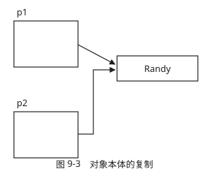
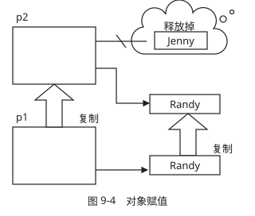

## 一、类的定义(Class define)

类的定义与结构体相似

```cpp
//==================================
// f0802.cpp
// Date class application
//==================================
#include<iostream>
#include<iomanip>
using namespace std;
//----------------------------------
class Date{
private:
    int year, month, day;
public:
    Data(); //Constructor
    ~Data(); //Destructor
    Data( const Data & ); //copy constructor
    void set(int y,int m,int d);   // 赋值操作
    bool isLeapYear();             // 判断闰年
    void print();                  // 输出日期
};//-------------------------------
void Date::set(int y,int m,int d){
    year=y; month=m; day=d;
}//--------------------------------
bool Date::isLeapYear(){
    return (year%4==0 && year%100!=0)||(year%400==0);
}//--------------------------------
void Date::print(){
    cout<<setfill('0');
    cout<<setw(4)<<year<<'-'<<setw(2)<<month<<'-'<<setw(2)<<day<<'\n';
    cout<<setfill(' ');
}//--------------------------------
int main(){
    Date d;
    d.set(2000,12,6);
    if(d.isLeapYear())
    d.print();
}//================================
```

## 二、类成员的访问

访问限定符|访问权限
:---:|:---:
public		| 程序的任何地方都可以访问.
private		| 只能通过公有成员函数和类的友元函数访问.对本类相当于私有
protected	| 对派生类像public,对其它程序像private
default		| private

```cpp
// protected的访问特性
//=====================================
#include <iostream>
using namespace std;
class Base
{
protected:
    int mem;
};

class Derived : public Base{
public:
    void set( int b){
        mem = b;  //派生类可以访问父类的公有成员和保护成员
    }
};
int main()
{
    Base base;
    base.mem = 23; //error,类对象只能访问公有成员
    Derived derived;
    derived.set(23); //correct
    system("pause");
}
```

## 三、构造函数(Constructor Function)

### 3.1 作用

　　初始化类对象

### 3.2 形式

　　ClassName()或ClassName(ParamList)

### 3.3 规则

1. 默认构造函数ClassName(),如果无显式构造函数,编译器会生成.

2. 类中只能有一个默认构造函数,所有参数都有默认值的构造函数不能与默认构造函数同时存在,会产生二义性.

   ```cpp
   ClassName()
   ClassName( Param1=0 , Param2 = 0 );  二者不能同时存在.
   ```

3. 构造顺序:先出现先构造

4. 构造函数不能被继承

## 四、析构函数(Destructor Function)

### 4.1 作用

　　人为的动态内存释放需要析构函数来完成.

### 4.2 形式

　　~ClassName();

### 4.3 规则

1. 析构函数不能重载,不能被继承.

2. 如果无显式析构函数,编译器生成默认析构函数.

3. 由系统自动调用,一般不用程序显示调用.指针通过delete调用

4. 析构顺序与构造顺序相反.

### 4.4 调用时机

* 静态对象,程序结束时调用.

* 函数内对象,函数执行完成后调用.

* new创建的对象,驻留在堆栈或自由存储中,直到delete时调用.

## 五、复制构造函数(Copy Constructor Function)

### 5.1 作用

　　将一个对象复制到新创建的对象中.

### 5.2 形式

　　ClassName( const ClassName & )

### 5.3 规则

1. 复制构造函数不能重载,不能被继承.

2. 如果无显式复制构造函数,编译器将生成默认复制构造函数.

3. 默认的复制构造函数逐个复制非静态成员,复制的是成员值也就是对象本体,即原对象和复制的对象指向同一空间.

4. 复制构造函数形参为什么是const ClassName & ?

   * 如果形参是对象,那么就值传递,在调用时需要实例化,再次调用复制构造函数,出现了死循环.

   * 使用const是防止原对象被改变,同时防止实参是const类型.注;形参为普通类型,实参不可为const,反之,形参为const类型,实参可为普通类型.

### 5.4 深拷贝与浅拷贝

* 浅拷贝:对象本体与实体一致,系统自动做内存分配与释放,不需要重写复制构造函数.

* 深拷贝:对象本体与实体不一致,需要做动态内存分配和释放工作.需重写复制构造函数.

**浅拷贝与深拷贝的区别**

1. 浅拷贝一般调用默认复制构造函数,和原对象指向同一空间,不会为指针分配内存空间.

   

   ```cpp
   //=====================================
   // f0912.cpp
   // constructing object from other object
   //=====================================
   #include<iostream>
   using namespace std;
   //-------------------------------------
   class Person{
       char* pName;
   public:
       Person(char* pN="noName"){
           cout<<"Constructing "<<pN<<"\n";
           pName = new char[strlen(pN)+1];
           if(pName) strcpy(pName,pN);
       }
      ~Person(){
           cout <<"Destructing "<<pName<<"\n";
           delete[] pName;
      }
   };//-----------------------------------
   int main(){
       Person p1("Randy");
       Person p2(p1);
   }//====================================
   /*Output:
   Constructing Randy
   Destructing Randy
   Destructing ┐vg2┐vg2
   */
   /*explain:
   创建p2时并没有调用构造函数,并且析构出现了异常.
   原因:C++调用了默认复制构造函数,仅复制了对象本体,p1和p2指向同一空间,即p2 的char *pName没有申请内存空间,指向了p1的char *pName.
   当析构p2时,将pName空间释放,当析构p1时,pName已不存在.
   */
   ```

2. 深拷贝需要自定义复制构造函数,动态分配和释放内存.

   ```cpp
   //=====================================
   // f0913.cpp
   // copy constructor
   //=====================================
   #include<iostream>
   using namespace std;
   //-------------------------------------
   class Person{
       char* pName;
   public:
       Person(char* pN="noName"){
           cout<<"Constructing "<<pN<<"\n";
           pName = new char[strlen(pN)+1];
           if(pName) strcpy(pName,pN);
       }
       Person(const Person& s){
           cout<<"copy Constructing "<<s.pName<<"\n";
           pName = new char[strlen(s.pName)+1];
           if(pName) strcpy(pName, s.pName);
       }
    ~  Person(){
           cout <<"Destructing "<<pName<<"\n";
           delete[] pName;
       }
   };//-----------------------------------
   int main(){
       Person p1("Randy");
       Person p2(p1);
   }//====================================
   /*Output:
   Constructing Randy
   copy Constructing randy
   Destructing Randy
   Destructing Randy
   */
   ```

### 5.5 调用时机

1. 一个对象以值传递的方式传入函数体(类作形参).若函数的形参为类对象,调用函数时,实参赋值给形参,系统自动调用拷贝构造函数.

   ```cpp
   class A{};
   class B{
      B(A a)();
   };
   int main(){
     A a;
     B b(a); //调用A的复制构造函数初始化形参
   }
   ```

2. 一个对象以值传递的方式从函数返回(返回类对象),此时返回引用效率高,但是不允许返回临时变量的引用,因为返回时临时对象已消亡.当函数的返回值是类对象时,系统自动调用拷贝构造函数.

   ```cpp
   class A{};
   class B{
      B(A a)(){
        ...
        return a;  //返回值为对象,调用复制构造函数生成临时对象
      };
   };
   ```

3. 一个对象需要通过另一个对象进行初始化(对象赋值)

   ```cpp
   A a;
   A b;
   A b = a;//这里b对象新定义,用a给b赋值,调用复制构造函数.
   b = a; //将一个已有对象赋值给另一个已有对象,调用赋值操作符
   A c(b); //一个对象需要通过另一个对象进行初始化,调用复制构造函数.
   ```

## 六、赋值操作符(=)

### 6.1 规则

1. 如果返回类型非引用,语句不合法.因为实际返回的是原始对象的临时副本,编译器不允许使用临时对象调用成员函数.

2. 如果无显式赋值操作符,编译器将生成默认赋值操作符,进行浅拷贝,只负责对象本体的复制.

3. 如果自定义赋值操作符,原来的对象已经存在,需要释放内存再进行深拷贝.

4. 一般来说,赋值操作符与复制构造函数同时存在,因为可能发生对象类型自动转换,不能被继承.

### 6.2 实例

1. 对象赋值示意图:

   ```cpp
   Person p1( "Randy" );
   Person p2( "Jenny" );
   p2 = p1; //将一个已有对象赋值个另一个已有对象.
   Person p3 = p2； //将一个已有对象赋值给新定义对象,调用复制构造函数
   ```

   

2. 赋值操作符的深拷贝.

   ```cpp
   //=====================================
   // f0917.cpp
   // copy constructor
   //=====================================
   #include<iostream>
   using namespace std;
   //-------------------------------------
   class Person{
       char* pName;
   public:
       Person(char* pN="noName"){
           cout<<"Constructing "<<pN<<"\n";
           pName = new char[strlen(pN)+1];
           if(pName) strcpy(pName,pN);
       }
       Person(const Person& s){
           cout<<"copy Constructing "<<s.pName<<"\n";
           pName = new char[strlen(s.pName)+1];
           if(pName) strcpy(pName, s.pName);
       }
       Person& operator=(Person& s){
           cout<<"Assigning "<<s.pName<<"\n";
           if(this==&s) return s;
           delete[] pName;
           pName = new char[strlen(s.pName)+1];
           if(pName) strcpy(pName,s.pName);
           return *this;
       }
    ~  Person(){
           cout <<"Destructing "<<pName<<"\n";
           delete[] pName;
       }
   };//-----------------------------------
   int main(){
       Person p1("Randy");
       Person p2("Jenny");
       p2 = p1;
   }//====================================
   /*output:
   Constructing Randy
   Constructing Jenny
   Assigning Randy
   Destructing	Randy
   Destructing	Randy
   */
   ```

## 七、编译器自动生成的类方法

1. 如果没有定义构造函数,将提供默认构造函数.

2. 如果没有定义析构函数,将提供默认析构函数.

3. 如果没有定义复制构造函数,将提供默认复制构造函数.

4. 如果没有定义赋值操作符,将提供默认赋值操作符.

5. 如果没有定义地址操作符,将提供地址操作符.

6. 如果定义了析构函数/复制构造函数或者赋值操作符,编译器不会自动生成移动构造函数和移动赋值运算符.

7. 如果定义了移动构造函数,编译器不会自动生成构造函数/复制构造函数/赋值操作符.

## 八、内联函数(Inline Function)

### 8.1 作用

　　**编译器**设法以函数代码代替函数调用,程序无需跳到另一个位置执行代码,避免调用函数的大量系统开销,加速运行,类似于宏.运行速度比常规函数稍快,代价是占用更多的内存.

### 8.2 规则

1. 定义于类生命中的函数将自动成为内联函数.

2. 在函数声明或函数定义前加inline.inline void func().

3. 经验上,内联函数只适合于1~5行的小函数.是否内联由编译器决定,如果函数体过大,即使有内联关键字,编译器也会当成非内联函数处理.

4. 内联函数不能定义为虚函数,即使定义为虚函数,编译也会当成普通函数处理.

5. 内联函数应该在头文件中定义,不同于其它函数.因为**内联函数要求在每个使用它的文件中都对其定义**,所以放在头文件中定义最方便.

### 8.3 实例

```cpp

//==================================
// Inline function define and apply
//==================================
#include<iostream>
#include<iomanip>
using namespace std;
//----------------------------------
class Date{
    int year, month, day;
public:
    void set(int y,int m,int d){  // default inline(默认内联)
        year=y; month=m; day=d;
    }
    bool isLeapYear();
    void print();
    inline int getYear();
};
//-------------------------------
inline bool Date::isLeapYear()	//explicit inline(显式内联)
{
    return (year%4==0 && year%100!=0)||(year%400==0);
}//--------------------------------
int int Date::getYear(){
    return year;
}
void Date::print()
{
    cout<<setfill('0');
    cout<<setw(4)<<year<<'-'<<setw(2)<<month<<'-'<<setw(2)<<day<<'\n';
    cout<<setfill(' ');
}//--------------------------------
```

## 九、常成员函数(Const Member Function)

### 9.1 作用

　　常成员函数只会进行读操作,不用改变对象值,方便调试.

### 9.2 规则

1. 能够成为常成员函数的,尽量设计成常成员函数.

2. 常成员函数的声明与定义形式一致,即在形参列表后加const.例如 void print() const.

3. const类对象不能调用非const成员函数.

### 9.3 实例

```cpp
//==================================
// Inline function and const member function
//==================================
#include<iostream>
#include<iomanip>
using namespace std;
//----------------------------------
class Date{
    int year, month, day;
public:
    void set(int y,int m,int d){  // default inline(默认内联)
        year=y; month=m; day=d;
    }
    bool isLeapYear()const;       //const member function(常成员函数)
    void print() const;           //const member function(常成员函数)
};
//-------------------------------
inline bool Date::isLeapYear() const	//explicit inline(显式内联)
{
    return (year%4==0 && year%100!=0)||(year%400==0);
}//--------------------------------
void Date::print() const
{
    cout<<setfill('0');
    cout<<setw(4)<<year<<'-'<<setw(2)<<month<<'-'<<setw(2)<<day<<'\n';
    cout<<setfill(' ');
}//--------------------------------
```

## 十、类的静态成员(Static Members)

### 10.1 作用

　　当某个属性不是每个对象分别拥有,而是共用的,可以用static关键字声明,成为静态成员.

### 10.2 规则

1. 各个对象拥有类中每一个普通成员的副本,但是静态数据成员只有一个实例.

2. 一般用来统计有多少个对象存在.

3. 类的静态成员的访问可以不捆绑对象.例如 ClassName::StaticMemberName.

4. 类的静态成员在类外分配空间和初始化.除静态成员的初始化之外,静态成员遵循类的其他成员函数所遵循的访问限制.

### 10.3 实例

```cpp
//=====================================
// f0813.cpp
// static data member
//=====================================
#include<iostream>
using namespace std;
//-------------------------------------
class Student
{
private:
    static int number;
    string name;
public:
    void set(string str){
      name = str;
      ++number;
    }
    void print(){ cout<<name<<" -> students are "<<number<<" numbers\n"; }
};//-----------------------------------
int Student::number = 0;  //静态数据成员在类外分配空间和初始化
//-------------------------------------
void fn()
{
    Student s1;
    s1.set("Jenny");
    Student s2;
    s2.set("Randy");
    s1.print();
}//------------------------------------
int main()
{
    Student s;
    s.set("Smith");
    fn();
    s.print();
    s.number = 4 ; //error,can not access private member
}//====================================
/*output:
Jenny -> students are 3 numbers
Smith -> students are 3 numbers
*/
```

## 十一、this指针

1. 任何非静态成员函数执行时,都包含一个名为this的隐藏指针,它指向调用该函数时使用的对象.

2. 静态成员函数没有this指针,因为只有一个实例,没有对象的副本.

## 十二、静态成员函数(Static Member Function)

### 12.1 作用

　　访问静态数据成员

### 12.2 规则

1. 静态成员函数不可以调用类的非静态成员.因为静态成员函数没有this指针,即静态成员函数不以捆绑对象的形式调用,没有对象信息.

2. 可以不以捆绑对象的形式调用,ClassName::StaticMemberFunction();

3. 静态成员函数如果在类外实现,应该去除static关键字.成员函数的静态只在第一次声明时体现.

### 12.3 实例

```cpp
//=====================================
// f0814.cpp
// static member function
//=====================================
#include<iostream>
using namespace std;
//-------------------------------------
class Student{
private:
    static int number;
    string name;
public:
    void set(string str){
        name = str;
        ++number;
    }
    static void printNumber(){ cout<<number<<" total numbers\n"; }//静态成员函数只能访问静态成员,因为没有this指针.
    void print(){ cout<<name<<" -> students are "<<number<<" numbers\n"; }
};//-----------------------------------
int Student::number = 0;  //静态数据成员在类外分配空间和初始化
//-------------------------------------
void fn(){
    Student s1;
    s1.set("Jenny");
    Student s2;
    s2.set("Randy");
    s1.printNumber();
}//------------------------------------
int main(){
    Student s;
    s.set("Smith");
    fn();
    Student::printNumber();
}//====================================
/*output:
3 total numbers
3 total numbers
*/
```

## 十三、友元(Friends)

### 13.1 作用

　　某些不是类成员的函数能够访问类的所有成员

### 13.2 规则

1. 声明方式:    friend void function();

2. 友元不是类的成员,不受类的访问限制的影响(public/protected/private),也不能被继承.

3. 不能使用成员操作符来调用.

4. 只需在声明时使用friend关键字,定义时不用.

### 13.3 实例

```cpp
class Student;
class Teacher
{
    Student *pList;
public:
    //...
    void assignGrade( Student &s );
    //共同友元
    friend void ( Student & , Teacher &);
};
class Student
{
    Teacher *pT;
    int semesterHours;
    double grade;
public:
    //...
    friend void Teacher::assignGrade( Student &s ); //friend function(友元函数),类成员函数作为友元。
    friend class Teacher;							//friend class(友元类)

        //共同友元
    friend void ( Student & , Teacher &);
};
```

## 十四、类成员变量的初始化

### 14.1 在构造函数内初始化

类成员变量在构造函数内初始化,一般经过两步:

1. 调用默认构造函数生成对象并赋随机值或默认值.

2. 在构造函数内被赋指定值.如果未被初始化,将被设置为默认值.

如果类成员变量没有无参构造函数,必须放在初始化列表里初始化.

`类成员对象构造初始化--->类成员赋值操作`

### 14.2 初始化列表里初始化

　　类成员变量使用初始化列表的方式初始,只需调用复制构造函数.所以效率更高.

### 14.3 常量和引用成员的初始化

在构造函数体中是不能完成对常量成员和引用成员初始化的,必须放在初始化列表中.

```cpp
// 类成员变量的初始化
//=====================================
#include<iostream>
using namespace std;
class Silly{
private:
    int x;
    const int ten;
    int &a;
public:
    //类成员变量的初始化方式一,直接赋值
    Silly(int x,int ten ,int &a){
        this->x = x;
        this->ten = ten;   //常量不能做左值
        this->a = a;       //引用必须在定义时进行初始化
    }
    //类成员变量的初始化方式二,初始化列表
    Silly(int x,int ten ,int &a):x(x),ten(ten),a(a){
    }
};
```

### 14.4 初始化实例

**Sample01**

建议使用初始化列表而不是在构造函数中赋值,原因在于可以提高效率.将类成员对象构造和赋值简化为类成员对象复制构造,类的普通成员无差别.

```cpp
// 构造函数的构造顺序和初始化
//=====================================
#include <iostream>
using namespace std;
class A{
public:
    A(){
        cout<<"A Constructor"<<endl;
    }
    A( const A &){
        cout<<"A Copy Constructor"<<endl;
    }
    A &operator=(A &b){
        cout<<"A assign"<<endl;
        return *this;
    }
};
class B{
private:
    A a;
public:
    B(){
        cout<<"B Constructor"<<endl;
    }
    B(A a){
        cout<<"B parameter constructor"<<endl;
    }
    B(A a,int x){
        this->a = a;
        cout<<"B parameter function init"<<endl;
    }
    B( A a , double x ):a(a){
        cout<<"B parameter init list init"<<endl;
    }
    B( const B &b){
        cout<<"B Copy Constructor"<<endl;
    }
    B &operator=(B &b){
        cout<<"Base01 ="<<endl;
        return *this;
    }

};
class C{
private:
    B b;
    A a;
public:
    C(){
        cout<<"C Constructor"<<endl;
    }
    C( const C &c){
        cout<<"C Copy Constructor"<<endl;
    }
    C &operator=(C &c){
        cout<<"C assign"<<endl;
        return *this;
    }

};
int main()
{
    //复制构造函数与赋值操作的不同调用时机
    A a1;
    A a2 = a1;     //定义并赋值时,调用复制构造函数,等价于A a2(a1)
    A a3;
    a3 = a2;       //直接赋值时,调用赋值操作符.

    //类对象构造顺序(有参构造函数)
    B b(a1);
    /*output
    A Copy Constructor--->构造形参
    A Constructor--->构造类成员变量a
    B parameter constructor---->构造对象b
    */
    cout<<endl<<endl;

    //构造函数内初始化类成员
    B b1(a1,5);
    cout<<endl;
    /*output:
    A Copy Constructor--->构造形参
    A Constructor--->构造类成员变量a
    A assign---->赋值操作符
    B parameter function init---->构造对象b
    */

    //使用初始化类表初始化类成员
    B b2( a2, 5.000f);
    /*output:
    A Copy Constructor--->构造形参
    A Copy Constructorr--->调用复制构造函数定义、赋值变量a
    B parameter init list init---->构造对象b
    */
    cout<<endl;
    system("pause");
}
```

**Sample02**

```cpp
class A
{
private:
    int n1;
    int n2;

public:
   A() :n2(0), n1(n2+2)  {  }
   void Print()  {  std::cout << n1 << " " << n2;  }
   //output:n1是随机数,n2为0,调用复制构造函数赋值
   A(int b){
     n2 = 0;
     n1 = n2 + 2;
   }
   //output:n1为2,n2为0,先初始化再赋值
};

对成员变量的初始化,是严格按照声明次序,而不是在初始化列表中的顺序进行初始化
n1初始化为随机值-->n1赋值随机值
```

## 十五、函数参数的传递与返回(引用的使用)

### 15.1 引用参数和const引用参数

```cpp
//==================================
//C++ primer plus
//传值与传引用的区别
#include <iostream>
double cube(double a);
double refcube(double &ra);
int main ()
{
    using namespace std;
    double x = 3.0;

    cout << cube(x);
    cout << " = cube of " << x << endl;  //27 = cube of 3
    cout << refcube(x);
    cout << " = cube of " << x << endl;  //27 = cube of 27

    //如果按值传递,以下都是合法的
    double z = cube( x + 2.0 );
    z = cube( 8.0 );
    int k = 10;
    z = cube( k );

    //如果按引用传递,实参与形参类型应该相同,以下都是不合法的.
    double z = refcube( x + 3.0 );
    int k = 10;
    refcube( k );

    return 0;
}

double cube(double a)
{
    a *= a * a;
    return a;
}

double refcube(double &ra) //使用复制构造函数初始化形参
{
    ra *= ra * ra;
    return ra;
}
//==================================
```

　　如果实参与引用参数不匹配,C\++将生成临时变量.仅当参数为const引用时有效.对于形参为const引用的c\++函数,如果实参不匹配,则其行为类似于值才传递,为了确保原始数据不被修改,使用临时变量来存储值.

**应尽可能使用const**

**将引用参数设置为常量的理由**

* **可以避免无意中修改数据的变成错误**

* **使函数能够处理const和非const实参,否则只能接受非const实参**

  ```cpp
  //==================================
  //C++ primer plus
  //const与非const的形参
  double refcube( const double &ra ){
      return ra*ra*ra;
  }
  double cube( double &ra ){
      return ra*ra*ra;
  }
  const double side = 3.0;
  double edge = 5.0;
  long len = 1.0L;

  //const形参可以接受const和非const实参,可以接受与形参不同类型
  refcube(side);
  refcube(edge);
  refcube(len);

  //非const形参只能接受与形参相同的类型
  cube(side);  //error
  cube(edge);  //correct
  cube(len);   //error
  //==================================
  ```

* **使函数能正确生成并使用临时变量**

  ```cpp
  //==================================
  //C++ primer plus
  //形参与实参不同的引用传递
  double refcube( const double &ra ){
      return ra*ra*ra;
  }
  double side = 3.0;
  double *pd = &side;
  double &rd = side;
  long edge = 5L;

  //以下传递不会产生临时变量
  double c1 = refcube(side);
  double c2 = refcube(rd);
  double c3 = refcube(*pd);

  //以下传递会产生临时变量
  double c4 = refcube(7.0);
  double c5 = refcube(edge);
  double c6 = refcube(die + 10.0);
  //==================================
  ```

### 15.2 函数的返回

C\++中函数的返回方式:

* 返回指向对象的引用

* 返回const引用或const对象

* 返回普通对象(值)

#### 15.2.1 返回普通对象(值)

　　返回时,会调用复制构造函数生成临时对象(值),调用完毕后,会调用析构函数.增加系统开销.

　　如果要返回局部对象,应该返回对象而不是引用.

#### 15.2.2 返回指向对象的引用

* 返回引用不会生成临时对象,不会调用复制构造函数,可以提高运行速度.

* **不允许返回局部对象的引用**,引用指向的对象应该在执行时存在.局部对象可能已被销毁.

* 如果既可以返回对象,又可以返回引用.应首选引用.

* 没有公有复制构造函数的类(如ostream,`<<`操作符),必须返回引用

#### 15.2.3 返回const引用或const对象

返回的引用或者对象不可以再修改.

```cpp
const vector &max(const vector &v1,const vector &v2);
```

## 十六、函数的默认参数

当函数省略了实参,自动使用的一个值.

### 基本规则

* 对于带参数列表的函数,必须从右向左添加默认值.

  ```cpp
  int harpoo( int n ,int m= 4 ,int j=5);     //valid
  int chico( int n , int m = 6 , int j );    //invalid
  int groucho( int k = 1, int m = 2 , int n = 3); //valid

  beeps = harpo(2);
  beeps = harpo( 1 , 8 );
  ```
* 实参从左到右的顺序依次被赋给相应的形参.

  ```cpp
  beeps = harpo( 3 , , 8 );     //invalid
  ```

* 原型指定了默认值,函数定义与默认值完全相同.

  ```cpp
  class chico{
     chico( int k = 1, int m = 2 , int n = 3);
     chico();  //define conflict
     int do( int k );
     int do( int k , int m = 1 ); //产生二义性
  }
  ```


