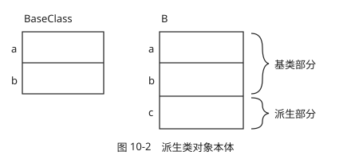
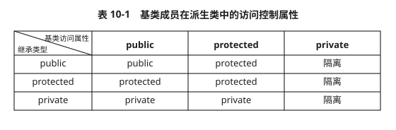
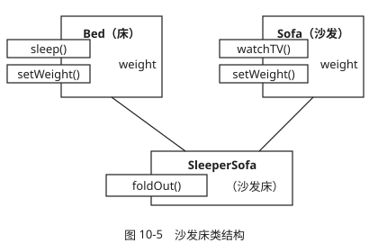
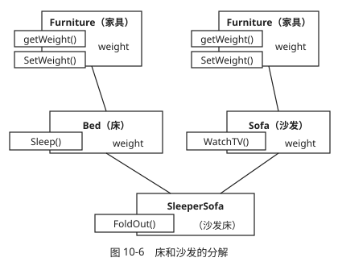
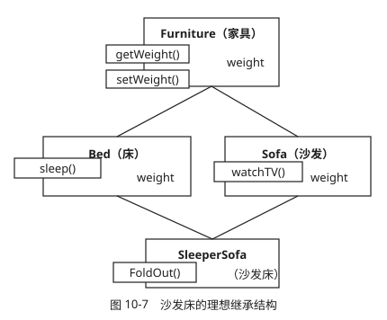
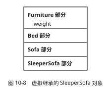

## 一、派生类对象结构(Derived Object Structure)

```cpp
class BaseClass
{
private:
    int a,b;
    //...other member
};
class B : public BaseClass
{
private:
    int c;
    //...other member
};
```

派生类对象本体包含两个部分:一个为基类部分,另一个为派生类对象部分.

示意图如下:

   

### 不能被继承的函数

1. 构造函数

2. 析构函数

3. 友元函数

4. 赋值操作符

5. 复制构造函数

派生类的以上函数初始化时,将默认调用基类的对应函数.

## 二、类内访问控制(Access Control in Class)

### 2.1 访问控制列表

继承类型/基类访问属性|pulibc|protected|private
:---:|:---:|:---:|:---:
pulibc		| pulibc	| protected	| 隔离,通过基类访问
protected	| protected	| protected	| 隔离,通过基类访问
private		| private	| private	| 隔离,通过基类访问

   

### 2.2 调整访问控制属性

　　通过在派生类中使用using关键字,可以调整public/protected类型成员的访问控制属性.

```cpp
class Base
{
private:
    int b1;
protected:
    int b2;
    void fb2(){ b1 = 1;}
public:
    int b3;
    void fb3(){ b1 = 1 ;}
};
class pri : private Base
{
public:
    using Base::b3;
    using Base::fb3;
};
int main()
{
    pri pri;
    pri.b3 = 1;
    pri.fb3();
}
```

## 三、派生类的构造及构造顺序.

### 3.1 派生类的构造

1. 默认构造函数.

   派生类的默认构造函数会首先调用父类的无参构造函数,如果父类定义了有参构造函数(因此没有默认构造函数),又没有重载无参构造函数,则会出错.

2. 自定义构造函数.

   可以在派生类的构造函数中调用父类的构造函数.

3. 复制构造函数

   与构造函数类似,如果父类没有自定义构造函数,派生类将调用父类的默认构造函数,否则调用父类的自定义复制构造函数.对于本体与实体不一致的情况,需要派生类自定义复制构造函数.

### 3.2 构造顺序

　　创建派生类对象时,程序首先调用基类的构造函数.做完了基类的构造之后,接下来要给自身的对象本体分配空间,进而调用各个成员对象的构造函数,如果有多个对象,按照声明顺序进行构造.然后开始执行自身的构造函数.

<center>创建派生类对象----->基类构造----->自身对象构造(按照声明顺序)------>自身构造函数</center>

### 3.3 析构顺序

　　与构造严格相反.

## 四、继承与组合(Compostion)

类中含有其它对象成员的情形成为组合.

### 区别

类别|特性
:---:|:---:
组合|成员对象的数据不能直接访问,需要间接访问.
继承|可以直接访问.基类的功能可能不适用派生类

## 五、多重继承(Multi-Inheritance Structure)

### 5.1 多继承结构

一个类可以从多个基类派生,这样的继承结构成为多重继承(多继承).

**Sample**

　　一个沙发床(SleepeSofa),既有沙发的功能,又有床的功能.
继承示意图如下:



```cpp
//=====================================
// f1006.cpp
// 多重继承
//=====================================
#include<iostream>
using namespace std;
//-------------------------------------
class Bed
{
protected:
    int weight;
public:
    Bed():weight(0){}
    void sleep()const{ cout <<"Sleeping...\n"; }
    void setWeight(int i){ weight =i; }
};//-----------------------------------
class Sofa
{
protected:
    int weight;
public:
    Sofa():weight(0){}
    void watchTV()const{ cout <<"Watching TV.\n"; }
    void setWeight(int i){ weight =i; }
};//-----------------------------------
class SleeperSofa : public Bed, public Sofa
{
public:
    SleeperSofa(){}
    void foldOut()const{ cout <<"Fold out the sofa.\n"; }
};//-----------------------------------
int main(){
    SleeperSofa ss;
    ss.watchTV();
    ss.foldOut();
    ss.sleep();
}//====================================
/*output:
Watching TV.
Fold out the sofa.
Sleeping...
*/
```

### 5.2 基类成员名冲突

```cpp
int main()
{
    SleeperSofa ss;
    ss.setWeight( 20 ); //错,是Bed::setWeight(),还是Sofa::setWeight()?
}
```

1. 在程序f1006.cpp中,Bed和Sofa都含有Weight成员,SleeperSofa无法确定继承哪一个.这样就导致了基类成员名冲突,在编译时将会报错.

2. 为了明确访问目的,必须在setWeight()前加前缀以说明基类:

   ```cpp
   int main()
   {
       SleeperSofa ss;
       ss.Sofa::setWeight( 20 );
   }
   ```

   这种情况,要求掌握类的所有信息,因此,在基类中出现两个意义相同的实体是不妥当的.

### 5.3 基类分解(BaseClass Decompostion)



```cpp
//=====================================
// f1007.cpp
// 非虚拟多继承
//=====================================
#include<iostream>
using namespace std;
//-------------------------------------
class Furniture
{
protected:
    int weight;
public:
    Furniture():weight(0){}
    void setWeight(int i){ weight =i; }
    int getWeight()const{ return weight; }
};//-----------------------------------
class Bed : public Furniture
{
public:
    Bed(){}
    void sleep()const{ cout <<"Sleeping...\n"; }
};//-----------------------------------
class Sofa : public Furniture
{
public:
    Sofa(){}
    void watchTV()const{ cout <<"Watching TV.\n"; }
};//-----------------------------------
class SleeperSofa : public Bed, public Sofa
{
public:
    SleeperSofa() :Sofa(), Bed(){}
    void FoldOut()const{ cout <<"Fold out the sofa.\n"; }
};//-----------------------------------
int main()
{
    SleeperSofa ss;
    ss.setWeight(20);                  // error 模糊的setWeight成员
    Furniture* pF = (Furniture*)&ss;   // error 模糊的Furniture*
    cout<<pF->getWeight()<<endl;
}//====================================
```

### 5.4 虚拟继承(Virtual Inheritance)

　　程序f1007.cpp通不过编译是因为遇到了含糊不清,指向Furniture的指针不知道指向哪个Furniture,从道理上讲,SleeperSofa只需对应一个Furniture对象,所以我们希望只有一个Furniture副本.如下图所示:



C++可以实现这种继承结构,使用的是**虚拟继承技术**.

使用方法:**在继承关键字前加 virtual**



```cpp
//=====================================
// f1008.cpp
// virtual inheritance
//=====================================
#include<iostream>
using namespace std;
//-------------------------------------
class Furniture
{
protected:
    int weight;
public:
    Furniture(){}
    void setWeight(int i){ weight =i; }
    int getWeight()const{ return weight; }
};//-----------------------------------
class Bed : virtual public Furniture
{
public:
    Bed(){}
    void sleep()const{ cout <<"Sleeping...\n"; }
};//-----------------------------------
class Sofa : virtual public Furniture
{
public:
    Sofa(){}
    void watchTV()const{ cout <<"Watching TV.\n"; }
};//-----------------------------------
class SleeperSofa : public Bed, public Sofa
{
public:
    SleeperSofa() :Sofa(), Bed(){}
    void foldOut()const{ cout <<"Fold out the sofa.\n"; }
};//-----------------------------------
int main(){
    SleeperSofa ss;
    ss.setWeight(20);
    cout<<ss.getWeight()<<endl;
}//====================================
```

### 5.5 虚基类及其派生类的构造函数

1. 建立对象时所指的类成为最(远)派生类.

2. 虚基类的成员是由最(远)派生类的构造函数通过调用虚基类的构造函数进行初始化的.

3. 在整个继承结构中,直接或者间接继承虚基类的所有派生类都必须在构造函数的成员初始化列表中给出对虚基类的构造函数的调用,如果未列出,则表示调用该虚基类的默认构造函数.

4. 在建立对象时,只有最(远)派生类的构造函数调用虚基类的构造函数,该派生类的其它基类对虚基类的构造函数的调用被忽略.

```cpp
//=====================================
// Virtual Base Class Contructor
//=====================================
#include <iostream>
using namespace std;
class B0
{
public:
    B0( int n ) { nv = n ; cout<<"Consturctor B0 "<<endl; }
    int nv;
    void fun() { cout<<"Member of B0 "<<endl; }
};
class B1 : virtual public B0
{
public:
    B1( int a ): B0(a){ cout<<"Consturctor B1 "<<endl; }
    int nv1;
};
class B2 : virtual public B0
{
public:
    B2( int a ): B0(a){ cout<<"Consturctor B2 "<<endl; }
    int nv2;
};
class D1 : public B1 , public B2
{
public:
    D1( int a ): B0(a),B1(a),B2(a){ cout<<"Consturctor D1 "<<endl; }
    int nvd;
    void fun() { cout<<"Member of D1"<<endl; }
};
int main()
{
    D1 d1(1);
    d1.nv = 2;
    d1.fun();
}
/*Output:
Consturctor B0
Consturctor B1
Consturctor B2
Consturctor D1
Member of D1
*/
```

### 5.6 多继承对象的构造顺序

**含有多继承的构造函数按下列顺序被调用**:

1. 任何虚拟基类的构造函数按照它们被继承的顺序构造.

2. 任何非虚拟基类的构造函数按照它们被继承的顺序构造

3. 任何成员对象的构造函数按照它们声明的顺序构造

4. 类自己的构造函数.

这说明,若一个类含有虚拟继承,则**构造从虚拟基类开始**.

程序f1008.cpp构造顺序如下

1. Furniture对象

2. Bed对象,不管构造函数的初始化列表是否把Bed放在Sofa后面

3. Sofa对象

4. SleeperSofa本身部分

### 5.7 多继承评价(Multi-Inheritance Evalution)

　　在语言中实现多继承并不容易,主要是编译问题、模糊性问题、调试问题.应避免多继承.

## 六、派生类和基类的指针或引用转换.

1. **基类指针(引用)可以在不进行显式类型转换的情况下指向派生类对象**

   ```cpp
   Derived B;
   Base &rt = B;
   Base *pt = &B
   ```

2. **不可以将派生类指针(引用)指向基类**

   ```cpp
   Base B;
   Derived &rt = B;
   Derived *pt = &B;
   ```
3. **显示类型转换**

   参考C++Notes03-六.类型转换

　　总之,**基类指针(引用)可以指向派生类.但是,派生类指针(引用)不可以指向基类.**


