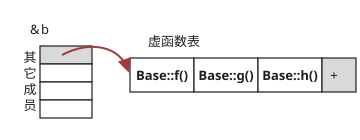

## 一、多态概念与实现

### 1.1 多态概念

　　一个操作根据传递或者捆绑的对象不同做出不同的反应,称为多态.

### 1.2 多态的实现方式

1. 函数重载(overload).

2. 运算符重载

3. 虚函数(virtual)

### 1.3 函数调用的两种方式

* **静态绑定**

  联编出现在编译阶段,根据对象名或类名限定要调用的函数.

* **动态绑定或滞后绑定(late bingding)**

  联编工作在程序运行时,在运行时根据对象实际类型确定要调用的函数.

## 二、重载(overload)、覆盖(override)、重写(overwrite)区别

### 2.1 重载(overload)

　　将语义、功能相似的几个函数用同一个名字表示,但参数不同（包括类型、顺序不同）,即函数重载.

1. 相同范围(同一个类中).

2. 函数名相同.

3. 参数不同(类型、顺序不同),不包括返回值类型不同.

4. 不同作用域声明的函数不算重载.

5. virtual可有可无.

### 2.2 覆盖(override)

派生类函数覆盖基类函数,函数名和参数均相同.

1. 不同范围(分别位于基类与派生类).

2. 函数名相同.

3. 参数相同.

4. 必须有virtual.

### 2.3 重写(overwrite)即同名隐藏规则

1. 如果派生类与基类函数同名,参数不同,此时无论有无virtual,基类函数将被隐藏.

2. 如果派生类与基类同名,参数相同,有virtual为覆盖.无virtual为隐藏.

3. 在覆盖中,根据引用或指针指向的实际对象调用函数.属动态绑定.

4. 在隐藏中,根据引用或指针的类型调用函数,属静态绑定.

```cpp
#include<iostream>
using namespace std;

class Base
{
public:
	virtual void f(float x){
		cout<<"BASE::f"<<x<<endl;
	}
	virtual void g(float x){
		cout<<"BASE::g"<<x<<endl;
	}
	void h(float x){
		cout<<"BASE::h"<<x<<endl;
	}
};
class Driver:public Base
{
public:
	void f(float x){
		cout<<"d::f"<<x<<endl;
	}
	virtual void g(int x){
		cout<<"d::g"<<x<<endl;
	}
	void h(float x){
		cout<<"d::h"<<x<<endl;
	}
};

int main(int argc, char const *argv[])
{
	Driver d;
	Base* pb=&d;
	Driver* pd=&d;
    //f()名称相同,参数相同且有virtual为覆盖,根据指向的实际对象调用函数,属于动态绑定.
	pd->f(1.2f);
	pb->f(1.2f);
    //g()名称相同,参数不同为隐藏,根据指针类型调用函数,属于静态绑定.
	pd->g(1.2f);
	pb->g(1.2f);
	 //g()名称相同,参数相同无virtual为隐藏,根据指针类型调用函数,属于静态绑定.
	pd->h(1.2f);
	pb->h(1.2f);
    system("pause");
	return 0;
}
/*output:
d::f1.2
d::f1.2
d::g1
BASE::g1.2
d::h1.2
BASE::h1.2
*/
```
## 三、操作符重载

通过操作符重载来扩展自定义的类型

### 3.1 重载限制

1. 重载后的操作符至少有一个操作数是用户自定义的类型,防止未标准类型重载操作符.

2. 不能创建新的操作符.

3. 优先级和结合性不能改变.

4. 操作个数不变.

5. 不能改变元操作符的意义,如将+做*操作.

### 3.2 实现方式

1. 通过类友元函数

   一般有两个参数,作为第一操作符和第二操作符.当需要运算符有可交换性时,选择重载为友元操作符.例如a+3和3+a,`<<`于`>>`必须用友元重载,因为只能为左值且需要访问类的私有成员.双目运算符最好被重载为友元函数.

2. 通过类的成员函数实现

   成员操作符定义中省略了第一个参数,因为成员函数总是与对象绑定的,被捆绑的对象就是第一操作符,因此,单目成员操作符没有参数,双目成员操作符有一个参数,单目运算符最好被重载为成员

### 3.3 不能重载的操作符

这些操作符要求第二参数为名称,比如3.a和a.3难以理解

operator|name
:---:|:---:
sizeof|sizeof操作符
.|成员操作符
.*|成员指针操作符
::|作用域解析操作符
?:|条件操作符
typeid|RTTI操作符
const_cast|强制类型转换操作符
static_cast|强制类型转换操作符
dynamic_cast|强制类型转换操作符
reinterpret_cast|强制类型转换操作符

### 3.4 只能通过类成员函数重载的操作符

单目运算符,依赖于类

operator|name
:---:|:---:
=|赋值操作符
()|函数调用操作符
[]|下标操作符
->|通过指针访问类成员的操作符

### 3.5 参数、返回与实现

返回类型 operator 操作符 (参数列表){}

* 参数若为类类型,一般为引用型.

* 参数若为内部数据类型,则不用引用类型.

* 返回为对象,实际返回的是临时对象的副本,为了连续操作,返回引用.

  ```cpp
  a = b + c + d;
  a = b = c; //不合法,不允许临时副本调用成员函数
  ```

* 返回引用,一般将`=`，`operator++()`前缀操作符,返回引用

* `<<`与`>>`必须返回引用，因为需要连续输入和拼接.iostream只能为左值且访问类的私有成员.

  `friend ostream &operator<<( ostream &os , A a);`

```cpp
//友元函数实现,参数必须有两个,运算符具有可交换性
class Point{
friend Point operator+(const Point &a , const Point &b);
}；

//类成员函数实现,参数一个
class Point{
Point operator+(const Point &a );
}；
```

### 3.6 常用操作符的重载

#### 3.6.1 前增量操作符`++x`

```cpp
//前增量操作符与返回值是同一变量,返回引用
friend X& operator++(X &a); //友元函数重载
X &operator++();            //类成员操作符重载
++X;
```

#### 3.6.2 后增量操作符`x++`

　　由于前后增量操作都有`++`,如果参数相同,编译器进行报错.所以对后增量操作特殊处理,增加一个用不到的参数.

```cpp
//后增量操作符与返回值是非同一变量,返回对象
friend X operator++(X &a,int b); //友元函数重载
X operator++(int b);             //类成员操作符重载
X++;
```

#### 3.6.3 流操作符`<<`与`>>`

```cpp
//ostream只能做左值,必须用友元实现
friend ostream& operator<<(ostream& o,const ClassName& c);
friend CArchive& AFXAPI operator>>(CArchive& ar, CObject*& pOb);
```

#### 3.6.4 前后增量符与流操作符重载示例

```cpp
//==================================
// f0806.cpp
// class Time's operator++
//==================================
#include<iostream>
#include<iomanip>
using namespace std;
//----------------------------------
class Time{
  int hour, minute, second;
public:
  void set(int h, int m, int s){ hour=h, minute=m, second=s; }
  friend Time& operator++(Time& a);
  friend Time operator++(Time& a, int);
  friend ostream& operator<<(ostream& o, const Time& t);
};//-------------------------------
Time& operator++(Time& a){
  if(!(a.second=(a.second+1)%60)&&!(a.minute=(a.minute+1)%60))
    a.hour=(a.hour+1)%24;
  return a;
}//--------------------------------
Time operator++(Time& a, int){
  Time t(a);
  if(!(a.second=(a.second+1)%60)&&!(a.minute=(a.minute+1)%60))
    a.hour=(a.hour+1)%24;
  return t;
}//------------------------------------
ostream& operator<<(ostream& o, const Time& t){
  o<<setfill('0')<<setw(2)<<t.hour<<":"<<setw(2)<<t.minute<<":";
  return o<<setw(2)<<t.second<<"\n"<<setfill(' ');
}//--------------------------------
int main(){
  Time t;
  t.set(11, 59, 58);
  cout<<t++;  //11:59:59
  cout<<++t;  //12:00:00
}//================================
```

#### 3.6.5 运算符重载示例

**类成员函数重载**

```cpp
#include <iostream>
using namespace std;

class complex{
public:
    complex() { real=imag=0; }
    complex(double r, double i){
        real = r, imag = i;
    }
    complex operator+(const complex &c);
    complex operator-(const complex &c);
    complex operator*(const complex &c);
    complex operator/(const complex &c);
    friend void print(const complex &c);
private:
    double real, imag;
};

inline complex complex::operator +(const complex &c){
    return complex(real + c.real, imag + c.imag);
}

inline complex complex::operator -(const complex &c){
    return complex(real - c.real, imag - c.imag);
}

inline complex complex::operator *(const complex &c){
    return complex(real * c.real - imag * c.imag, real * c.imag + imag * c.real);
}

inline complex complex::operator /(const complex &c){
    return complex((real * c.real + imag + c.imag) / (c.real * c.real + c.imag * c.imag),
(imag * c.real - real * c.imag) / (c.real * c.real + c.imag * c.imag));
}

void print(const complex &c){
    if(c.imag<0)
        cout<<c.real<<c.imag<<'i';
    else
        cout<<c.real<<'+'<<c.imag<<'i';
}
int main(){
    complex c1(2.0, 3.0);
    complex c2(4.0, -2.0);
    complex c3;

    c3 = c1 - c2;
    cout<<"/nc1-c2=";
    print(c3);
    c3 = c1 * c2;
    cout<<"/nc1*c2=";
    print(c3);
    c3 = c1 / c2;
    cout<<"/nc1/c2=";
    print(c3);
    c3 = (c1+c2) * (c1-c2) * c2/c1;
    cout<<"/n(c1+c2)*(c1-c2)*c2/c1=";
    print(c3);
    cout<<endl;

    return 0;
}
```

**友元函数重载**

```cpp
#include <iostream>
class complex{
public:
    complex() { real=imag=0; }
    complex(double r, double i){
    real = r, imag = i;
    }
    friend complex operator +(const complex &c1, const complex &c2);
    friend complex operator -(const complex &c1, const complex &c2);
    friend complex operator *(const complex &c1, const complex &c2);
    friend complex operator /(const complex &c1, const complex &c2);
    friend void print(const complex &c);
private:
    double real, imag;
};
```

#### 3.6.6 下标`[]`重载

```cpp
#include <iostream>
using namespace std;
const int SIZE = 10;

class safearay
{
private:
    int arr[SIZE];
public:
    safearay(){
        register int i;
        for(i = 0; i < SIZE; i++){
           arr[i] = i;
        }
     }
     int& operator[](int i){
         if( i< 0 || > SIZE ){
             cout << "索引超过最大值" <<endl;
             return arr[0];
         }
         return arr[i];
      }
};
int main()
{
    safearay A;

    cout << "A[2] 的值为 : " << A[2] <<endl;
    cout << "A[5] 的值为 : " << A[5]<<endl;
    cout << "A[12] 的值为 : " << A[12]<<endl;

   return 0;
}
```

#### 3.6.7 括号重载

```cpp
#include <iostream>
using namespace std;
class Clastype
{
public:
    Clastype(int a)  {
        cout << "Hello Clastype!" << a << endl;
    }
    bool operator ()(int b)  {
        cout << "Hello Clastype()!" << b << endl;
        return true;
    }
};
int main()
{
    Clastype a(1);
    Clastype(2);
    Clastype t = Clastype(3);
    t(4);
    Clastype *b = new Clastype(5);
    (*b)(6);
}
/*output:
Hello Clastype!1
Hello Clastype!2
Hello Clastype!3
Hello Clastype()!4
Hello Clastype!5
Hello Clastype()!6
*/
```

## 四、虚函数(virtual)

### 4.1 虚函数的声明和定义

声明时在函数前加virtual关键字,定义时不用加.

```cpp
class Base{
private:
    virtual void display();
};
void Base::display(){
   ...
}
```

### 4.2 虚函数调用方式

　　只能通过对象的引用或指针访问.

### 4.3 虚函数特性

1. virtual具有继承性,在基类中声明了虚函数,派生类中无论是否声明,同原型函数自动为虚函数.

2. 虚函数不是重载(overload)、重写(overwrite)而是覆盖(override).

3. 只有类的成员函数才能声明为虚函数.

4. 静态成员函数不能是虚函数.不从属于某个对象.

5. 构造函数不能是虚函数.其一,虚函数表是在构造之后生成的.其二,虚函数是通过指针调用的,而指针是构造之后才有指向的对象.

6. 析构函数最好是虚函数.此时基类指针也可以删除派生类对象.

7. 赋值操作符不宜为虚函数,因为赋值操作符中的指针可能指向基类.

8. 内联函数不能定义为虚函数,内联函数是在编译阶段由编译器确定的,即使定义为虚函数,编译时仍将其视为非内联的.

### 4.4 虚函数工作原理

#### 4.4.1 虚函数表(V-Table/vtbl)

* 编译器在编译时,会将类中的虚函数地址保存到函数指针数组中,这个函数指针数组称为虚函数表.

* 虚函数表属于类,类的所有对象共享这个类的虚函数表.不是保存在对象中.不同编译器位置不同.

#### 4.4.2 虚函数表指针(vptr)

* 在生成类对象时,会在对象实例的最前位置保存一个指向虚函数表的指针,称为虚函数表指针.由编译器加入.

* 虚函数指针在对象空间的最前端,占4个字节.因此有虚函数的类比无虚函数的类多内存开销.



* 每一个具有虚函数的类都有一个虚函数表VTABLE,里面按在类中声明的虚函数的顺序存放着虚函数的地址,这个虚函数表VTABLE是这个类的所有对象所共有的,也就是说无论用户声明了多少个类对象,但是这个VTABLE虚函数表只有一个.

* 在每个具有虚函数的类的对象里面都有一个VPTR虚函数指针,这个指针指向VTABLE的首地址,每个类的对象都有这么一种指针.

#### 4.4.3 派生类虚函数表的构建

**派生类虚函数表的构建**

* `派生类`--->`覆盖(override)基类函数`--->`保存新的虚函数地址`

* `派生类`---->`基类函数不变`-->`直接保存到派生类虚函数表`

* `派生类`---->`定义新的虚函数`-->`加入派生类虚函数表`

**通过指针或引用调用虚函数时,找到虚函数表指针,查询到虚函数地址,然后执行**


#### 4.4.4 虚函数的缺点

* 执行效率低,普通函数直接调用,虚函数需要查询虚函数表.

* 内存空间大,虚函数表和虚函数表指针都要占空间.

## 五、RTTI

　　RTTI是运行阶段类型识别符(Runtime Type Identific)的简称,旨在运行阶段确定对象的类型.

　　RTTI只适用于包含虚函数的类.

　　C\++有三个支持RTTI的元素:

### 5.1 dynamic_cast

　　`dynamic_cast`使用一个基类的指针来生成指向派生类的指针(向上转换),反之,向下转换不安全,返回空指针.

### 5.2 type_info类

　　type_info是在头文件typeinfo中定义的一个类,重载了`==`和`!=`操作符,可以直接用操作符进行比较.

type_info包含一个name()成员,返回一个字符串(类名).

```cpp
cout<<typeid(*pg).name()<<endl;
```

### 5.3 typeid

typeid返回一个指向type_info的引用,它可以接受两个参数

```cpp
typeid(ClassName);
typeid(object expression)

typeid(Magnificent) == typeid( *pg ) //如果pg为空指针,将引发bad_typeid异常,为exception的派生类
```

## 六、抽象类(Abstract class)

### 6.1 纯虚函数

纯虚函数是指被标明为不具体实现的虚函数

```cpp
class Account{
   virtual void withdrawl(double amount) = 0; //纯虚函数
};
```

### 6.2 抽象类

* 在类定义中至少声明一个纯虚函数.

* 抽象类不允许有实例对象,一般作为基类.


