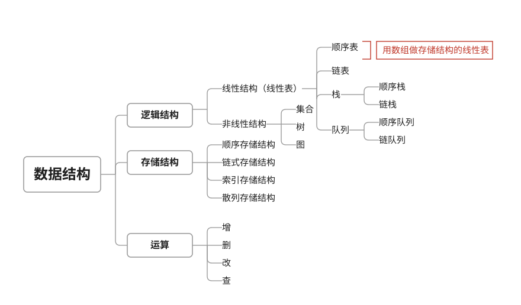
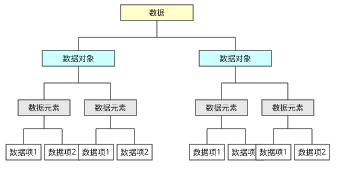

## 一、组成要素



### 1.1 逻辑结构

* 线性结构(线性表)

  * 顺序表(用数组存储结构的线性表)
  * 链表
  * 栈(顺序栈和链栈)
  * 队列(顺序队列和链队列)

* 非线性结构

  * 集合(无逻辑关系)
  * 树
  * 图

### 1.2 物理结构

* 顺序存储结构

  所有数据元素存放在一片连续的存储空间中,逻辑上相邻的元素在内存中的物理位置也是相邻的

* 链式存储结构

  对逻辑上相邻的元素不要求其物理位置相邻,元素间的逻辑关系通过附设的指针字段来表示,由此得到的存储表称为链式存储结构

* 索引存储结构
* 散列存储结构

### 1.3 算法

* 增
* 删
* 改
* 查

## 二、构成



### 2.1 数据项

最小的数据单位

### 2.2 数据元素

是组成数据的、有一定意义的基本单位,主要由数据项构成

### 2.3 数据对象

是性质相同的数据元素的集合,是数据的子集,主要由数据元素构成

### 2.3 抽象数据类型

一个数学模型以及定义在此模型上的一组操作。其三个组成部分为:数据对象、数据关系和基本操作。可以用抽象数据类型完整定义数据结构

## 三、算法和算法分析

### 3.1 算法的特性

<center>程序＝数据结构＋算法</center>

* 有穷性

  一个算法必须总是在执行有穷步之后结束,且每一步都在有穷时间内完成

* 确定性

  算法中每一条指令必须有确切的含义。不存在二义性。且算法在任何条件下,只有唯一的一条执行路径,即对于相同的输入只能得出相同的输出

* 可行性

  一个算法是可行的。即算法描述的操作都是可以通过已经实现的基本运算执行有限次来实现的

* 输入

  一个算法有零个或多个输入,这些输入取自于某个特定的对象集合

* 输出

  一个算法有一个或多个输出,这些输出是同输入有着某些特定关系的量

### 3.2 算法分析

一个程序的时间复杂度是指该程序的运行时间与问题规模的对应关系

#### 3.2.1 时间复杂度

* 原操作
* 频度
* 原操作重复执行的次数与问题规模n之间的关系f(n)
* 时间复杂度:T(n)=O( f(n) )

```
{  ++x; s = 0; }

for( i = 1; i <=n;i ++){
    ++ x; s += x;
}

for( i = 1; i <=n;i ++){}
    for( k=1;k<=n;k++ ){
        ++ x; s += x;
    }
}
它们的时间复杂度分别为O(1)、 O(n) 和O(n2)
```

#### 3.2.2 空间复杂度

一个程序的空间复杂度(Space Complexity)指程序运行从开始到结束所需存储量与问题规模的对应关系,记作:
<center>S(n)=O( f (n))</center>
其中,ｎ为问题的规模。

> [Xiongchao99的博客](https://blog.csdn.net/Xiongchao99/article/details/74910577)

