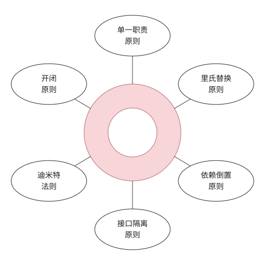

## 一、Design Principles



**View** &rarr; [**More**](https://blog.csdn.net/xiqingnian/article/details/41843885)

### 1.1 Single Reponsibility Principle

　　**单一职责原则**:仅有一个导致类变更的原因,即**一个类只负责一项职责**.

　　如果一个类承担的职责过多,某一个职责的变化可能影响其它职责.

### 1.2 Liskov's Substitution Principle(LSP)

　　**里氏替换原则**:一个软件实体如果使用了父类,那么一定适用其子类.即**子类型能够替换父类型**

　　父类中凡是已经实现好的方法(相对于抽象方法而言),实际上是在设定一系列的规范和契约,虽然它不强制要求所有的子类必须遵从这些契约,但是如果子类对这些非抽象方法任意修改,就会对整个继承体系造成破坏.而里氏替换原则就是表达了这一层含义.

### 1.3 Open Close Principle

　　**开放-封闭原则**,软件实体(类/模块/函数)对**扩展开放,对修改封闭**.

　　面对需求,对程序的改动是通过增加代码来完成,而不是修改代码.因为可能给旧代码引入错误.

　　开闭原则思想是对频繁变化的部分作出抽象,用抽象构建框架,用实现扩展细节.因为抽象灵活性好,适应性广,只要抽象的合理,可以基本保持软件架构的稳定.而软件中易变的细节,我们用从抽象派生的实现类来进行扩展,当软件需要发生变化时,我们只需要根据需求重新派生一个实现类来扩展就可以了.当然前提是我们的抽象要合理,要对需求的变更有前瞻性和预见性才行.

### 1.4 Dependency Inversion Principle

　　**依赖倒置原则**:高层模块不应该依赖低层模块,二者都应该依赖其抽象；抽象不应该依赖细节；细节应该依赖抽象.

1. 依赖倒置原则演示,妈妈讲故事

   ```java
   //依赖倒置原则
   //妈妈讲故事
   class Book{
        public String getContent(){
            return "很久很久以前有一个阿拉伯的故事……";
        }
   }

   class Mother{
       public void narrate(Book book){
           System.out.println("妈妈开始讲故事");
           System.out.println(book.getContent());
       }
   }

   public class Client{
       public static void main(String[] args){
            Mother mother = new Mother();
            mother.narrate(new Book());
       }
   }
   ```

2. 依赖倒置原则演示,新增读报纸

   ```java
   //违反依赖倒置原则
   //高层模块依赖底层模块
   //mother类无法读报纸,
   class Newspaper{
       public String getContent(){
            return "林书豪38+7领导尼克斯击败湖人……";
       }
   }
   ```

3. 依赖倒置原则演示,对模块进行抽象,使细节依赖抽象

   ```java
   //依赖倒置原则
   //对模块抽象,使其符合依赖倒置,细节依赖抽象
   class Newspaper implements IReader {
       public String getContent(){
            return "林书豪17+9助尼克斯击败老鹰……";
       }
   }
   class Book implements IReader{
       public String getContent(){
           return "很久很久以前有一个阿拉伯的故事……";
       }
   }

   class Mother{
       public void narrate(IReader reader){
            System.out.println("妈妈开始讲故事");
            System.out.println(reader.getContent());
       }
   }

   public class Client{
       public static void main(String[] args){
            Mother mother = new Mother();
            mother.narrate(new Book());
            mother.narrate(new Newspaper());
       }
   }
   ```

在实际编程中,我们一般需要做到如下3点：

* 低层模块尽量都要有抽象类或接口,或者两者都有.

* 变量的声明类型尽量是抽象类或接口.

* 使用继承时遵循里氏替换原则.

### 1.5 Interface Segregation Principle (ISP)

　　**接口隔离原则**:客户端不应该依赖它不需要的接口；一个类对另一个类的依赖应该建立在最小的接口上.

　　接口隔离原则的含义是：建立单一接口,不要建立庞大臃肿的接口,尽量细化接口,接口中的方法尽量少.也就是说,我们要为各个类建立专用的接口,而不要试图去建立一个很庞大的接口供所有依赖它的类去调用.本文例子中,将一个庞大的接口变更为3个专用的接口所采用的就是接口隔离原则.在程序设计中,依赖几个专用的接口要比依赖一个综合的接口更灵活.接口是设计时对外部设定的“契约”,通过分散定义多个接口,可以预防外来变更的扩散,提高系统的灵活性和可维护性.

### 1.6 Law of Demeter

　　**迪米特法则(最少知道原则)**:一个对象应该对其他对象保持最少的了解

　　如果两个类不必直接通信,那么这两个类不应当发生直接的相互作用.如果其中一个类需要调用另一个类的某一个方法的话,可通过第三者发起这个调用

　　类与类之间的关系越密切,耦合度越大,当一个类发生改变时,对另一个类的影响也越大.

　　迪米特法则又叫最少知道原则,最早是在1987年由美国Northeastern University的Ian Holland提出.通俗的来讲,就是一个类对自己依赖的类知道的越少越好.也就是说,对于被依赖的类来说,无论逻辑多么复杂,都尽量地的将逻辑封装在类的内部,对外除了提供的public方法,不对外泄漏任何信息.迪米特法则还有一个更简单的定义：只与直接的朋友通信.首先来解释一下什么是直接的朋友：每个对象都会与其他对象有耦合关系,只要两个对象之间有耦合关系,我们就说这两个对象之间是朋友关系.耦合的方式很多,依赖、关联、组合、聚合等.其中,我们称出现成员变量、方法参数、方法返回值中的类为直接的朋友,而出现在局部变量中的类则不是直接的朋友.也就是说,陌生的类最好不要作为局部变量的形式出现在类的内部.

1. 违反迪米特法则的设计

   ```java
   //总公司员工
   //打印出所有下属单位的员工ID
   class Employee{
       private String id;
       public void setId(String id){
           this.id = id;
       }
       public String getId(){
           return id;
       }
   }

   //分公司员工
   class SubEmployee{
       private String id;
       public void setId(String id){
           this.id = id;
       }
       public String getId(){
           return id;
       }
   }

   class SubCompanyManager{
       public List<SubEmployee> getAllEmployee(){
           List<SubEmployee> list = new ArrayList<SubEmployee>();
           for(int i=0; i<100; i++){
               SubEmployee emp = new SubEmployee();
       //为分公司人员按顺序分配一个ID
               emp.setId("分公司"+i);
               list.add(emp);
           }
           return list;
       }
   }

   class CompanyManager{

       public List<Employee> getAllEmployee(){
           List<Employee> list = new ArrayList<Employee>();
           for(int i=0; i<30; i++){
               Employee emp = new Employee();
       //为总公司人员按顺序分配一个ID
               emp.setId("总公司"+i);
               list.add(emp);
           }
           return list;
       }

       public void printAllEmployee(SubCompanyManager sub){
           List<SubEmployee> list1 = sub.getAllEmployee();
           for(SubEmployee e:list1){
               System.out.println(e.getId());
           }

           List<Employee> list2 = this.getAllEmployee();
           for(Employee e:list2){
               System.out.println(e.getId());
           }
       }
   }

   public class Client{
       public static void main(String[] args){
           CompanyManager e = new CompanyManager();
           e.printAllEmployee(new SubCompanyManager());
       }
   }
   ```

   根据迪米特法则,只与直接的朋友发生通信,而SubEmployee类并不是CompanyManager类的直接朋友(以局部变量出现的耦合不属于直接朋友),从逻辑上讲总公司只与他的分公司耦合就行了,与分公司的员工并没有任何联系,这样设计显然是增加了不必要的耦合.按照迪米特法则,应该避免类中出现这样非直接朋友关系的耦合.

2. 修改后符合迪米特法则

   ```java
   class SubCompanyManager{
       public List<SubEmployee> getAllEmployee(){
           List<SubEmployee> list = new ArrayList<SubEmployee>();
           for(int i=0; i<100; i++){
               SubEmployee emp = new SubEmployee();
               //为分公司人员按顺序分配一个ID
               emp.setId("分公司"+i);
               list.add(emp);
           }
           return list;
       }
       public void printEmployee(){
           List<SubEmployee> list = this.getAllEmployee();
           for(SubEmployee e:list){
               System.out.println(e.getId());
           }
       }
   }

   class CompanyManager{
       public List<Employee> getAllEmployee(){
           List<Employee> list = new ArrayList<Employee>();
           for(int i=0; i<30; i++){
               Employee emp = new Employee();
               //为总公司人员按顺序分配一个ID
               emp.setId("总公司"+i);
               list.add(emp);
           }
           return list;
       }

       public void printAllEmployee(SubCompanyManager sub){
           sub.printEmployee();
           List<Employee> list2 = this.getAllEmployee();
           for(Employee e:list2){
               System.out.println(e.getId());
           }
       }
   }
   ```

### 1.7 Composite/Aggregate Reuse Principle

　　**合成/聚合复用原则**:尽量使用合成/聚合,尽量不要使用类继承

## 二、Pattern Types(24种)

Types | Name
:---:|:---
Creational(创建型) | 6种
-| [Simple Factory Pattern(简单工厂模式)](/WaiMinutes/design-pattern/designpattern02-simplefactory-factorymethod-abstractfactory/#一simple-factory-pattern)
-| [Factory Method(工厂方法模式)](/WaiMinutes/design-pattern/designpattern02-simplefactory-factorymethod-abstractfactory/#二factory-method-pattern)
-| [Abstract Factory Pattern(抽象工厂模式)](/WaiMinutes/design-pattern/designpattern02-simplefactory-factorymethod-abstractfactory/#三abstract-factory-pattern)
-| [Builder Pattern(建造者模式)](/WaiMinutes/design-pattern/designpattern03-builder-prototype-singleton/#四builder-pattern)
-| [Prototype Pattern(原型模式)](/WaiMinutes/design-pattern/designpattern03-builder-prototype-singleton/#五prototype-pattern)
-| [Singleton Pattern(单例模式)](/WaiMinutes/design-pattern/designpattern03-builder-prototype-singleton/#六singleton-pattern)
Structural(结构型) | 7种
-| [Adapter Pattern(适配器模式)](/WaiMinutes/design-pattern/designpattern04-adapter-facade-bridge/#一adapter-pattern)
-| [Facade(外观模式)](/WaiMinutes/design-pattern/designpattern04-adapter-facade-bridge/#二facade-pattern)
-| [Bridge Pattern(桥接模式)](/WaiMinutes/design-pattern/designpattern04-adapter-facade-bridge/#三bridge-pattern)
-| [Composite Pattern(组合模式)](/WaiMinutes/design-pattern/designpattern05-composite-decorator-flyweight-proxy/#四composite-pattern)
-| [Decorator Pattern(装饰器模式)](/WaiMinutes/design-pattern/designpattern05-composite-decorator-flyweight-proxy/#五decorator-pattern)
-| [Flyweight Pattern(享元模式)](/WaiMinutes/design-pattern/designpattern05-composite-decorator-flyweight-proxy/#六flyweight-pattern)
-| [Proxy Pattern(代理模式)](/WaiMinutes/design-pattern/designpattern05-composite-decorator-flyweight-proxy/#七proxy-pattern)
Behavioral(行为型) | 11种
-| [Memento Pattern(备忘录模式)](/WaiMinutes/design-pattern/designpattern06-memento-mediator-observer/#一memento-pattern)
-| [Mediator Pattern(中介者模式)](/WaiMinutes/design-pattern/designpattern06-memento-mediator-observer/#二mediator-pattern)
-| [Observer Pattern(观察者模式)](/WaiMinutes/design-pattern/designpattern06-memento-mediator-observer/#三observer-pattern)
-| [State Pattern(状态模式)](/WaiMinutes/design-pattern/designpattern07-state-visitor-interpret/#四state-pattern)
-| [Visitor Pattern(访问者模式)](/WaiMinutes/design-pattern/designpattern07-state-visitor-interpret/#五visitor-pattern)
-| [Interpreter Pattern(解释器模式)](/WaiMinutes/design-pattern/designpattern07-state-visitor-interpret/#六interpreter-pattern)
-| [Iterator Pattern(迭代器模式)](/WaiMinutes/design-pattern/designpattern08-iterator-strategy-command/#七iterator-pattern)
-| [Strategy Pattern(策略模式)](/WaiMinutes/design-pattern/designpattern08-iterator-strategy-command/#八strategy-pattern)
-| [Command Pattern(命令模式)](/WaiMinutes/design-pattern/designpattern08-iterator-strategy-command/#九command-pattern)
-| [Template Method Pattern(模板方法模式)](/WaiMinutes/design-pattern/designpattern09-templatemethod-chainofresponsibility/#十template-method-pattern)
-| [Chain of Responsibility(责任链模式)](/WaiMinutes/design-pattern/designpattern09-templatemethod-chainofresponsibility/#十一chain-of-responsibility-pattern)

> [西青年·部落格](https://blog.csdn.net/xiqingnian/article/details/41843885)

