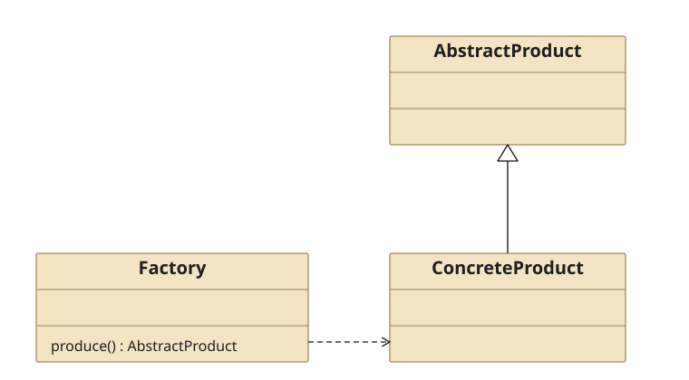
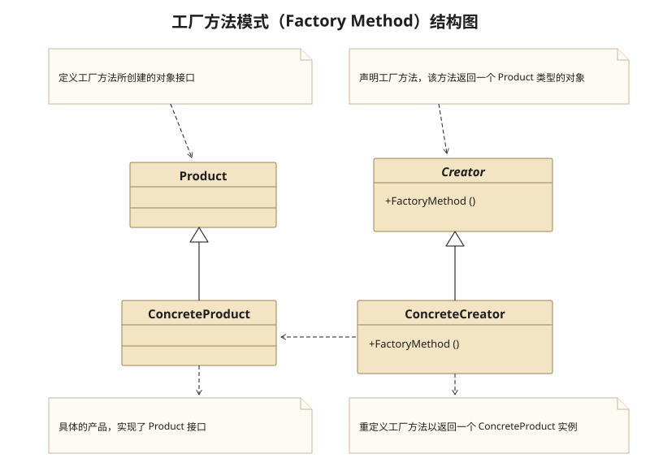
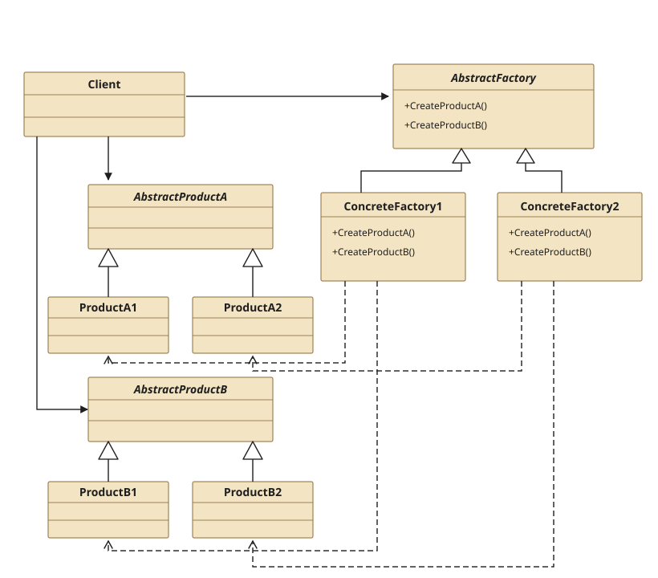

## 一、Simple Factory Pattern

### 1.1 Definition

　　**简单工厂模式**用一个工厂来根据输入的条件产生不同的类,根据不同类的virtual函数得到不同的结果

### 1.2 Structure



* 工厂类Factory

  工厂类是用来制造产品的.在Factory中有一个用于制造产品的Create或Generate函数.这个函数能够根据“标识符”的不同生成不同的ConcreteProduct,当然这些ConcreteProduct都是继承自AbstractProduct的.

* 抽象产品类AbstractProduct

  抽象产品是从其他具体产品抽象出来的.抽象产品类只有一个.

* 具体产品类ConcreteProduct

  具体产品类继承自抽象产可以有多个.当需要增加新的产品的时候就增加一个继承自抽象产品类的具体产品类即可.

### 1.3 Usage

1. 优势

   统一创建不同的具体产品,增加新产品时,只需增加新产品类(继承自抽象产品)和增加标识符

2. 缺点

   客户端必须知道基类和工厂类,耦合性差

### 1.4 Example

**Src Downloads**  &rarr; [SimpleFactoryPattern.h](design-pattern/SimpleFactoryPattern.h) and [SimpleFactoryPatternClient.cpp](design-pattern/SimpleFactoryPatternClient.cpp)

```cpp
//============================
//Simple Factory Pattern
//============================
#ifndef SIMPLEFACTORYPATTERN_H
#define SIMPLEFACTORYPATTERN_H

//Abstract Product class
class COperation{
private:
    int mFirstOperand = 0;
    int mSecondOperand = 0;
public:
    virtual ~COperation(){}
    void setFirstOperand(int firstOperand){
        mFirstOperand = firstOperand;
    }
    void setScondOperand(int secondOperand){
        mSecondOperand = secondOperand;
    }
    int getFirstOperand(){
        return mFirstOperand;
    }
    int getScondOperand(){
        return mSecondOperand;
    }
    virtual int getResult(){
        auto result = 0 ;
        return result;
    }
};

//ConcreteProduct class
class CAddOperation : public COperation{
public:
    virtual ~CAddOperation(){}
    virtual int getResult(){
        return (COperation::getFirstOperand() + COperation::getScondOperand());
    }
};

//ConcreteProduct class
class CSubOperation : public COperation{
public:
    virtual ~CSubOperation(){}
    virtual int getResult(){
        return (COperation::getFirstOperand() - COperation::getScondOperand());
    }
};

//Factory class
class COperationFactory{
public:
    COperation *create(char op){
        switch(op){
        case '+':
            return (new CAddOperation());
            break;
        case '-':
            return (new CSubOperation());
            break;
        default:
            return nullptr;
            break;
        }
    }
};

#endif // SIMPLEFACTORYPATTERN_H
```

```cpp
//============================
//Simple Factory Pattern Client
//============================
#include "SimpleFactoryPattern.h"
#include <iostream>
using namespace std;

int main(){
    auto a = 3 , b = 4;
    COperationFactory *pFactory = new COperationFactory();
    COperation *pOp = nullptr;
    if(pFactory != nullptr)
        pOp = pFactory->create('+');
    if( pOp != nullptr ){
        pOp->setFirstOperand(a);
        pOp->setScondOperand(b);
        cout<<pOp->getResult()<<endl;
        delete pOp;
        pOp = nullptr;
    }
    if( pFactory != nullptr ){
        delete pFactory;
        pFactory = nullptr;
    }

    return 0;
}
```

## 二、Factory Method Pattern

### 2.1 Definition

　　**工厂方法模式**定义一个创建产品对象的工厂抽象,每种具体产品类都对应一个生产它的具体工厂类

### 2.2 Structure



* 抽象工厂类(AbstractFactory)

* 具体工厂类(ConcreteFactory)

* 抽象产品类(AbstractProduct)

* 具体产品类(ConcreteProduct)

### 2.3 Usage

　　修正了简单工厂不遵守开放-封闭原则.工厂方法模式把选择判断移到了客户端去实现.

　　当需要增加一种产品的时候,需要做的是:增加一种继承自抽象产品的具体产品类,增加一种继承在抽象工厂的具体工厂类,更改客户端.

### 2.4 Example

**Src Downloads**  &rarr; [FactoryMethodPattern.h](design-pattern/FactoryMethodPattern.h) and [FactoryMethodPatternClient.cpp](design-pattern/FactoryMethodPatternClient.cpp)

```cpp
//============================
//Factory Method Pattern
//============================
#ifndef FACTORYMETHODPATTERN_H
#define FACTORYMETHODPATTERN_H

//Abstract Product class
class COperation{
private:
    int mFirstOperand = 0;
    int mSecondOperand = 0;
public:
    virtual ~COperation(){}
    void setFirstOperand(int firstOperand){
        mFirstOperand = firstOperand;
    }
    void setScondOperand(int secondOperand){
        mSecondOperand = secondOperand;
    }
    int getFirstOperand(){
        return mFirstOperand;
    }
    int getScondOperand(){
        return mSecondOperand;
    }
    virtual int getResult(){
        auto result = 0 ;
        return result;
    }
};

//ConcreteProduct class
class CAddOperation : public COperation{
public:
    virtual ~CAddOperation(){}
    virtual int getResult(){
        return (COperation::getFirstOperand() + COperation::getScondOperand());
    }
};

//ConcreteProduct class
class CSubOperation : public COperation{
public:
    virtual ~CSubOperation(){}
    virtual int getResult(){
        return (COperation::getFirstOperand() - COperation::getScondOperand());
    }
};

//AbstractFactory class
class CAbstractFactory{
public:
    virtual ~CAbstractFactory(){}
    virtual COperation *createOperation(){
        return new COperation();
    };
};

//ConcreteFactory class
class CAddFactory : public CAbstractFactory{
public:
    virtual ~CAddFactory(){}
    virtual COperation *createOperation(){
        return new CAddOperation();
    }
};

//ConcreteFactory class
class CSubFactory : public CAbstractFactory{
public:
    virtual ~CSubFactory(){}
    virtual COperation *createOperation(){
        return new CSubOperation();
    }
};

#endif // FACTORYMETHODPATTERN_H
```

```cpp
//============================
//Factory Method Pattern Client
//============================
#include <iostream>
#include "FactoryMethodPattern.h"

CAbstractFactory *getFactory(char op){
    switch( op ){
    case '+':
        return  new CAddFactory();
        break;
    case '-':
        return new CSubFactory();
        break;
    default:
        return nullptr;
        break;
    }
}

int main(){
    using namespace std;
    auto a = 3 , b = 4;
    CAbstractFactory *pFactory = dynamic_cast<CAbstractFactory *>(getFactory('+'));
    COperation *pOp = nullptr;
    if( pFactory != nullptr )
        pOp = pFactory->createOperation();
    if( pOp != nullptr ){
        pOp->setFirstOperand(a);
        pOp->setScondOperand(b);
        cout<<pOp->getResult()<<endl;
        delete pOp;
        pOp = nullptr;
    }
    if( pFactory != nullptr ){
        delete pFactory;
        pFactory = nullptr;
    }

    return 0;
}
```

### 2.5 Example-LeiFeng Factory

**Src Downloads**  &rarr; [LeiFengFactoryMethodPattern.h](design-pattern/LeiFengFactoryMethodPattern.h) and [LeiFengFactoryMethodPattern.cpp](design-pattern/LeiFengFactoryMethodPattern.cpp)

```cpp
//============================
//Factory Method Pattern-LeiFeng Factory
//============================
#ifndef LEIFENGFACTORYMETHODPATTERN_H
#define LEIFENGFACTORYMETHODPATTERN_H

#include <iostream>
using namespace std;

//AbstractProduct LeiFeng
class CLeiFeng{
public:
    virtual void sweep(){
        cout<<"LeiFeng Seep"<<endl;
    }
    virtual void wash(){
        cout<<"LeiFeng Wash"<<endl;
    }
    virtual void buyRice(){
        cout<<"LeiFeng Buy Rice"<<endl;
    }
};

//ConcreteProduct
class CUndergraduate : public CLeiFeng{
public:
    void sweep(){
        cout<<"Undergraduate Sweep"<<endl;
    }
    void wash(){
        cout<<"Undergraduate wash"<<endl;
    }
    void buyRice(){
        cout<<"Undergraduate Buy Rice"<<endl;
    }
};

//ConcreteProduct
class CVolunteer : public CLeiFeng{
public:
    void sweep(){
        cout<<"Volunteer Sweep"<<endl;
    }
    void wash(){
        cout<<"Volunteer wash"<<endl;
    }
    void buyRice(){
        cout<<"Volunteer Buy Rice"<<endl;
    }
};

//AbstractFactory
class CAbstractFactory {
public:
    virtual CLeiFeng *create(){
        return new CLeiFeng();
    }
};

//ConcreteFactory
class CUndergraduateFactory : public CAbstractFactory{
public:
    virtual CUndergraduate *create(){
        return new CUndergraduate();
    }
};
//ConcreteFactory
class CVolunteerFactory : public CAbstractFactory{
public:
    virtual CVolunteer *create(){
        return new CVolunteer();
    }
};
#endif // LEIFENGFACTORYMETHODPATTERN_H
```

```cpp
//============================
//Factory Method Pattern-LeiFeng Factory Client
//============================
#include "LeiFengFactoryMethodPattern.h"

int main(){

    CAbstractFactory *pAbstractFactory = new CVolunteerFactory();
    CLeiFeng *pLeiFeng = nullptr;
    if( pAbstractFactory != nullptr)
       pLeiFeng = pAbstractFactory->create();

    pLeiFeng->sweep();
    pLeiFeng->wash();
    pLeiFeng->buyRice();


    if( pLeiFeng != nullptr){
        delete pLeiFeng;
        pLeiFeng = nullptr;
    }
    if( pAbstractFactory != nullptr){
        delete pAbstractFactory;
        pAbstractFactory = nullptr;
    }

    return 1;
}
```

## 三、Abstract Factory Pattern

### 3.1 Definition

　　**抽象工厂模式**提供一个创建一系列相关或互相依赖对象的接口,而无需指定他们具体的类.抽象工厂模式是对工厂方法模式的改进.用于处理产品不只有一类的情况(工厂方法模式下,产品只有User这一类,而抽象工厂模式下,产品包括User和Department两类).

### 3.2 Structure



* 抽象工厂类(AbstractFactory)

* 具体工厂类(ConcreteFactory)

  包括具体工厂1和具体工厂2.具体工厂1用于生产具体产品A1和具体产品B1,具体工厂2用于生产具体产品A2和具体产品B2；

* 抽象产品类(AbstractProduct)

  包括抽象产品A和抽象产品B

* 具体产品类(ConcreteProduct)

  包括抽象产品A所对应的具体产品A1和A2,以及抽象产品B所对应的具体产品B1和B2.

### 3.3 Usage

　　抽象工厂模式是对工厂方法模式的改进.用于处理产品不只有一类的情况(工厂方法模式下,产品只有User这一类,而抽象工厂模式下,产品包括User和Department两类).

**在以下情况下应当考虑使用抽象工厂模式**

* 一个系统不应当依赖于产品类实例如何被创建、组合和表达的细节,这对于所有形态的工厂模式都是重要的.

* 这个系统有多于一个的产品族,而系统只消费其中某一产品族.

* 同属于同一个产品族的产品是在一起使用的,这一约束必须在系统的设计中体现出来.

* 系统提供一个产品类的库,所有的产品以同样的接口出现,从而使客户端不依赖于实现.

### 3.4 Example

**Src Downloads**  &rarr; [AbstractFactoryPattern.h](design-pattern/AbstractFactoryPattern.h) and [AbstractFactoryPatternClient.cpp](design-pattern/AbstractFactoryPatternClient.cpp)

```cpp
//============================
//Abstract Factory Pattern
//============================
#ifndef ABSTRACTFACTORYPATTERN_H
#define ABSTRACTFACTORYPATTERN_H

#include <iostream>
using namespace std;

//Data Table:user
class CUserTable{
private:
    int mID;
    string mStrName;
public:
    int getID(){ return mID; }
    string getName(){ return mStrName; }
    void setID(int id){ mID = id; }
    void setName(string name){ mStrName = name; }
};

//Data Table:department
class CDepartmentTable{
private:
    int mID;
    string mStrName;
public:
    int getID(){ return mID; }
    string getName(){ return mStrName; }
    void setID(int id){ mID = id; }
    void setName(string name){ mStrName = name; }
};

//Abstract Product A: IUser
class IUSer{
public:
    virtual void insert(CUserTable user) = 0;
    virtual CUserTable *getUser(int id) = 0;
};

//Concrete Product A1: AccessUser
class CAcessUser : public IUSer{
public:
    virtual void insert(CUserTable user){
        cout<<"AccessUser add record"<<endl;
    }
    virtual CUserTable *getUser(int id){
        cout<<"AccessUser get record"<<endl;
        return nullptr;
    }
};

//Concrete Product A2: SQLserverUser
class CSQLServerUser : public IUSer{
public:
    virtual void insert(CUserTable user){
        cout<<"SQLServerUser add record"<<endl;
    }
    virtual CUserTable *getUser(int id){
        cout<<"SQLServerUser get record"<<endl;
        return nullptr;
    }
};

//Abstract Product B: IDepartment
class IDepartment{
public:
    virtual void insert(CDepartmentTable department) = 0;
    virtual CDepartmentTable *getDepartment(int id) = 0;
};

//Concrete Product B1: AccessDepartment
class CAcessDepartment : public IDepartment{
public:
    virtual void insert(CDepartmentTable department){
        cout<<"AccessDepartment add record"<<endl;
    }
    virtual CDepartmentTable *getDepartment(int id){
        cout<<"AccessDepartment get record"<<endl;
        return nullptr;
    }
};

//Concrete Product B2: SQLserverDepartment
class CSQLServerDepartment : public IDepartment{
public:
    virtual void insert(CDepartmentTable department){
        cout<<"SQLServerDepartmentr add record"<<endl;
    }
    virtual CDepartmentTable *getDepartment(int id){
        cout<<"SQLServerDepartment get record"<<endl;
        return nullptr;
    }
};

//Abstract Factory: IFactory
class IFactory{
public:
    virtual IUSer *createUser() = 0;
    virtual IDepartment *createDepartment() = 0 ;
};

//Concrete Factory:AccessFactory
class CAccessFactory : public IFactory{
public:
    virtual IUSer *createUser(){
        return new CAcessUser();
    }
    virtual IDepartment *createDepartment(){
        return new CAcessDepartment();
    }
};

//Concrete Factory: SQLServerFactory
class CSQLServerFactory : public IFactory{
public:
    virtual IUSer *createUser(){
        return new CSQLServerUser();
    }
    virtual IDepartment *createDepartment(){
        return new CSQLServerDepartment();
    }
};

#endif // ABSTRACTFACTORYPATTERN_H
```

```cpp
//============================
//Abstract Factory Pattern-client
//============================
#include "AbstractFactoryPattern.h"

int main(){

    CUserTable userTable;
    CDepartmentTable departmentTable;

    //Concrete Factory
    IFactory *factory = new CAccessFactory();

    //Concrete Product A1
    IUSer *user = nullptr;
    if( factory != nullptr)
        user = factory->createUser();
    if( user != nullptr){
        user->insert(userTable);
        user->getUser(0);
    }

    //Concrete product B1
    IDepartment *department = nullptr;
    if( factory != nullptr)
        department = factory->createDepartment();
    if( department != nullptr){
        department->insert(departmentTable);
        department->getDepartment(0);
    }

    if( factory != nullptr){
        delete factory;
        factory = nullptr;
    }
    if( user != nullptr ){
        delete user;
        user = nullptr;
    }
    if( department != nullptr ){
        delete department;
        department = nullptr;
    }
    return 1;
}
```

