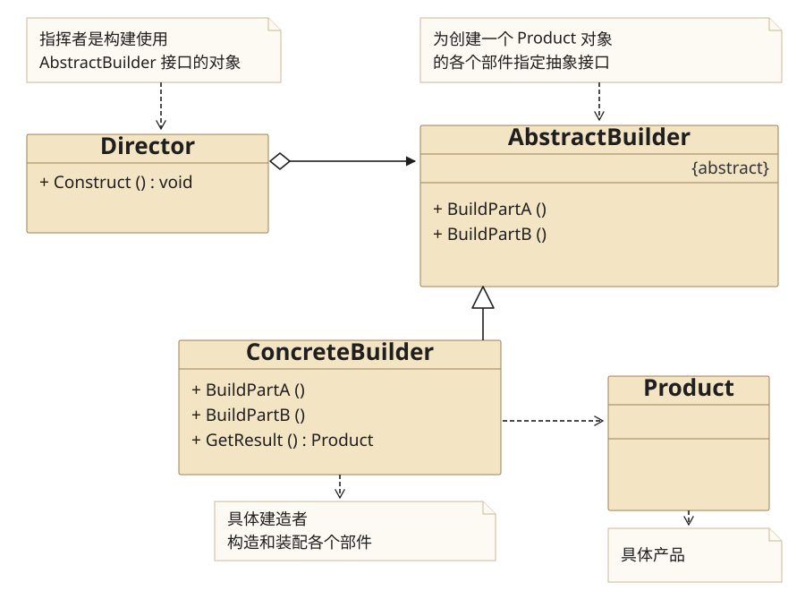
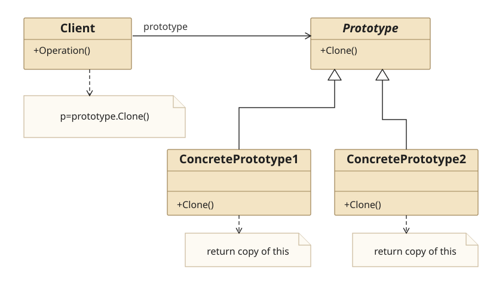
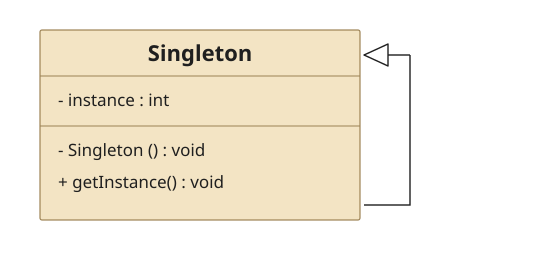

## 四、Builder Pattern

### 4.1 Definition

　　**建造者模式**将一个复杂对象的构建和它的实现分离,使得同样的构建过程可以创建不同的实现

### 4.2 Structure



* 建造者类Builder

  是为创建一个Product对象的各个部件指定的抽象接口

* 具体创建者ConcreteBuilder

  实现Builder接口,构造和装配各个部件.

* 产品类Product

* 指挥者Director

  构建一个使用Builder接口的对象

### 4.3 Usage

1. 什么时候使用建造者模式？

   它主要是用于创建一些复杂的对象,这些对象内部构造间的建造顺序通常是稳定的,但对象内部的构建通常面临着复杂的变化.

2. 使用建造者模式的好处

   建造者模式的好处就是使得建造代码与实现代码分离,由于建造者隐藏了 该产品是如何组装的,所以若需要改变一个产品的内部实现,只需要再定义一个具体的建造者就可以了

### 4.4 Example

**Src Downloads**  &rarr; [BuilderPattern.h](design-pattern/BuilderPattern.h) and [BuilderPatternClient.cpp](design-pattern/BuilderPatternClient.cpp)

```cpp
//============================
//BuilderPattern.h
//============================
#ifndef BUILDERPATTERN_H
#define BUILDERPATTERN_H

#include<iostream>
#include<vector>
using namespace std;

//Product class
class CProduct{
private:
    vector<string> mParts;
public:
    void add(string part){ mParts.push_back(part); }
    void show(){
        cout<<"Product Build------"<<endl;
        for(auto part : mParts)
            cout<<part<<endl;
    }
};

//abstract builder
class CBuilder{
public:
    virtual void buildPartA() = 0;
    virtual void buildPartB() = 0;
    virtual CProduct *getProduct() = 0;
};

//concrete builder 1
class CConcreteBuilder1 : public CBuilder{
private:
    CProduct *mpProduct;
public:
    CConcreteBuilder1(){ mpProduct = new CProduct(); }
    virtual ~CConcreteBuilder1(){
        if( mpProduct != nullptr ){
            delete mpProduct;
            mpProduct = nullptr;
        }
    }
    virtual void buildPartA(){ mpProduct->add("One"); }
    virtual void buildPartB(){ mpProduct->add("Two"); }
    virtual CProduct *getProduct(){ return mpProduct; }
};

//concrete builder 2
class CConcreteBuilder2 : public CBuilder{
private:
    CProduct *mpProduct;
public:
    CConcreteBuilder2(){ mpProduct = new CProduct(); }
    virtual ~CConcreteBuilder2(){
        if( mpProduct != nullptr ){
            delete mpProduct;
            mpProduct = nullptr;
        }
    }
    virtual void buildPartA(){ mpProduct->add("A"); }
    virtual void buildPartB(){ mpProduct->add("B"); }
    virtual CProduct *getProduct(){ return mpProduct; }
};

//director class
class CDirector{
public:
    void construct(CBuilder *builder){
        builder->buildPartA();
        builder->buildPartB();
    }
};

#endif // BUILDERPATTERN_H
```

```cpp
//============================
//BuilderPatternClient.cpp
//============================
#include "BuilderPattern.h"

int main(){

    CDirector *pDirector = new CDirector();

    CConcreteBuilder1 *pConcreteBuilder1 = new CConcreteBuilder1();
    CConcreteBuilder2 *pConcreteBuilder2 = new CConcreteBuilder2();

    cout<<"Direnctor Construct through ConcreteBuilder1"<<endl;
    pDirector->construct(pConcreteBuilder1);
    CProduct *pProduct = pConcreteBuilder1->getProduct();
    pProduct->show();
    cout<<endl;

    cout<<"Direnctor Construct through ConcreteBuilder2"<<endl;
    pDirector->construct(pConcreteBuilder2);
    pProduct = pConcreteBuilder2->getProduct();
    pProduct->show();
    cout<<endl;

    delete pDirector;
    delete pConcreteBuilder1;
    delete pConcreteBuilder2;
    return 1;
}
```

## 五、Prototype Pattern

### 5.1 Definition

　　**原型模式**用原型示例指定创建对象的种类,并且通过拷贝这些原型创建新的可定制的对象

### 5.2 Structure



### 5.3 Usage

* 原型模式实际上就是从一个对象再创建另外一个可定制的对象,而且不需要知道任何创建的细节.

* 一般在初始化的信息不发生变化的情况下,克隆是最好的办法.这既隐藏了对象创建的细节,又对性能是大大的提高.因为如果不用Clone,每次new,都需要执行一次构造函数,如果构造函数的执行时间很长,那么多次的执行这个初始化操作就实在是太低效了.

* 深复制把引用对象的变量指向复制过的新对象,而不是原有的被引用的对象.

### 5.4 Example

**Src Downloads**  &rarr; [PrototypePattern.h](design-pattern/PrototypePattern.h) and [PrototypePatternClient.cpp](design-pattern/PrototypePatternClient.cpp)

```cpp
//============================
//PrototypePattern.h
//============================
#ifndef PROTOTYPEPATTERN_H
#define PROTOTYPEPATTERN_H

#include <iostream>
using namespace std;

//abstract prototype
class CPrototype{
private:
    string mstrName;
public:
    CPrototype(string name=""):mstrName(name){}
    virtual ~CPrototype(){}
    void show(){ cout<<mstrName<<endl; }
    virtual CPrototype *clone() = 0;
};

//concrete prototype1
class CConcretePrototype1 : public CPrototype{
public:
    CConcretePrototype1(string name = ""):CPrototype(name){}
    virtual ~CConcretePrototype1(){}
    virtual CPrototype *clone(){
        CConcretePrototype1 *pConcretePrototype = new CConcretePrototype1();
        *pConcretePrototype = *this;
        return pConcretePrototype;
    }
};

//concrete prototype2
class CConcretePrototype2 : public CPrototype{
private:
    int sss;
public:
    CConcretePrototype2(string name = ""):CPrototype(name){}
    virtual ~CConcretePrototype2(){}
    virtual CPrototype *clone(){
        CConcretePrototype2 *pConcretePrototype = new CConcretePrototype2();
        *pConcretePrototype = *this;
        return pConcretePrototype;
    }
};

#endif // PROTOTYPEPATTERN_H
```

```cpp
//============================
//PrototypePatternClient.cpp
//============================
#include "PrototypePattern.h"

int main(){
    CPrototype *pPrototype = new CConcretePrototype1("Wai");
    CConcretePrototype2 *pConcretePrototype2 = (CConcretePrototype2*)pPrototype->clone();
    pPrototype->show();
    pConcretePrototype2->show();
    delete pPrototype;
    delete pConcretePrototype2;
    return 1;
}
```

```cpp
Wai
Wai
```

### 5.5 Example-Resume

**Src Downloads**  &rarr; [ResumePrototypePattern.h](design-pattern/ResumePrototypePattern.h) and [ResumePrototypePatternClient.cpp](design-pattern/ResumePrototypePatternClient.cpp)

```cpp
//============================
//ResumePrototypePattern.h
//============================
#ifndef RESUMEPROTOTYPEPATTERN_H
#define RESUMEPROTOTYPEPATTERN_H

#include<iostream>>
using namespace std;

//Work Experience class
class CWorkExperience{
private:
    string mStrWorkDate;
    string mStrCompany;
public:
    CWorkExperience(){}
    ~CWorkExperience(){}

    string getWorkDate(){ return mStrWorkDate; }
    string getCompany(){ return mStrCompany; }
    void setWorkDate(string strWorkDate){ mStrWorkDate = strWorkDate; }
    void setCompany(string strCompany){ mStrCompany = strCompany; }
    void display(){
        cout<<"Work Experience "<<endl;
        cout<<"  "<<mStrWorkDate<<"  "<<mStrCompany<<endl;
    }
};

//Abstract Prototype
class CPrototype{
protected:
    string mstrName;
    string mstrSex;
    string mstrAge;
public:
    virtual ~CPrototype(){}
    virtual void setPersonalInfo(string strSex,string strAge) = 0;
    virtual void setWorkExperience(string strWorkDate,string strCompany) = 0;
    virtual void display() = 0;
    virtual CPrototype *clone() = 0 ;
};

//Concrete Prototype
class CResume : public CPrototype{
private:
    CWorkExperience *mpWorkExperience;
public:
    CResume(string strName){
        mstrName = strName;
        mpWorkExperience = new CWorkExperience();
    }
    virtual ~CResume(){
        if( mpWorkExperience != nullptr){
            delete mpWorkExperience;
            mpWorkExperience = nullptr;
        }
    }

    virtual void setPersonalInfo(string strSex, string strAge){
        mstrSex = strSex;
        mstrAge = strAge;
    }
    virtual void setWorkExperience(string strWorkDate,string strCompany){
        mpWorkExperience->setWorkDate(strWorkDate);
        mpWorkExperience->setCompany(strCompany);
    }
    virtual void display(){
        cout<<"Name : "<<mstrName<<endl;
        cout<<"Age  : "<<mstrAge<<endl;
        mpWorkExperience->display();
    }
    virtual CResume *clone(){
        CResume *pResume = new CResume(this->mstrName);
        pResume->setPersonalInfo(this->mstrSex,this->mstrAge);
        pResume->setWorkExperience(this->mpWorkExperience->getWorkDate(),this->mpWorkExperience->getCompany());
        return pResume;
    }
};

#endif // RESUMEPROTOTYPEPATTERN_H
```

```cpp
//============================
//ResumePrototypePatternClient.cpp
//============================

#include "ResumePrototypePattern.h"

int main(){

    CPrototype *pResumeOne = new CResume("Wai");
    pResumeOne->setPersonalInfo("male","20");
    pResumeOne->setWorkExperience("1988-1999","XXX Company");

    CPrototype *pResumeTwo = pResumeOne->clone();
    pResumeTwo->setWorkExperience("1999-2000","YYY Company");

    CPrototype *pResumeThree = pResumeOne->clone();
    pResumeThree->setWorkExperience("2000-20001","ZZZ Company");

    pResumeOne->display();
    pResumeTwo->display();
    pResumeThree->display();

    delete pResumeOne;
    delete pResumeTwo;
    delete pResumeThree;
    return 1;
}
```

```cpp
Name : Wai
Age  : 20
Work Experience
  1988-1999  XXX Company
Name : Wai
Age  : 20
Work Experience
  1999-2000  YYY Company
Name : Wai
Age  : 20
Work Experience
  2000-20001  ZZZ Company
```

## 六、Singleton Pattern

### 6.1 Definition

　　**单例模式**保证一个类仅有一个实例,并提供一个访问他的全局访问点

### 6.2 Structure



### 6.3 Usage

* 懒汉模式,在需要时初始化,线程不安全,以时间换空间

* 饿汉模式,程序启动时初始化,线程安全,以空间换时间

### 6.4 Example-Lazy

* C\++规定,non-local static 对象的初始化发生在main函数执行之前

* 在C\++11之前,在多线程环境下local static对象的初始化并不是线程安全的,ocal static对象则不同,多个线程的控制流可能同时到达其初始化语句.

* C\++11规定,在一个线程开始local static 对象的初始化后完成初始化前,其他线程执行到这个local static对象的初始化语句就会等待,直到该local static 对象初始化完成.

**View** &rarr; [**More**](//blog.csdn.net/qq_35280514/article/details/70211845)

**Src Downloads**  &rarr; [LazySingletonPattern.h](design-pattern/LazySingletonPattern.h) and [LazySingletonPatternClient.cpp](design-pattern/LazySingletonPatternClient.cpp)

```cpp
//============================
//LazySingletonPattern.h
//============================
#ifndef SINGLETONPATTERN_H
#define SINGLETONPATTERN_H

#include<iostream>
#include<pthread.h>
using namespace std;

//Lazy Singleton Pattern-set mutex lock(before C++11)
class CLazySingleton{
public:
    static CLazySingleton& getInstance(){
        pthread_mutex_lock(&mutex);
        static CLazySingleton lazySingleton; //C++11标准下local static对象初始化在多线程条件下安全
        pthread_mutex_unlock(&mutex);
        return lazySingleton;
    }
    void eat(){ cout<<"I am mutex lock lazy and want to eat"<<endl; }
private:
    static pthread_mutex_t mutex;
private:
    CLazySingleton(){}
    CLazySingleton( const CLazySingleton&){}
    CLazySingleton &operator=(const CLazySingleton&){ return *this; }
    ~CLazySingleton(){}
};
#define MUTEX_LAZY_SINGLETON CLazySingleton::getInstance()

//Lazy Singleton Pattern-thread safe in C++11
class CMeyersSingleton{
public:
    static CMeyersSingleton& getInstance(){
        static CMeyersSingleton meyersSingleton;
        return meyersSingleton;
    }
    void drink(){ cout<<"I am meyers In c++11 lazy and want to drink "<<endl; }
private:
    CMeyersSingleton(){}
    ~CMeyersSingleton(){}
    CMeyersSingleton(const CMeyersSingleton&){}
    CMeyersSingleton &operator=(const CMeyersSingleton&){ return *this; }
};
#define C11_LAZY_SINGLETON CMeyersSingleton::getInstance()

#endif // SINGLETONPATTERN_H
```

```cpp
//============================
//LazySingletonPatternClient.cpp
//============================

#include "SingletonPattern.h"

pthread_mutex_t CLazySingleton::mutex = PTHREAD_MUTEX_INITIALIZER;

int main(){

    //mutex lock lazy singleton
    CLazySingleton::getInstance().eat();
    MUTEX_LAZY_SINGLETON.eat();

    //c++11 lazy singleton
    CMeyersSingleton::getInstance().drink();
    C11_LAZY_SINGLETON.drink();
    return 1;
}
```

### 6.5 Example-Hungry

**Src Downloads**  &rarr; [HungrySingletonPattern.h](design-pattern/HungrySingletonPattern.h) and [HungrySingletonPatternClient.cpp](design-pattern/HungrySingletonPatternClient.cpp)

```cpp
//============================
//HungrySingletonPattern.h
//============================
#ifndef HUNGRYSINGLETONPATTERN_H
#define HUNGRYSINGLETONPATTERN_H

#include <iostream>
using namespace std;

//singleton pattern- hungry
class CHungrySingleton{
public:
    void eat(){ cout<<" I am hungry and want to eat"<<endl; }
public:
    static CHungrySingleton hungrySingleton;
private:
    CHungrySingleton(){}
    ~CHungrySingleton(){}
    CHungrySingleton(const CHungrySingleton&){}
    CHungrySingleton &operator=(const CHungrySingleton&){ return *this; }
};

#define HUNGRY_SINGLETON CHungrySingleton::hungrySingleton

#endif // HUNGRYSINGLETONPATTERN_H
```

```cpp
//============================
//HungrySingletonPatternClient.cpp
//============================
#include "HungrySingletonPattern.h"

CHungrySingleton CHungrySingleton::hungrySingleton;

int main(){
    CHungrySingleton::hungrySingleton.eat();
    HUNGRY_SINGLETON.eat();
    return 1;
}
```


