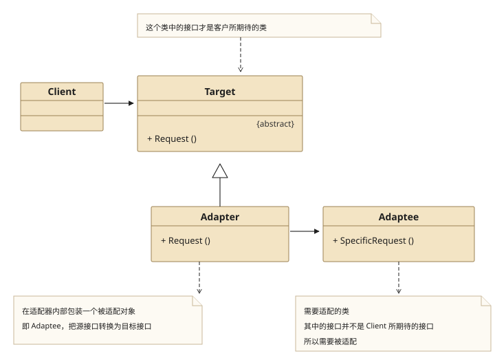
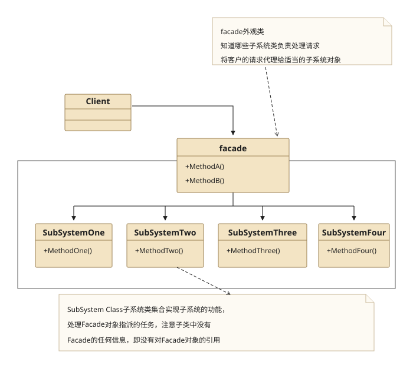
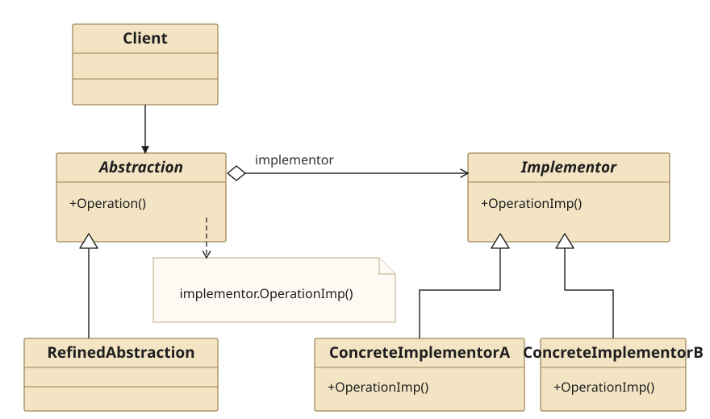

## 一、Adapter Pattern

### 1.1 Definition

　　**适配器模式**将一个类的接口转换成客户希望的另外一个接口.Adapter模式使得原来由于接口不兼容而不能一起工作的那些类可以一起工作.

### 1.2 Structure



* Target

  客户所期待的接口,Target可以是具体的或抽象的类,也可以是接口

* Adaptee

  需要适配的类

* Adapter

  通过在内部包装一个Adaptee对象,把源接口转换成目标接口

### 1.3 Usage

1. 在想使用一个已存在的类,但是如果他的接口,也就是它的方法和你的要求不相同时,就应该考虑用适配器模式.

2. 用了适配器模式,客户代码可以统一调用统一接口就行了,这样可以更简单,更直接,更紧凑.

3. 要在双方都不太容易修改的时候再使用适配器模式适配,而不是一有不同就使用它.

### 1.4 Example

**Src Downloads**  &rarr; [MinAdapterPattern.h](design-pattern/MinAdapterPattern.h) and [MinAdapterPatternClient.cpp](design-pattern/MinAdapterPatternClient.cpp)

```cpp
//============================
//MinAdapterPattern.h
//============================
#ifndef MINADAPTERPATTERN_H
#define MINADAPTERPATTERN_H

#include <iostream>
using namespace std;

//Target class
class CTarget{
public:
    virtual void request(){
        cout<<"Common Request"<<endl;
    }
};

//Adaptee class
class CAdaptee{
public:
    void specialRequest(){
        cout<<"Special Request"<<endl;
    }
};

//Adapter class
class CAdapter : public CTarget{
private:
    CAdaptee *mpDaptee;
public:
    virtual void request(){
        mpDaptee->specialRequest();
        CTarget::request();
    }
    CAdapter(){ mpDaptee = new CAdaptee(); }
    virtual ~CAdapter(){ delete mpDaptee; }
};

#endif // MINADAPTERPATTERN_H
```

```cpp
//============================
//MinAdapterPatternClient.cpp
//============================

#include "MinAdapterPattern.h"

int main(){
    CAdapter *pAdapter = new CAdapter();
    pAdapter->request();
    delete pAdapter;
    return 1;
}
```

### 1.5 Example-Foreign Center

**Src Downloads**  &rarr; [AdapterPattern.h](design-pattern/AdapterPattern.h) and [AdapterPatternClient.cpp](design-pattern/AdapterPatternClient.cpp)

```cpp
//============================
//AdapterPattern.h
//============================
#ifndef ADAPTERPATTERN_H
#define ADAPTERPATTERN_H

#include <iostream>
using namespace std;

//Target: Palyer-"运动员"
class CPlayer{
public:
    CPlayer(string strName){
        mStrName = strName;
    }
    ~CPlayer(){}
    virtual void attack() = 0;
    virtual void defense() = 0;
protected:
    string mStrName;
};

//adaptee : foreign center-"外籍中锋"
class CForeignCenter{
public:
    CForeignCenter(string strName){
        mStrName = strName;
    }
    void foreignAttack(){ cout<<"Foreign Center "<<mStrName<<" Attack!"<<endl; }
    void foreignDefense(){ cout<<"Foreign Center "<<mStrName<<" Defense!"<<endl; }
private:
    string mStrName;
};

//adapter: Translator-"翻译"
class CTranslator : public CPlayer{
public:
    CTranslator(string strName): CPlayer(strName){
        mpForeignCenter = new CForeignCenter(strName);
    }
    virtual ~CTranslator(){
        if( mpForeignCenter != nullptr){
            delete mpForeignCenter;
            mpForeignCenter = nullptr;
        }
    }
    virtual void attack(){ mpForeignCenter->foreignAttack(); }
    virtual void defense(){ mpForeignCenter->foreignDefense(); }
private:
    CForeignCenter *mpForeignCenter;
};

//common01: Forwards-"前锋"
class CForwards : public CPlayer{
public:
    CForwards(string strName) : CPlayer(strName){}
    virtual ~CForwards(){}
    virtual void attack(){ cout<<"Forwards "<<mStrName<<" Attack!"<<endl; }
    virtual void defense(){ cout<<"Forwards "<<mStrName<<" Defense!"<<endl; }
};

//common02: Center-"中锋"
class CCenter : public CPlayer{
public:
    CCenter(string strName) : CPlayer(strName){}
    virtual ~CCenter(){}
    virtual void attack(){ cout<<"Center "<<mStrName<<" Attack!"<<endl; }
    virtual void defense(){ cout<<"Center "<<mStrName<<" Defense!"<<endl; }
};

//common03: Guards-"后卫"
class CGuards : public CPlayer{
public:
    CGuards(string strName) : CPlayer(strName){}
    virtual ~CGuards(){}
    virtual void attack(){ cout<<"Guards "<<mStrName<<" Attack!"<<endl; }
    virtual void defense(){ cout<<"Guards "<<mStrName<<" Defense!"<<endl; }
};

#endif // ADAPTERPATTERN_H
```

```cpp
//============================
//AdapterPatternClient.cpp
//============================

#include "AdapterPattern.h"

int main(){

    CPlayer *pForward = new CForwards("XXX");
    pForward->attack();

    CPlayer *pGuard = new CGuards("YYY");
    pGuard->defense();

    CPlayer *pTranslator = new CTranslator("ZZZ");
    pTranslator->attack();
    pTranslator->defense();

    delete pForward;
    delete pGuard;
    delete pTranslator;

    return 1;
}
```

## 二、Facade Pattern

### 2.1 Definition

　　**外观模式**为子系统中的一组接口提供一个一致的界面,使用户使用起来更加方便.

### 2.2 Structure




### 2.3 Usage

* 首先,在设计初期阶段,应该要有意识的将不同的两个层分离

* 第二,在开发阶段,子系统往往因为不断的重构演化而变得越来越复杂,大多数的模式使用时也会产生很多很小的类,这本是好事儿,但是也给外部调用他们的用户程序带来了使用上的困难,增加外观Facade可以提供一个简单的接口,减少他们之间的依赖.

* 第三,在维护一个遗留的大型系统时,可能这个系统已经非常难以维护和扩展了,但因为它包含非常重要的功能,新的需求开发必须要依赖于它.此时用外观模式Facade也是非常合适的.

### 2.4 Example

**Src Downloads**  &rarr; [FacadePattern.h](design-pattern/FacadePattern.h) and [FacadePatternClient.cpp](design-pattern/FacadePatternClient.cpp)

```cpp
//============================
//FacadePattern.h
//============================
#ifndef FACADEPATTERN_H
#define FACADEPATTERN_H

#include <iostream>
using namespace std;

class CSubSysOne{
public:
    void methodOne(){ cout<<"Method One"<<endl; }
};

class CSubSysTwo{
public:
    void methodTwo(){ cout<<"Method Two"<<endl; }
};

class CSubSysThree{
public:
    void methodThree(){ cout<<"Method Three"<<endl; }
};

class CFacade{
private:
    CSubSysOne *mpSubSysOne;
    CSubSysTwo *mpSubSysTwo;
    CSubSysThree *mpSubSysThree;
public:
    CFacade(){
        mpSubSysOne = new CSubSysOne();
        mpSubSysTwo = new CSubSysTwo();
        mpSubSysThree = new CSubSysThree();
    }
    ~CFacade(){
        delete mpSubSysOne;
        delete mpSubSysTwo;
        delete mpSubSysThree;
    }
    void facadeMethod(){
        mpSubSysOne->methodOne();
        mpSubSysTwo->methodTwo();
        mpSubSysThree->methodThree();
    }
};

#endif // FACADEPATTERN_H
```

```cpp
//============================
//FacadePatternClient.cpp
//============================

#include "FacadePattern.h"

int main(){
    CFacade *pFacade = new CFacade();
    pFacade->facadeMethod();
    return 1;
}
```

## 三、Bridge Pattern

### 3.1 Definition

　　**桥接模式**将抽象部分与它的实现部分分离,使他们都可以独立地变化.

　　不是让抽象基类与具体类分离,而是现实系统可能有多角度分类,每一种分类都有可能变化.将这种多角度分离出来让它们独立变化,减少它们之间的耦合性.

### 3.2 Structure



### 3.3 Example

**Src Downloads**  &rarr; [BridgePattern.h](design-pattern/BridgePattern.h) and [BridgePatternClient.cpp](design-pattern/BridgePatternClient.cpp)

```cpp
//============================
//BridgePattern.h
//============================
#ifndef BRIDGEPATTERN_H
#define BRIDGEPATTERN_H

#include <iostream>
using namespace std;

//Implementor:手机软件抽象类
class CHandsetSoft{
public:
    virtual void run() = 0 ;
    virtual ~CHandsetSoft(){}
};

//ConcreteImplementorA: 手机游戏
class CHandsetGame : public CHandsetSoft {
public:
    virtual void run(){ cout<<"Run Handset Game"<<endl; }
    virtual ~CHandsetGame(){}
};

//ConcreteImplementorB: 手机通讯录
class CHandsetAddressList : public CHandsetSoft{
public:
    virtual void run(){ cout<<"Run Handset Address List"<<endl; }
    virtual ~CHandsetAddressList(){}
};

//Abstraction: 手机品牌抽象类
class CHandsetBrand{
protected:
    CHandsetSoft *mpHandsetSoft = nullptr;
public:
    void setHandsetSoft(CHandsetSoft *pHandsetSoft){
        if( mpHandsetSoft != nullptr){
            delete mpHandsetSoft;
            mpHandsetSoft = nullptr;
        }
        mpHandsetSoft = pHandsetSoft;
    }
    virtual void run() = 0 ;
    virtual ~CHandsetBrand(){
        if( mpHandsetSoft != nullptr ){
            delete mpHandsetSoft;
            mpHandsetSoft = nullptr;
        }
    }
};

//Redefine Abstraction: 手机品牌M
class CHandsetBrandM : public CHandsetBrand{
public:
    virtual void run(){
        mpHandsetSoft->run();
    }
};

//Redefine Abstraction: 手机品牌N
class CHandsetBrandN : public CHandsetBrand{
public:
    virtual void run(){
        mpHandsetSoft->run();
    }
};

#endif // BRIDGEPATTERN_H
```

```cpp
//============================
//BridgePatternClient.cpp
//============================

#include "BridgePattern.h"

int main(){
    cout<<"Handset Brand M :"<<endl;

    CHandsetBrand *pHandsetBrand = new CHandsetBrandM();
    pHandsetBrand->setHandsetSoft(new CHandsetGame());
    pHandsetBrand->run();

    pHandsetBrand->setHandsetSoft(new CHandsetAddressList());
    pHandsetBrand->run();

    delete pHandsetBrand;

    cout<<endl;
    cout<<"Handset Brand N :"<<endl;

    pHandsetBrand = new CHandsetBrandN();
    pHandsetBrand->setHandsetSoft(new CHandsetGame());
    pHandsetBrand->run();

    pHandsetBrand->setHandsetSoft(new CHandsetAddressList());
    pHandsetBrand->run();

    delete pHandsetBrand;
    return 1;
}
```

