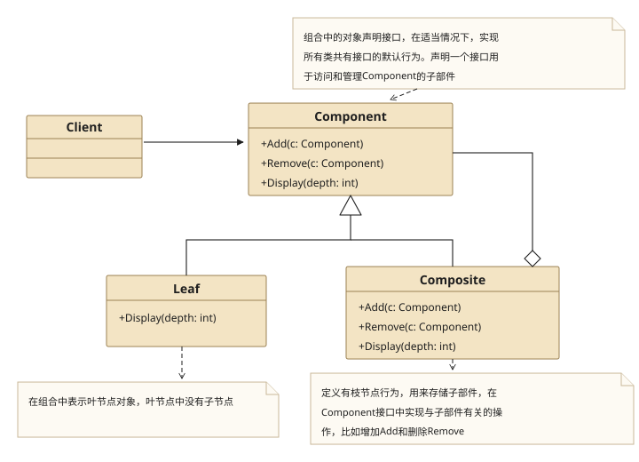
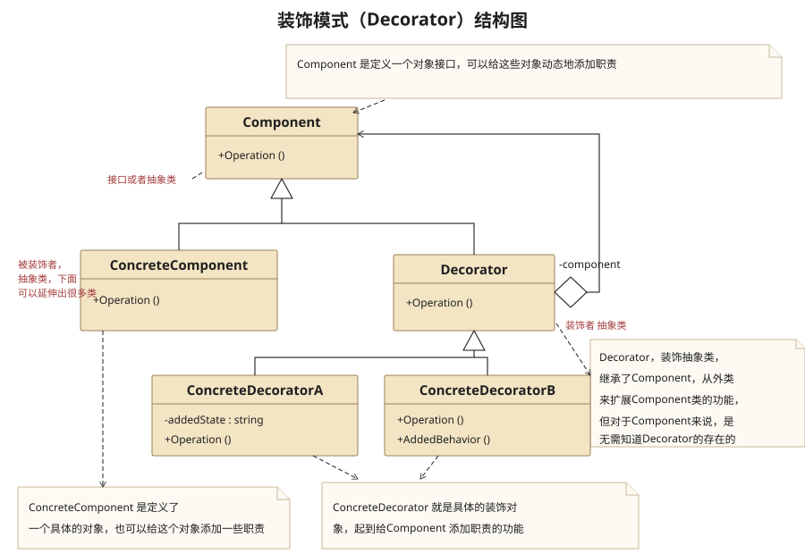
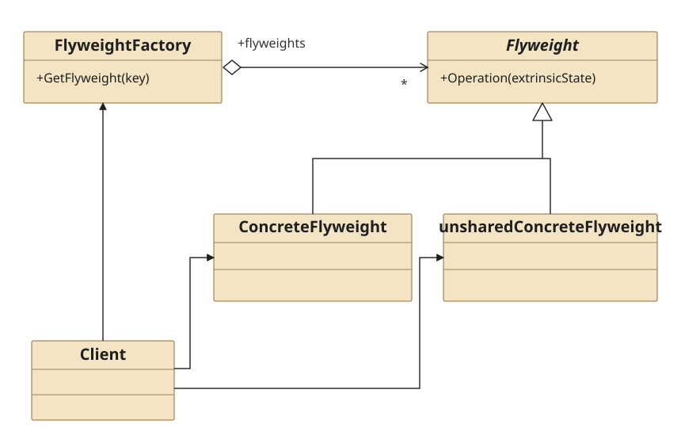
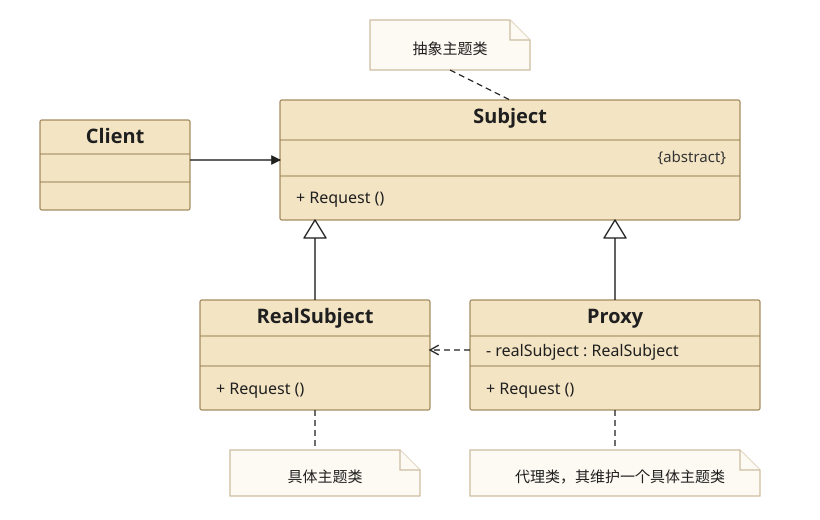

## 四、Composite Pattern

### 4.1 Definition

　　**组合模式**将对象组合成树形结构以表示“部分-整体”的层次结构.组合模式使得用户对单个对象和组合对象的使用具有一致性.

### 4.2 Structure



* Component

  为组合中的对象声明接口,在适当情况下,实现所有类共有接口的默认行为.声明一个接口用于访问和管理Component 的子部件.

* Leaf

  基本对象,在组合中是叶节点对象,叶节点没有子节点.

* Composite

  组合对象,定义有枝节点行为,用来存储子部件,在Component接口中实现与子部件有关的操作,比如增加Add和删除Remove.

### 4.3 Usage

1. 什么时候使用组合模式？

   当你发现需求中是体现部分与整体层次的结构时,以及你希望用户可以忽略组合对象与单个对象的不同,统一地使用组合结构中的所有对象时,就应该考虑用组合模式了.

2. 使用组合模式的好处

   * 组合模式定义了包含基本对象（Leaf）和组合对象（Composite）的类层次结构.基本对象可以被组合成更复杂的组合对象,而这个组合对象又可以被组合,这样不断地地柜下去,客户代码中,任何用到基本对象的地方都可以使用组合对象了.

   * 用户不用关心到底是处理一个叶子节点还是处理一个组合组件,也就不用为定义组合而写一些判断语句了.

   * 组合模式让客户可以一致的使用组合结构和单个对象

### 4.4 Example

**Src Downloads**  &rarr; [CompositePattern.h](design-pattern/CompositePattern.h) and [CompositePatternClient.cpp](design-pattern/CompositePatternClient.cpp)

```cpp
//============================
//CompositePattern.h
//============================
#ifndef COMPOSITEPATTERN_H
#define COMPOSITEPATTERN_H

#include <iostream>
#include <list>
#include <algorithm>

using namespace std;

//Component:抽象公司类
class CCompany{
protected:
    string mStrName;
public:
    CCompany(string strName):mStrName(strName){}
    virtual ~CCompany(){}
    virtual void add(CCompany *pCompany) = 0;
    virtual void remove(CCompany *pCompany) = 0;
    virtual void display(int nDepth) = 0 ;
    virtual void lineOfDuty() = 0;
    bool operator==(const CCompany &company) const{
        return this->mStrName == company.mStrName;
    }
};

//Composite: 具体公司类
class CConcreteCompany : public CCompany{
private:
    list<CCompany *> *mpChildMemberList;

public:
    CConcreteCompany(string strName):CCompany(strName){
        mpChildMemberList = new list<CCompany *>();
    }
    virtual ~CConcreteCompany(){
        for_each(mpChildMemberList->begin() , mpChildMemberList->end() , [=](CCompany *pCompany){ delete pCompany; pCompany = nullptr; } );
        delete mpChildMemberList;
    }
    virtual void add(CCompany *pCompany){
        mpChildMemberList->push_back(pCompany);
    }
    virtual void remove(CCompany  *pCompany){
        mpChildMemberList->remove(pCompany);
    }
    virtual void display(int nDepth){
        for( int i = 0 ; i < nDepth ; i++)
            cout<<"-";
        cout<<mStrName<<endl;
        for_each(mpChildMemberList->begin() , mpChildMemberList->end() , [=](CCompany *pCompany){ pCompany->display(nDepth+1); } );
    }
    virtual void lineOfDuty(){
        for_each(mpChildMemberList->begin() , mpChildMemberList->end() , [=](CCompany *pCompany){ pCompany->lineOfDuty(); } );
    }
};

//Leaf : 人力资源部
class CHRDepartment : public CCompany{
public:
    CHRDepartment(string strName) : CCompany(strName){}
    virtual ~CHRDepartment(){}

    virtual void add(CCompany* pCompany){}
    virtual void remove(CCompany* pCompany){}
    virtual void display(int nDepth){
        for( int i = 0 ; i < nDepth ; i++)
            cout<<"-";
        cout<<mStrName<<endl;
    }
    virtual void lineOfDuty(){
        cout<<mStrName<<" Staff Manage"<<endl;
    }
};

//Leaf: 财务部
class CFinanceDepartment : public CCompany{
public:
    CFinanceDepartment(string strName) : CCompany(strName){}
    virtual ~CFinanceDepartment(){}
    virtual void add(CCompany* pCompany){}
    virtual void remove(CCompany* pCompany){}
    virtual void display(int nDepth){
        for( int i = 0 ; i < nDepth ; i++)
            cout<<"-";
        cout<<mStrName<<endl;
    }
    virtual void lineOfDuty(){
        cout<<mStrName<<" Financial Manage"<<endl;
    }
};

#endif // COMPOSITEPATTERN_H
```

```cpp
//============================
//CompositePatternClient.cpp
//============================

#include "CompositePattern.h"

int main(){
    CCompany *pRootCompany = new CConcreteCompany("BeiJing Parent Company");
    pRootCompany->add(new CHRDepartment("BeiJing Parent Company HR"));
    pRootCompany->add(new CFinanceDepartment("BeiJing Parent Company Finance"));

    CCompany *pHDCompany = new CConcreteCompany("ShangHai Branch Company ");
    pHDCompany->add(new CHRDepartment("ShangHai Branch Company HR"));
    pHDCompany->add(new CFinanceDepartment("ShangHai Branch Company Finance"));

    pRootCompany->add(pHDCompany);

    CCompany *pNJCompany = new CConcreteCompany("NanJing Branch Company ");
    pNJCompany->add(new CHRDepartment("NanJing Branch Company HR"));
    pNJCompany->add(new CFinanceDepartment("NanJing Branch Company Finance"));

    pRootCompany->add(pNJCompany);

    CCompany *pHZCompany = new CConcreteCompany("HangZhou Branch Company ");
    pHZCompany->add(new CHRDepartment("HangZhou Branch Company HR"));
    pHZCompany->add(new CFinanceDepartment("HangZhou Branch Company Finance"));

    pRootCompany->add(pHZCompany);

    cout<<endl;
    cout<<"Company Organization: "<<endl;
    pRootCompany->display(1);

    cout<<"Responsibility: "<<endl;
    pRootCompany->lineOfDuty();

    cout<<endl<<endl;
    cout<<"Release NanJing Branch Company"<<endl;
    pRootCompany->remove(pNJCompany);

    cout<<endl<<endl;
    cout<<"Organization after release Nanjin branch company"<<endl;
    pRootCompany->display(1);

    delete pRootCompany;

    return 1;
}
```

```cpp
Company Organization:
-BeiJing Parent Company
--BeiJing Parent Company HR
--BeiJing Parent Company Finance
--ShangHai Branch Company
---ShangHai Branch Company HR
---ShangHai Branch Company Finance
--NanJing Branch Company
---NanJing Branch Company HR
---NanJing Branch Company Finance
--HangZhou Branch Company
---HangZhou Branch Company HR
---HangZhou Branch Company Finance
Responsibility:
BeiJing Parent Company HR Staff Manage
BeiJing Parent Company Finance Financial Manage
ShangHai Branch Company HR Staff Manage
ShangHai Branch Company Finance Financial Manage
NanJing Branch Company HR Staff Manage
NanJing Branch Company Finance Financial Manage
HangZhou Branch Company HR Staff Manage
HangZhou Branch Company Finance Financial Manage


Release NanJing Branch Company


Organization after release Nanjin branch company
-BeiJing Parent Company
--BeiJing Parent Company HR
--BeiJing Parent Company Finance
--ShangHai Branch Company
---ShangHai Branch Company HR
---ShangHai Branch Company Finance
--HangZhou Branch Company
---HangZhou Branch Company HR
---HangZhou Branch Company Finance
```

## 五、Decorator Pattern

### 5.1 Definition

　　**装饰模式**动态地给一个对象添加一些额外的职责(不重要的功能,只是偶然一次要执行),就增加功能来说,装饰模式比生成子类更为灵活.

### 5.2 Structure



* Component

  是定义一个对象,可以给这些对象动态地添加职责

* ConcreteComponent

  是定义了一个具体的对象,也可以给这个对象增加一些职责.

* Decorator

  装饰抽象类,继承了Component,从外类来扩展Component类的功能,但是对于Component来说,是无需知道Decorator的存在的.

* ConcreteDecorator

  具体的装饰对象,起到给Component添加职责的作用.

### 5.3 Usage

1. 什么时候使用装饰模式？

   * 需要在内部组装完成再显示出来的情况.

   * 类似于建造者模式,但是建造者模式的要求建造过程必须是稳定的,而装饰模式的建造过程是不稳定的,可以有各种各样的组合方式

   * 我们需要把所需的功能按正确的顺序串联起来进行控制.

2. 使用装饰模式的好处

   * 把类的装饰功能从类中搬移去除,这样可以简化原有的类.

   * 有效地把类的核心职责和装饰功能区分开来,而且可以去除相关类中重复的装饰逻辑.

### 5.4 Example

**Src Downloads**  &rarr; [DecoratorPattern.h](design-pattern/DecoratorPattern.h) and [DecoratorPatternClient.cpp](design-pattern/DecoratorPatternClient.cpp)

```cpp
//============================
//DecoratorPattern.h
//============================
#ifndef DECORATORPATTERN_H
#define DECORATORPATTERN_H

#include <iostream>
using namespace std;

//Componet
class CPerson{
public:
    CPerson(){}
    CPerson(string strName):mStrName(strName){}
    virtual ~CPerson(){}
    virtual void show(){ cout<<"Decorate "<<mStrName<<endl; }
private:
    string mStrName;
};

//Decorator
class CFinery : public CPerson{
public:
    virtual ~CFinery(){}
    void decorator(CPerson *pComponet){ mpComponent = pComponet; }
    void show(){ mpComponent->show(); }
protected:
    CPerson *mpComponent;
};

//ConcreteDecorator
class CTShirts : public CFinery{
public:
    void show(){
        cout<<"T Shirts"<<endl;
        CFinery::show();
    }
};

//ConcreteDecorator
class CTrouser : public CFinery{
public:
    void show(){
        cout<<"Trouser"<<endl;
        CFinery::show();
    }
};

//ConcreteDecorator
class CBigTrouser : public CFinery{
public:
    void show(){
        cout<<"Big Trouser"<<endl;
        CFinery::show();
    }
};

//ConcreteDecorator
class CSneakers : public CFinery{
public:
    void show(){
        cout<<"Sneakers"<<endl;
        CFinery::show();
    }
};

//ConcreteDecorator
class CSuit : public CFinery{
public:
    void show(){
        cout<<"Suit"<<endl;
        CFinery::show();
    }
};

//ConcreteDecorator
class CTie : public CFinery{
public:
    void show(){
        cout<<"Tie"<<endl;
        CFinery::show();
    }
};

//ConcreteDecorator
class CLeatherShoes : public CFinery{
public:
    void show(){
        cout<<"LeatherShoes"<<endl;
        CFinery::show();
    }
};
#endif // DECORATORPATTERN_H

```

```cpp
//============================
//DecoratorPatternClient.cpp
//============================

#include "DecoratorPattern.h"

int main(){
    CPerson *pComponent = new CPerson("Cai");

    cout<<"First Decorator: "<<endl;
    CSneakers *pSneaker = new CSneakers();
    CBigTrouser *pBigTrouser = new CBigTrouser();
    CTShirts *pTShirts = new CTShirts();

    pSneaker->decorator(pComponent);
    pBigTrouser->decorator(pSneaker);
    pTShirts->decorator(pBigTrouser);

    pTShirts->show();

    delete pSneaker;
    delete pBigTrouser;
    delete pTShirts;

    cout<<endl;
    cout<<"Second Decorator: "<<endl;
    CLeatherShoes *pLeatherShoes = new CLeatherShoes();
    CTie *pTie = new CTie();
    CSuit *pSuit = new CSuit();

    pLeatherShoes->decorator(pComponent);
    pTie->decorator(pLeatherShoes);
    pSuit->decorator(pTie);

    pSuit->show();

    delete pSuit;
    delete pTie;
    delete pLeatherShoes;
    delete pComponent;
    return 1;
}
```

```cpp
First Decorator:
T Shirts
Big Trouser
Sneakers
Decorate Cai

Second Decorator:
Suit
Tie
LeatherShoes
Decorate Cai
```

## 六、Flyweight Pattern

### 6.1 Definition

　　**享元模式**运用共享技术有效地支持大量细粒度的对象(对于C\++来说就是共用同一内存,对象指向同一个地方)

### 6.2 Structure



* Flyweight类

  所有具体享元类的超类或接口,通过这个接口,Flyweight可以接受并作用于外部状态.

* ConcreteFlyweight类

  继承Flyweight超类或实现Flyweight接口,并为内部状态增加存储空间.

* UnsharedConcreteFlyweight

  是指那些不需要共享的Flyweight子类.因为Flyweight接口共享成为可能,但是它并不强制共享.

* FlyweightFactory

  享元工厂,用来创建并管理Flyweight对象.它主要是用来确保合理地共享Flyweight,当用户请求一个Flyweight时,FlyweightFactory对象提供一个已创建的实例或者创建一个（如果不存在的话）.

### 6.3 Usage

1. 什么时候使用享元模式？

   如果一个应用程序使用了大量的对象,而大量的这些对象造成了很大的存储开销时就应该考虑使用;还有就是对象的大多数状态可以外部状态,如果删除对象的外部状态,那么可以用相对较少的共享对象取代很多组对象,此时可以考虑使用享元模式.

2. 使用享元模式的好处

   享元模式可以避免大量非常相似类的开销.在程序设计中,有时需要生成大量细粒度的类实例来表示数据.如果能发现这些实例除了几个参数外基本上都是相同的,有时就能够大幅度的减少需要实例化的类的数量.如果能把那些参数移到类实例的外面,在方法调用时将它们传递进来,就可以通过共享大幅度地减少单个实例的数目.

   也就是说,享元模式Flyweight执行时所需的状态是有内部的也可能有外部的,内部状态存储于ConcreteFlyweight对象之中,而外部对象则应该考虑由客户端对象存储或计算,当调用Flyweight对象的操作时,将该状态传递给它.

### 6.4 Example

**Src Downloads**  &rarr; [FlyweightPattern.h](design-pattern/FlyweightPattern.h) and [FlyweightPatternClient.cpp](design-pattern/FlyweightPatternClient.cpp)

```cpp
//============================
//FlyweightPattern.h
//============================
#ifndef FLYWEIGHTPATTERN_H
#define FLYWEIGHTPATTERN_H

#include <iostream>
#include <vector>
#include <algorithm>
using namespace std;

//user class
class CUser{
public:
    CUser(string strName):mStrName(strName){}
    string getName(){ return mStrName; }
private:
    string mStrName;
};

//flyweight class
class CWebsite{
public:
    virtual void use(CUser user) = 0;
    virtual string getCategory(){ return "Empty website";}
    virtual ~CWebsite(){}
};

//concreteFlyweight class
class CConcreteWebsite:public CWebsite{
public:
    CConcreteWebsite(string strCategory):mStrCategory(strCategory){}
    virtual void use(CUser user){
        cout<<"website category: "<<mStrCategory<<" User :"<<user.getName()<<endl;
    }
    virtual string getCategory(){ return mStrCategory; }
    virtual ~CConcreteWebsite(){}
private:
    string mStrCategory;
};

//unshareConcreteFlyweight class
class UnShareWebsite:public CWebsite{
public:
    UnShareWebsite(string strCategory):mStrCategory(strCategory){}
    virtual void use(CUser user){
        cout<<"website category: "<<mStrCategory<<" User :"<<user.getName()<<endl;
    }
    virtual ~UnShareWebsite(){}
private:
    string mStrCategory;
};

//flyweight factory class
class CWebsiteFactory{
public:
    CWebsiteFactory(){}
    virtual ~CWebsiteFactory(){
        for_each(mWebsiteVector.begin(),mWebsiteVector.end(),[&](CWebsite *pWebsitePair){ delete pWebsitePair; });
    }

    CWebsite *getWebsiteCategory(string strCatetory){
        for (auto pWebsite:mWebsiteVector ){
            if(pWebsite->getCategory() == strCatetory)
                return pWebsite;
        }
        CWebsite *pWebsite = new CConcreteWebsite(strCatetory);
        mWebsiteVector.push_back(pWebsite);
        return pWebsite;
    }
private:
    vector<CWebsite *> mWebsiteVector;
};

#endif // FLYWEIGHTPATTERN_H
```

```cpp
//============================
//FlyweightPatternClient.cpp
//============================
#include "FlyweightPattern.h"

int main(){
    CWebsiteFactory *pWebsiteFactory = new CWebsiteFactory();

    CWebsite *pShowWebsite = pWebsiteFactory->getWebsiteCategory("Product Show");
    pShowWebsite->use(CUser("Cai"));

    pShowWebsite = pWebsiteFactory->getWebsiteCategory("Product Show");
    pShowWebsite->use(CUser("BigBird"));

    delete pShowWebsite;

    CWebsite *pUnshareWebsite = new UnShareWebsite("Test");
    pUnshareWebsite->use(CUser("QA"));
    delete pUnshareWebsite;

    return 1;
}
```

```cpp
website category: Product Show User :Cai
website category: Product Show User :BigBird
website category: Test User :QA
```

## 七、Proxy Pattern

### 7.1 Definition

　　**代理模式**为其他对象提供一种代理以控制对这个对象的访问.根本原理:代理模式其实就是在访问对象的时候引入了一定程度的间接性,因为这种间接性,可以附加多种用途.

### 7.2 Structure



* 远程代理

  为一个对象在不同的地址空间提供局部代表.这样可以隐藏一个对象存在于不同地址空间的事实.

* 虚拟代理

  根据需要创建开销很大的对象.通过他来存放实例化需要很长时间的真实对象.例如:图片加载的时候.

* 安全代理

  用来控制真实对象访问时的权限

* 智能指引

  当调用真实的对象的时候,代理处理另外一些事.

### 7.3 Example

**Src Downloads**  &rarr; [ProxyPattern.h](design-pattern/ProxyPattern.h) and [ProxyPatternClient.cpp](design-pattern/ProxyPatternClient.cpp)

```cpp
//============================
//ProxyPattern.h
//============================
#ifndef PROXYPATTERN_H
#define PROXYPATTERN_H

#include <iostream>
using namespace std;

//interface
class CInterface{
public:
    virtual void request() = 0;
};

//realized class
class CRealClass : public CInterface{
public:
    virtual void request(){
        cout<<"Real request"<<endl;
    }
};

//proxy class
class CProxy : public CInterface{
public:
    CProxy(){ mpRealClass = nullptr; }
    virtual void request(){
        if( mpRealClass == nullptr )
            mpRealClass = new CRealClass();
        mpRealClass->request();
        delete mpRealClass;
        mpRealClass = nullptr;
    }
private:
    CRealClass *mpRealClass;
};

#endif // PROXYPATTERN_H
```

```cpp
//============================
//ProxyPatternClient.cpp
//============================

#include "ProxyPattern.h"

int main(){
    CProxy *pProxy = new CProxy();
    pProxy->request();
    delete pProxy;
    pProxy = nullptr;
    return 1;
}
```

