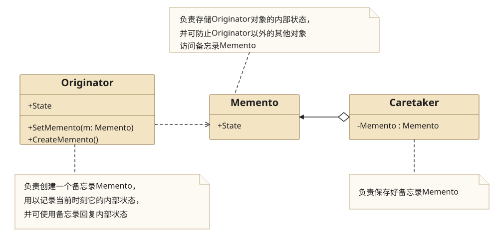
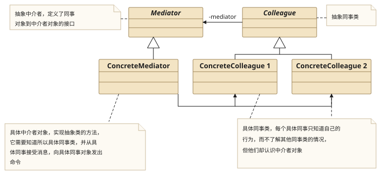
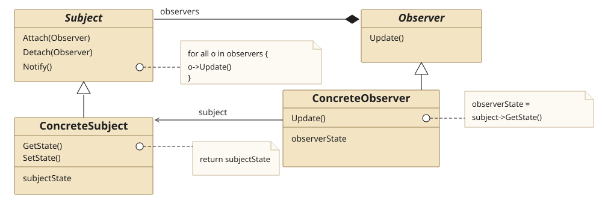

## 一、Memento Pattern

### 1.1 Definition

　　**备忘录模式**在不破坏封装性的前提下,捕获一个对象的内部状态,并在该对象之外保存这个状态.这样以后就可将对象恢复到原先保存的状态.

### 1.2 Structure



* Originator(发起人)

  负责创建一个Memento,用以记录当前时刻它的内部状态,并可以使用备忘录恢复内部状态.Originator可以根据需要决定Memento存储Originator的哪些内部状态.

* Memento(备忘录)

  负责存储Originator对象的内部状态,并可以防止Originator以外的其他对象访问备忘录Memento.备忘录有两个接口,Caretaker只能看到备忘录的窄接口,他只能将备忘录传递给其他对象.Originator能够看到一个宽接口,允许它访问先前状态所需的所有数据.

* Caretaker(管理者)

  负责保存包备忘录Memento,不能对备忘录的内容进行操作或检查

### 1.3 Usage

1. 什么时候使用？

   Memento模式比较适用于功能比较复杂的,但需要维护或记录属性历史的类,或者需要保存的属性只是众多属性中的一小部分时,Originator可以根据保存的Memento信息还原到迁移状态.

2. 与命令模式的关系？

   如果在某个系统中使用命令模式时,需要实现命令的撤销功能,那么命令模式可以使用备忘录模式来存储可撤销操作的状态.

### 1.4 Example

**Src Downloads**  &rarr; [MementoPattern.h](design-pattern/MementoPattern.h) and [MementoPatternClient.cpp](design-pattern/MementoPatternClient.cpp)

```cpp
//============================
//MementoPattern.h
//============================
#ifndef MEMENTOPATTERN_H
#define MEMENTOPATTERN_H

#include <iostream>
using namespace std;

//Memento类,备忘录,此处为角色状态存储箱RoleStateMemento class
class CRoleStateMemento{
public:
    CRoleStateMemento(int nVitality,int nAttrack,int nDefence):mVitality(nVitality),mAttrack(nAttrack),mDefence(nDefence){}

    void setVitality(int nVitality){ mVitality = nVitality; }
    int getVitality(){ return mVitality; }

    void setAttrack(int nAttrack){ mAttrack = nAttrack; }
    int getAttrack(){ return mAttrack; }

    void setDefence(int nDefence){ mDefence = nDefence; }
    int getDefence(){ return mDefence; }
private:
    int mVitality;
    int mAttrack;
    int mDefence;
};

//Originator,发起人,此处为游戏角色,GameRole class
class CGameRole{
public:
    CGameRole(){ mVitality = 100; mAttrack = 100 ; mDefence = 100; }
    void fight(){ mVitality = 0; mAttrack = 0 ; mDefence = 0; }
    void display(){
        cout<<"Vitality: "<<mVitality<<endl;
        cout<<"Attrack: "<<mAttrack<<endl;
        cout<<"Defence: "<<mDefence<<endl;
    }
    CRoleStateMemento saveState(){ return CRoleStateMemento(mVitality, mAttrack, mDefence);}
    void resumeState(CRoleStateMemento *pRoleMemento){
        mVitality = pRoleMemento->getVitality();
        mAttrack = pRoleMemento->getAttrack();
        mDefence = pRoleMemento->getDefence();
    }

    void setVitality(int nVitality){ mVitality = nVitality; }
    int getVitality(){ return mVitality; }

    void setAttrack(int nAttrack){ mAttrack = nAttrack; }
    int getAttrack(){ return mAttrack; }

    void setDefence(int nDefence){ mDefence = nDefence; }
    int getDefence(){ return mDefence; }
private:
    int mVitality;
    int mAttrack;
    int mDefence;
};

//Caretaker,管理者,此处为游戏角色管理类,RoleStateCaretaker class
class CRoleStateCaretaker{
public:
    CRoleStateCaretaker(): mpRoleStateMemento(nullptr){}
    ~CRoleStateCaretaker(){
        if( mpRoleStateMemento != nullptr){
            delete mpRoleStateMemento;
            mpRoleStateMemento = nullptr;
        }
    }

    void setRoleMemento(CRoleStateMemento *pRoleStateMemento){ mpRoleStateMemento = pRoleStateMemento; }
    CRoleStateMemento *getRoleMemento(){ return mpRoleStateMemento; }
private:
    CRoleStateMemento *mpRoleStateMemento;
};


#endif // MEMENTOPATTERN_H
```

```cpp
//============================
//MementoPatternClient.cpp
//============================
#include "MementoPattern.h"

int main(){
    cout<<"original status: "<<endl;
    CGameRole *pJetLi = new CGameRole();
    pJetLi->display();

    //save status
    CRoleStateCaretaker *pRoleStateCaretaker = new CRoleStateCaretaker();
    CRoleStateMemento roleStateMemento = pJetLi->saveState();
    pRoleStateCaretaker->setRoleMemento( &roleStateMemento ) ;

    cout<<endl;
    cout<<"Fighting status"<<endl;
    pJetLi->fight();
    pJetLi->display();

    cout<<endl;
    cout<<"resume status"<<endl;
    pJetLi->resumeState( pRoleStateCaretaker->getRoleMemento() );
    pJetLi->display();

    delete pRoleStateCaretaker;
    delete pJetLi;
    return 1;
}
```

```cpp
original status:
Vitality: 100
Attrack: 100
Defence: 100

Fighting status
Vitality: 0
Attrack: 0
Defence: 0

resume status
Vitality: 100
Attrack: 100
Defence: 100
```

## 二、Mediator Pattern

### 2.1 Definition

　　**中介者模式**用一个中介对象来封装一系列的对象交互.中介者使各对象不需要显示地相互引用,从而使其耦合松散,而且可以独立地改变它们之间的交互.

### 2.2 Structure



* Colleague

  抽象同事类

* ConcreteClleague

  具体同事类,每个具体同事只知道自己的行为,而不了解其他同事类的情况,但它们却都认识中介者对象.

* Mediator

  抽象中介者,定义了同事对象到中介者对象的接口

* ConcreteMediator

  具体中介者对象,实现抽象类的方法,它需要知道所有具体同事类,并从具体同事接收消息,向具体同事对象发出命令.

### 2.3 Usage

1. 中介者模式的优点

   * Mediator的出现减少了各个Colleague的耦合,使得可以独立地改变和复用各个Colleague,比如任何国家的改变不会影响到其他国家,而只是与安理会发生变化.

   * 由于把对象如何协作进行了抽象,将中介作为一个独立的概念并将其封装起在一个对象中,这样关注的对象就从对象各自本身的行为转移到他们之间的交互上来,也就是站在一个更宏观的角度去看待系统.

2. 中介者模式的缺点？

   由于ConcreteMediator控制了集中化,于是就把交互复杂性变为了中介者的复杂性,这就使得中介者会变得比任何一个ConcreteColleague都复杂.

3. 中介者模式的用途

   中介者模式一般应用于一组对象以定义良好但是复杂的方式进行通信的场合,以及想定制一个分布在多个类中的行为,而又不想生成太多的子类的场合.

### 2.4 Example

**Src Downloads**  &rarr; [MediatorPattern.h](design-pattern/MediatorPattern.h) and [MediatorPatternClient.cpp](design-pattern/MediatorPatternClient.cpp)

```cpp
//============================
//MediatorPattern.h
//============================
#ifndef MEDIATORPATTERN_H
#define MEDIATORPATTERN_H

#include <iostream>
using namespace std;

//mediator class : abstract
class CColleague;
class CMediator{
public:
    virtual void send(string strMsg,CColleague *pColleague ) = 0;
};

//Colleague class: abstract
class CColleague{
public:
    CColleague(CMediator *pMediator):mpMediator(pMediator){}
protected:
    CMediator *mpMediator;
};

//Concrete Colleague class A
class CConcreteColleagueA : public CColleague{
public:
    CConcreteColleagueA(CMediator *pMediator):CColleague(pMediator){}
    void send(string strMsg){
        mpMediator->send(strMsg,this);
    }
    void notify(string strMsg){ cout<<"Colleague A get Message : "<<strMsg<<endl; }
};

//Concrete Colleague class B
class CConcreteColleagueB : public CColleague{
public:
    CConcreteColleagueB(CMediator *pMediator):CColleague(pMediator){}
    void send(string strMsg){
        mpMediator->send(strMsg,this);
    }
    void notify(string strMsg){ cout<<"Colleague B get Message : "<<strMsg<<endl; }
};

//concrete mediator class
class CConcreteMediator : public CMediator{
public:
    virtual void send(string strMsg, CColleague* pColleague){
        if( pColleague == mpColleagueA)
            mpColleagueA->notify(strMsg);
        else
            mpColleagueB->notify(strMsg);
    }
    void setConcreteColleagueA(CConcreteColleagueA *pConcreteColleagueA){ mpColleagueA = pConcreteColleagueA; }
    void setConcreteColleagueB(CConcreteColleagueB *pConcreteColleagueB){ mpColleagueB = pConcreteColleagueB; }
private:
    CConcreteColleagueA *mpColleagueA;
    CConcreteColleagueB *mpColleagueB;
};

#endif // MEDIATORPATTERN_H
```

```cpp
//============================
//MediatorPatternClient.cpp
//============================

#include "MediatorPattern.h"

int main(){
    CConcreteMediator *pConcreteMediator = new CConcreteMediator();

    //让同事认识中介
    CConcreteColleagueA *pColleagueA = new CConcreteColleagueA(pConcreteMediator);
    CConcreteColleagueB *pColleagueB = new CConcreteColleagueB(pConcreteMediator);

    //让中介认识同事
    pConcreteMediator->setConcreteColleagueA(pColleagueA);
    pConcreteMediator->setConcreteColleagueB(pColleagueB);

    pColleagueA->send("Are you OK?");
    pColleagueB->send("very fine");
    return 1;
}

```

```cpp
Colleague A get Message : Are you OK?
Colleague B get Message : very fine
```

## 三、Observer Pattern

### 3.1 Definition

　　**观察者模式**定义了一种一对多的依赖关系,让多个观察者对象同时监听某一主题对象.这个主题对象在状态发生变化时,会通知所有观察者对象,使他们能够自动更新自己.

### 3.2 Structure



* Subject类

  可以翻译为主题或者抽象通知者,一般用一个抽象类或者一个接口实现.他把所有对观察者对象的引用保存在一个聚集里,每个主题都可以有任何数量的观察者.抽象主题提供一个接口,可以增加和删除观察者对象.

* Observer类

  抽象观察者,为所有的具体观察者定义一个接口,在得到主题的通知时更新自己.这个接口叫做更新接口.抽象观察者一般用一个抽象类或者一个接口实现.更新接口通常包含一个Update()方法,这个方法叫做更新方法.

* ConcreteSubject类

  叫做具体主题或者具体通知者,将有关状态存入具体观察者对象；在具体主题的内部状态改变时,给所有登记过的观察者发出通知.

* ConcreteObserver类

  具体观察者,实现抽象观察者角色所要求的更新接口,以便使本身的状态与主题的状态相协调.具体观察者角色可以保存一个指向具体主题对象的引用.

### 3.3 Usage

1. 什么时候用观察者模式

   * 当一个对象的改变需要同时改变其他对象的时候

   * 而且不知道具体有多少对象有待改变时,应该考虑使用观察者模式；

   * 当一个抽象模型有两个方面,其中一方面依赖于另一方面,这时用观察者模式可以将这两者封装在独立的对象中使他们各自独立地改变和复用.

### 3.4 Example

**Src Downloads**  &rarr; [ObserverPattern.h](design-pattern/ObserverPattern.h) and [ObserverPatternClient.cpp](design-pattern/ObserverPatternClient.cpp)

```cpp
//============================
//ObserverPattern.h
//============================
#ifndef OBSERVERPATTERN_H
#define OBSERVERPATTERN_H

#include <iostream>
#include <vector>
#include <algorithm>
using namespace std;

//Subject抽象通知者或者主题
class CObserver;
class CSubject{
public:
    virtual void attach(CObserver* pObserver) = 0;
    virtual void detach(CObserver* pObserver) = 0;
    virtual void notify() = 0;
    string getSujectState(){ return mStrSubjectState; }
    void setSubjectState(string strSubjectState){ mStrSubjectState = strSubjectState; }
private:
    string mStrSubjectState;
};

//Observer,抽象观察者
class CObserver{
public:
    CObserver(){}
    CObserver(string strName,CSubject *pSubject):mStrName(strName),mpSubject(pSubject){}
    virtual void update() = 0;
    bool operator==(const CObserver &observer) const{
        return (mStrName==observer.mStrName && mpSubject == observer.mpSubject);
    }
protected:
    string mStrName;
    CSubject *mpSubject;
};

//ConcreteSubject,具体通知者或者具体主题
class CBoss : public CSubject{
public:
    virtual void attach(CObserver* pObserver){
        mObserverVector.push_back(pObserver);
    }
    virtual void detach(CObserver* pObserver){
        for(auto it = mObserverVector.begin() ; it != mObserverVector.end(); ){
            if( *it == pObserver){
                mObserverVector.erase(it);
            }
            else
                it++;
        }
    }
    virtual void notify(){
//        for(auto it = mObserverVector.begin() ; it != mObserverVector.end(); it++){
//            (*it)->update();
//        }
        for_each(mObserverVector.begin(),mObserverVector.end(),[](CObserver * it){ it->update(); } );
    }
private:
    string mStrAction;
    vector<CObserver *> mObserverVector;
};

//ConcreteObserver,具体观察者,股票观察者
class CStockObserver:public CObserver{
public:
    CStockObserver(){}
    CStockObserver(string strName,CSubject *pSubject):CObserver(strName,pSubject){}
    void update(){
        cout<<mpSubject->getSujectState()<<" "<<mStrName<<" Close stock,Continue work"<<endl;
    }
};

//ConcreteObserver,具体观察者,NBA观察者
class CNBAObserver:public CObserver{
public:
    CNBAObserver(){}
    CNBAObserver(string strName,CSubject *pSubject):CObserver(strName,pSubject){}
    void update(){
        cout<<mpSubject->getSujectState()<<" "<<mStrName<<" Close NBA,Continue work"<<endl;
    }
};

#endif // OBSERVERPATTERN_H
```

```cpp
//============================
//ObserverPatternClient.cpp
//============================
#include "ObserverPattern.h"

int main(){
    //通知者
    CSubject *pSubject = new CBoss();

    //观察者
    CObserver *pObserverA = new CStockObserver("Colleague A",pSubject);
    CObserver *pObserverB = new CStockObserver("Colleague B",pSubject);
    CObserver *pObserverC = new CNBAObserver("Colleague C",pSubject);
    CObserver *pObserverD = new CNBAObserver("Colleague D",pSubject);

    //将4个观察者都加入到通知者的通知队列中
    pSubject->attach(pObserverA);
    pSubject->attach(pObserverB);
    pSubject->attach(pObserverC);
    pSubject->attach(pObserverD);

    //不通知某人
    pSubject->detach(pObserverC);

    //通知者状态改变
    pSubject->setSubjectState("Boss Come");

    //通知所有人
    pSubject->notify();

    delete pSubject;
    delete pObserverA;
    delete pObserverB;
    delete pObserverC;
    delete pObserverD;

    return 1;
}
```

```cpp
Boss Come Colleague A Close stock,Continue work
Boss Come Colleague B Close stock,Continue work
Boss Come Colleague D Close NBA,Continue work
```

