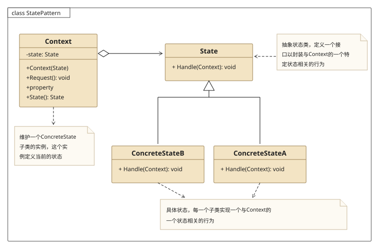
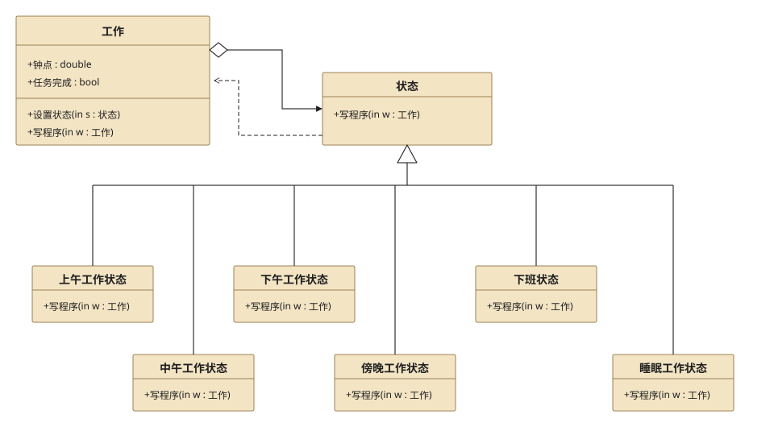
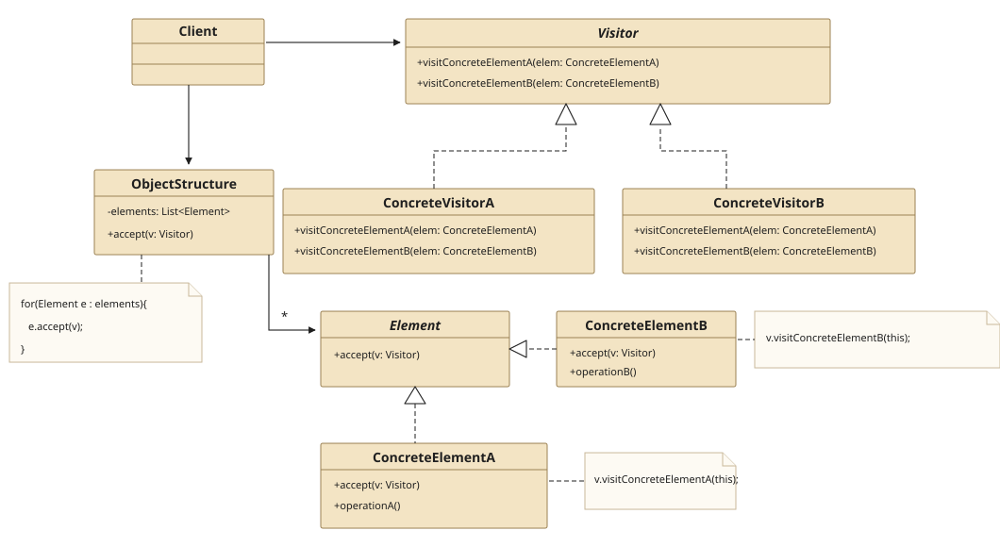
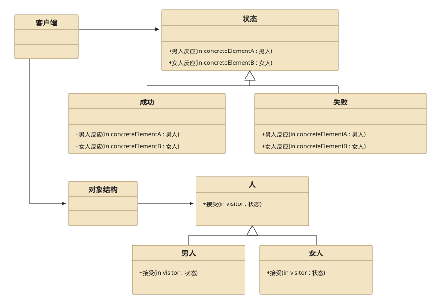
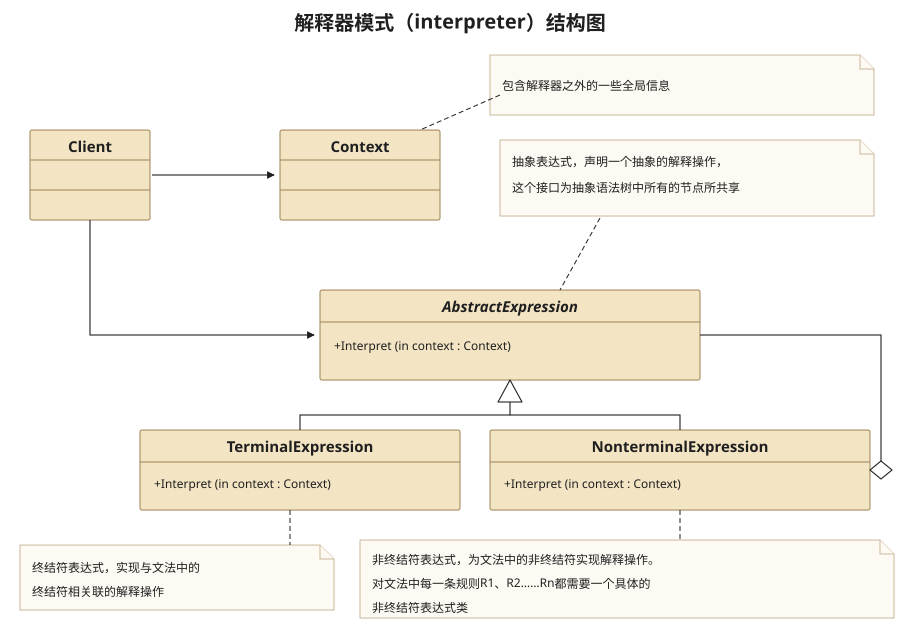

## 四、State Pattern

### 4.1 Definition

　　**状态模式**当一个对象的行为取决于它的状态,并且必须在运行时刻根据状态改变它的行为,可以考虑使用状态模式.

### 4.2 Structure



* Context类

  在该类内部维护一个ConcreteState子类的一个实例,这个实例定义当前的状态.

* State类

  抽象状态类,定义一个 接口以封装与Context的一个特定状态相关的行为.

* ConcreteStateA,ConcreteStateB类

  具体状态类,每一个子 类实现一个与Context的一个状态相关的行为.

### 4.3 Usage

1. 状态模式主要解决的是当控制一个对象状态转换的条件表达式过于复杂时的情况.把状态的判断逻辑转移到表示不同状态的一系列类中,可以把复杂的判 断逻辑简单化.(简单来说,就是把各种if else 转变成了一个个的具体状态,原来if else 每种情况下的操作现在转换到了某个具体状态中)

2. 当一个对象行为取决于它的状态,并且它必须在运行时刻根据状态改变它的行为时,就可以考虑使用状态模式了

### 4.4 Example



**Src Downloads**  &rarr; [StatePattern.h](design-pattern/StatePattern.h) and [StatePatternClient.cpp](design-pattern/StatePatternClient.cpp)

```cpp
//============================
//StatePattern.h
//============================
#ifndef STATEPATTERN_H
#define STATEPATTERN_H

#include <iostream>
using namespace std;

class CWork;

//抽象状态类
class CState{
public:
    virtual void writeProgram(CWork *pWork) = 0;
    virtual ~CState(){}
};

//context类
class CWork{
public:
    CWork();
    ~CWork(){
        if( mpState != nullptr){
            delete mpState;
            mpState = nullptr;
        }
    }
    void setState(CState *pState){
        if( mpState != nullptr )
            delete mpState;
        mpState = pState;
    }
    void writeProgram(){ mpState->writeProgram(this); }

    void setTime(double dTime){ mTime = dTime; }
    double getTime(){ return mTime; }
private:
    CState *mpState;
    double mTime;
};

//具体状态类:睡眠状态
class CSleepingState : public CState{
public:
    virtual void writeProgram(CWork* pWork){
        cout<<"Time: "<<pWork->getTime()<<" , Sleeping...."<<endl;
    }
};

//具体状态类:晚上状态
class CEveningState : public CState{
public:
    virtual void writeProgram(CWork* pWork){
        if( pWork->getTime() < 21 )
            cout<<"Time: "<<pWork->getTime()<<" , Sport...."<<endl;
        else{
            pWork->setState(new CSleepingState());
            pWork->writeProgram();
        }
    }
};

//具体状态类:下午状态
class CAfternoonState : public CState{
public:
    virtual void writeProgram(CWork* pWork){
        if( pWork->getTime() < 18 )
            cout<<"Time: "<<pWork->getTime()<<" , afternoon work...."<<endl;
        else{
            pWork->setState(new CEveningState());
            pWork->writeProgram();
        }
    }
};

//具体状态类:上午状态
class CForenoonState : public CState{
public:
    virtual void writeProgram(CWork* pWork){
        if( pWork->getTime() < 12 )
            cout<<"Time: "<<pWork->getTime()<<" , forcenoon work...."<<endl;
        else{
            pWork->setState(new CAfternoonState());
            pWork->writeProgram();
        }
    }
};
CWork::CWork(){
    mpState = new CForenoonState();
    mTime = 9;
}


#endif // STATEPATTERN_H
```

```cpp
//============================
//StatePatternClient.cpp
//============================

#include "StatePattern.h"

int main(){
    CWork *pWork = new CWork();
    pWork->setTime(10);
    pWork->writeProgram();

    pWork->setTime(22);
    pWork->writeProgram();
    return 1;
}
```

```cpp
Time: 10 , forcenoon work....
Time: 22 , Sleeping....
```

## 五、Visitor Pattern

### 5.1 Definition

　　**访问者模式**适用于数据结构稳定的系统.他把数据结构和作用于数据结构上的操作分离,使操作集合.

### 5.2 Structure



* Visitor类

  为该对象结构中ConcreteElement的每一个类声明一个Visit操作.

* ConcreteVisitor类

  具体访问者,实现每个由Visitor声明的操作.

* Element类

  定义一个Accept操作,它以一个访问者为参数.

* ConcreteElementA类

  具体元素,实现Accept操作.

* ObjectStructure类

  能枚举它的元素,可以提供一个高层的接口以允许访问者访问它的元素.

### 5.3 Usage

1. 访问者模式的目的

   访问者模式的目的是要把处理从数据结构分离出来.很多系统可以按照算法和数据机构分开,如果这样的系统有比较稳定的数据结构,又有易于变化的算法的话,使用访问者模式就是比较合适的,因为访问者模式使得算法操作的增加变得容易.反之,如果这样的系统的数据结构对象易于变化,经常要有新的数据对象增加进来,就不适合使用访问者模式.

2. 访问者模式的优点

   优点是增加新的操作很容易,因为增加新的操作就意味着增加一个新的访问者.访问者模式将有关的行为集中到一个访问者对象中.

3. 访问者模式的缺点

   使得增加新的数据结构变得困难了

### 5.4 Example



**Src Downloads**  &rarr; [VisitorPattern.h](design-pattern/VisitorPattern.h) and [VisitorPatternClient.cpp](design-pattern/VisitorPatternClient.cpp)

```cpp
//============================
//VisitorPattern.h
//============================
#ifndef VISITORPATTERN_H
#define VISITORPATTERN_H

#include <iostream>
#include <vector>
#include <typeinfo>
#include <algorithm>
using namespace std;

class CPerson;
class CMan;
class CWomen;

//Visitor:抽象类
class CAction{
public:
    virtual void getManConclusion(CPerson *pMan) = 0;
    virtual void getWomenConclusion(CPerson *pWomen) = 0;
    virtual ~CAction(){}
};

//Element:抽象类,接收Visitor,人
class CPerson{
public:
    virtual ~CPerson(){}
    virtual void accept(CAction *pVisitor) = 0 ;
};

//concreteElement:男人
class CMan : public CPerson{
public:
    virtual ~CMan(){}
    virtual void accept(CAction* pVisitor){
        pVisitor->getManConclusion(this);
    }
};

//concreteElement:女人
class CWomen : public CPerson{
public:
    virtual ~CWomen(){}
    virtual void accept(CAction* pVisitor){
        pVisitor->getWomenConclusion(this);
    }
};

//Concrete Visitor:成功
class CSuccess : public CAction{
public:
    virtual void getManConclusion(CPerson* pMan){
        cout<<typeid(*pMan).name()<<" "<<typeid(*this).name()<<" There is a great women in the back"<<endl;
    }
    virtual void getWomenConclusion(CPerson* pWomen){
        cout<<typeid(*pWomen).name()<<" "<<typeid(*this).name()<<" There is a useless men in the back"<<endl;
    }
};

//concrete visitor:失败
class CFailure : public CAction{
public:
    virtual void getManConclusion(CPerson* pMan){
       cout<<typeid(*pMan).name()<<" "<<typeid(*this).name()<<" Drink "<<endl;
    }
    virtual void getWomenConclusion(CPerson* pWomen){
        cout<<typeid(*pWomen).name()<<" "<<typeid(*this).name()<<" Cry"<<endl;
    }
};

//concrete visitor::恋爱
class CAmativeness : public CAction{
public:
    virtual void getManConclusion(CPerson* pMan){
        cout<<typeid(*pMan).name()<<" "<<typeid(*this).name()<<" give gift "<<endl;
    }
    virtual void getWomenConclusion(CPerson* pWomen){
        cout<<typeid(*pWomen).name()<<" "<<typeid(*this).name()<<" smile always"<<endl;
    }
};


//objectStructure
class CObjectStructure{
public:
    CObjectStructure(){}
    ~CObjectStructure(){
        for_each(mPersonVector.begin(),mPersonVector.end(),[](CPerson *p){ delete p;});
    }
    void attach(CPerson *pElement){
        mPersonVector.push_back(pElement);
    }
    void detach(CPerson *pElement){
        for(auto it = mPersonVector.begin(); it != mPersonVector.end(); ){
            if( *it == pElement )
                mPersonVector.erase(it);
            else
                it++;
        }
    }
    void display(CAction *pVisitor){
        for_each(mPersonVector.begin(),mPersonVector.end(),[pVisitor](CPerson *p){ p->accept(pVisitor); } );
    }
private:
    vector<CPerson *> mPersonVector;
};
#endif // VISITORPATTERN_H
```

```cpp
//============================
//VisitorPatternClient.cpp
//============================

#include "VisitorPattern.h"

int main(){
    CObjectStructure *pObjectStructure = new CObjectStructure();
    pObjectStructure->attach(new CMan());
    pObjectStructure->attach(new CWomen());

    CSuccess *pSuccess = new CSuccess();
    pObjectStructure->display(pSuccess);
    delete pSuccess;

    CFailure *pFaiure = new CFailure();
    pObjectStructure->display(pFaiure);
    delete pFaiure;

    CAmativeness *pAmativeness = new CAmativeness();
    pObjectStructure->display(pAmativeness);
    delete pAmativeness;

    delete pObjectStructure;
    return 1;
}
```

```cpp
CMan CSuccess There is a great women in the back

CWomen CSuccess There is a useless men in the ba
ck
CMan CFailure Drink
CWomen CFailure Cry
CMan CAmativeness give gift
CWomen CAmativeness smile always
```

## 六、Interpreter Pattern

### 6.1 Definition

　　**解释器模式**给定一个语言,定义它的文法的一种表示,并定义一个解释器,这个解释器使用该表示来解释语言中的句子.

### 6.2 Structure



* AbstractExpression(抽象表达式)

  声明一个抽象的解释操作,这个接口为抽象语法树中所有的节点所共享.

* TerminalExpression(终结符表达式)

  实现与文法中的终结符相关联的解释操作.实现抽象表达式中所要求的接口,主要是一个interpreter()方法.文法中每一个终结符都有一个具体终结表达式与之相对应.

* NonterminalExpression(非终结符表达式)

  为文法中的非终结符实现解释操作.

* Context

  包含解释器之外的一些全局信息

### 6.3 Usage

1. 解释器模式需要解决的问题

   如果一种特定类型的问题发生的频率足够高,那么可能就值得将该问题的各个实例表述为一个简单语言中的句子.这样就可以构建一个解释器,该解释器通过解释这些句子来解决该问题.

2. 什么时候用解释器模式？

   通常当有一个语言需要解释执行,并且你可将该语言中的句子表示为一个抽象语法树时,可使用解释器模式.

3. 访问者模式的优点

   用了解释器模式,就意味着可以很容易地改变和扩展文法,因为该模式使用类来表示文法规则,你可使用继承来改变或扩展该文法.也比较容易实现文法,因为定义抽象语法树种各个节点的类的实现大体类似,这些类都易于直接边写.

4. 访问者模式的缺点

   解释器模式为文法中的每一条规则至少定义了一个类,因此包含许多规则的文法可能难以管理和维护.建议当文法非常复杂时,使用其他的技术如语法分析程序或编译器生成器来处理.

### 6.4 Example

**Src Downloads**  &rarr; [InterpreterPattern.h](design-pattern/InterpreterPattern.h) and [InterpreterPatternClient.cpp](design-pattern/InterpreterPatternClient.cpp)

```cpp
//============================
//InterpreterPattern.h
//============================
#ifndef INTERPRETERPATTERN_H
#define INTERPRETERPATTERN_H

#include <iostream>
#include <vector>
#include <sstream>
#include <algorithm>
using namespace std;

//Context,此处为演奏内容类
class CPlayContext{
public:
    void setText(string strText){ mStrText = strText; }
    string getText(){ return mStrText; }
private:
    string mStrText;
};

//AbstractExpression,此处为表达式类
class CExpression{
public:
    void interpret(CPlayContext *pPlayContext){
        string strText = pPlayContext->getText();

        if(strText.length() <= 0 )
            return;
        else{
            vector<string> strVector;
            string strTemp,strBuffer;
            for(istringstream ss(strText);ss>>strTemp;)
                strVector.push_back(strTemp);
            execute(strVector.at(0),strVector.at(1));
            strVector.erase(strVector.begin(),strVector.begin() + 2);
            ostringstream oss;
            for(auto it = strVector.begin() ; it != strVector.end() ; it++)
                oss<<*it<<" ";
            pPlayContext->setText(oss.str());
        }
    }
    virtual void execute(string strKey,string strValue) = 0;
};

//ConcreteExpression,此处为音符类
class CNote : public CExpression{
public:
    virtual void execute(string strKey, string strValue){
        string strNote;
        switch (strKey[0]){
        case 'C':
            strNote="1";
            break;
        case 'D':
            strNote="2";
            break;
        case 'E':
            strNote="3";
            break;
        case 'F':
            strNote="4";
            break;
        case 'G':
            strNote="5";
            break;
        case 'A':
            strNote="6";
            break;
        case 'B':
            strNote="7";
            break;
        }
        cout<<strNote<<" ";
    }
};

//ConcreteExpression,此处为音阶类
class CScale : public CExpression{
public:
    virtual void execute(string strKey, string strValue){
        string strScale;
        switch(strValue[0])  {
        case '1':
            strScale="low";
            break;
        case '2':
            strScale="medium";
            break;
        case'3':
            strScale="high";
            break;
        }
        cout<<endl<<strScale<<" ";
    }
};
#endif // INTERPRETERPATTERN_H
```

```cpp
//============================
//InterpreterPatternClient.cpp
//============================

#include "InterpreterPattern.h"

int main(){
    CPlayContext playContext;
    cout<<"上海滩"<<endl;
    playContext.setText("O 2 E 0.5 G 0.5 A 3 E 0.5 G 0.5 D 3 E 0.5 G 0.5 A 0.5 O 3 C 1 O 2 A 0.5 G 1 C 0.5 E 0.5 D 3");

    CExpression *pExpression = nullptr;
    while(playContext.getText().length()>0){
        char c=playContext.getText()[0];
        switch(c){
        case 'O':
            pExpression=new CScale();
            break;
        case 'C':
        case 'D':
        case 'E':
        case 'F':
        case 'G':
        case 'A':
        case 'B':
        case 'P':
            pExpression=new CNote();
            break;
        }
        pExpression->interpret(&playContext);
        delete pExpression;
    }
    return 1;
}
```

```cpp
上海滩

medium 3 5 6 3 5 2 3 5 6
high 1
medium 6 5 1 3 2
```

