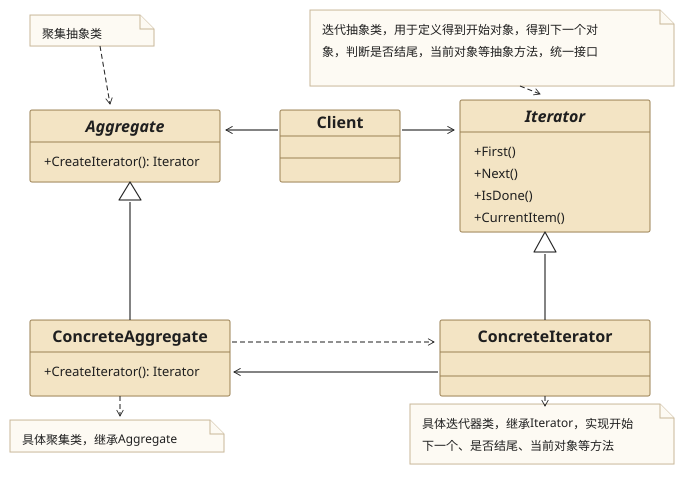
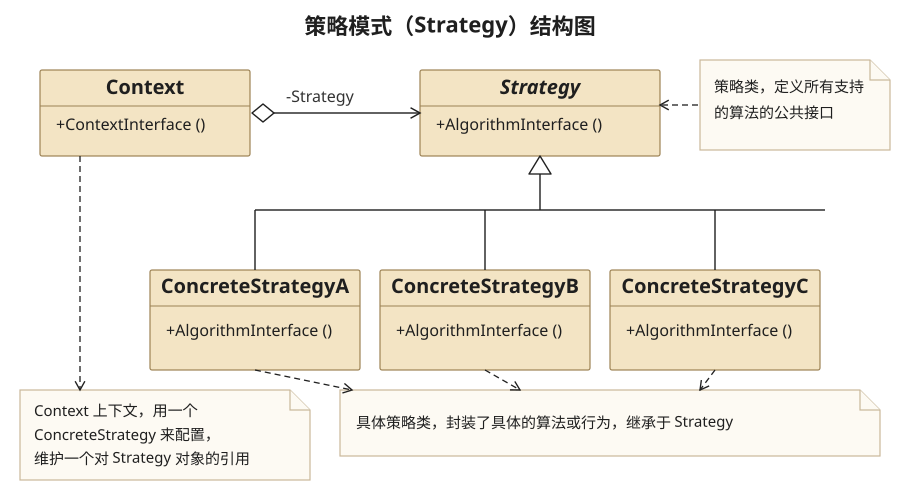
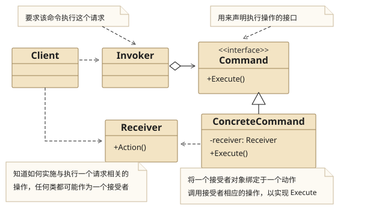
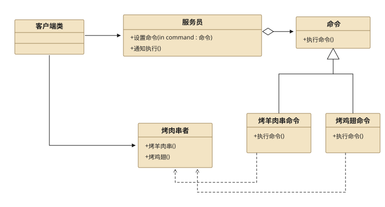

## 七、Iterator Pattern

### 7.1 Definition

　　**迭代器模式**提供一种方法顺序访问一个聚合对象中各个元素,而又不暴露该对象的内部表示.

### 7.2 Structure



### 7.3 Usage

1. 什么时候用

   * 当你需要访问一个聚集对象,而且不管这些对象无论什么时候都需要遍历的时候,你就应该考虑用迭代器模式

   * 你需要对聚集有多种遍历时,可以考虑用迭代器模式

   * 为遍历不同的聚集结构提供如开始、下一个、是否结束、当前哪一项等统一的接口.

2. 迭代器模式的好处？

   迭代器模式就是分离了集合对象的遍历行为,抽象出一个迭代器类来负责,这样既可以不暴露集合的内部结构,又可让外部代码透明地访问集合内部的数据.

### 7.4 Example

**Src Downloads**  &rarr; [IteratorPattern.h](design-pattern/IteratorPattern.h) and [IteratorPatternClient.cpp](design-pattern/IteratorPatternClient.cpp)

```cpp
//============================
//IteratorPattern.h
//============================
#ifndef ITERATORPATTERN_H_INCLUDED
#define ITERATORPATTERN_H_INCLUDED

#include <iostream>
#include <vector>
using namespace std;

class CFrontIterator;
class CBackIterator;
using object = string;

//迭代器抽象类
class CIterator{
public:
    virtual ~CIterator(){}
    virtual object first() = 0;
    virtual object next() = 0;
    virtual bool isDone() = 0;
    virtual object currentItem() = 0;
};

//聚集抽象类
class CAggregate{
public:
    virtual CIterator *createIterator() = 0;
};

//具体聚集类
class CConcreteAggregate : public CAggregate{
public:
    CConcreteAggregate():mpFrontIterator(nullptr),mpBackIterator(nullptr){
        mpObjectVector = new vector<object>();
    }
    virtual ~CConcreteAggregate(){
        if(mpObjectVector !=nullptr){
            delete mpObjectVector;
            mpObjectVector = nullptr;
        }
        if(mpFrontIterator!=nullptr){
            delete mpFrontIterator;
            mpFrontIterator = nullptr;
        }
        if( mpBackIterator != nullptr){
            delete mpBackIterator;
            mpBackIterator = nullptr;
        }
    }
    //产生从前往后的迭代器
    virtual CIterator *createIterator();

    //产生从后往前的迭代器
    CIterator *createIteratorDesc();
    int getCount(){
        return mpObjectVector->size();
    }
    object getElement(int nIndex){
        return mpObjectVector->at(nIndex);
    }
    void push(object obj){
        mpObjectVector->push_back(obj);
    }
private:
    vector<object> *mpObjectVector;
    CIterator *mpFrontIterator;
    CIterator *mpBackIterator;
};

//具体迭代器类,从前往后的迭代器
class CFrontIterator : public CIterator{
public:
    CFrontIterator(CConcreteAggregate *pConcreteAggregate):mpConcreteAggregate(pConcreteAggregate),mCurrentIndex(0){}
    virtual ~CFrontIterator(){}
    virtual object first(){
        return mpConcreteAggregate->getElement(0);
    }
    virtual object next(){
        mCurrentIndex++;
        if(mCurrentIndex< mpConcreteAggregate->getCount())
            return mpConcreteAggregate->getElement(mCurrentIndex);
        return mpConcreteAggregate->getElement( mpConcreteAggregate->getCount() <= 0 ? 0 : ( mpConcreteAggregate->getCount() - 1 ) );
    }
    virtual bool isDone(){
        return ( mCurrentIndex >= mpConcreteAggregate->getCount() );
    }
    virtual object currentItem(){
        return mpConcreteAggregate->getElement(mCurrentIndex);
    }
private:
    CConcreteAggregate *mpConcreteAggregate;
    int mCurrentIndex;
};

//具体迭代器类,从后往前的迭代器
class CBackIterator : public CIterator{
public:
    CBackIterator(CConcreteAggregate *pConcreteAggregate):mpConcreteAggregate(pConcreteAggregate){
        mCurrentIndex = mpConcreteAggregate->getCount() - 1;
    }
    virtual ~CBackIterator(){}
    virtual object first(){
        int nLastElement = mpConcreteAggregate->getCount() - 1;
        nLastElement = (nLastElement <= 0 ) ? 0 : nLastElement;
        return mpConcreteAggregate->getElement(nLastElement);
    }
    virtual object next(){
        mCurrentIndex--;
        if(mCurrentIndex >= 0)
            return mpConcreteAggregate->getElement(mCurrentIndex);
        return mpConcreteAggregate->getElement(0);
    }
    virtual bool isDone(){
        return mCurrentIndex < 0 ;
    }
    virtual object currentItem(){
        return mpConcreteAggregate->getElement(mCurrentIndex);
    }
private:
    CConcreteAggregate *mpConcreteAggregate;
    int mCurrentIndex;
};

//产生从前往后的迭代器
CIterator *CConcreteAggregate::createIterator(){
    if( mpFrontIterator == nullptr )
        mpFrontIterator = new CFrontIterator(this);
    return mpFrontIterator;
}

//产生从后往前的迭代器
CIterator *CConcreteAggregate::createIteratorDesc(){
    if( mpBackIterator == nullptr)
        mpBackIterator = new CBackIterator(this);
    return mpBackIterator;
}

#endif // ITERATORPATTERN_H_INCLUDED
```

```cpp
//============================
//IteratorPatternClient.cpp
//============================

#include "IteratorPattern.h"

int main(){
    //公交车,即聚集对象
    CConcreteAggregate *pBus = new CConcreteAggregate();

    //新上来的乘客
    pBus->push("Man");
    pBus->push("Women");
    pBus->push("Baby");
    pBus->push("Boy");
    pBus->push("Thief");

    //产生从前往后的迭代器
    CIterator *pFrontIterator = pBus->createIterator();

    //告知每一位乘客买票
    cout<<"Aggregate Front Iterator: "<<endl;
    while(!pFrontIterator->isDone()){
        cout<<pFrontIterator->currentItem()<<" buy ticket "<<endl;
        pFrontIterator->next();
    }

    //产生从后往前的迭代器
    CIterator *pBackIterator = pBus->createIteratorDesc();

    //告知每一位乘客买票
    cout<<endl;
    cout<<"Aggregate Back Iterator: "<<endl;
    while(!pBackIterator->isDone()){
        cout<<pBackIterator->currentItem()<<" buy ticket "<<endl;
        pBackIterator->next();
    }

    delete pBus;
    return 1;
}
```

```cpp
Aggregate Front Iterator:
Man buy ticket
Women buy ticket
Baby buy ticket
Boy buy ticket
Thief buy ticket

Aggregate Back Iterator:
Thief buy ticket
Boy buy ticket
Baby buy ticket
Women buy ticket
Man buy ticket
```

## 八、Strategy Pattern

### 8.1 Definition

　　**策略模式**定义了算法家族,分别封装起来,让他们之间可以互相替换,此模式让算法的变化,不会影响到使用算法的客户.

### 8.2 Structure




### 8.3 Usage

* 策略模式是一种定义一系列算法的方法,从概念上来看,所有这些算法完成的都是相同的工作,只是实现不同,他可以以相同的方式调用所有的算法,减少了各种算法类与使用算法类之间的耦合.

* 策略模式的Strategy类曾是为Context定义了一些列的可供重用的算法或行为.集成有助于析取出这些算法中的公共功能.

* 策略模式简化了单元测试,因为每个算法都有自己的类,可以通过自己的接口单独测试.

* 策略模式就是用来封装算法的

* 简单工厂模式需要让客户端认识两个类,而策略模式和简单工厂模式结合的用法,客户端只需要认识一个类Context即可.

### 8.4 Example

**Src Downloads**  &rarr; [StrategyPattern.h](design-pattern/StrategyPattern.h) and [StrategyPatternClient.cpp](design-pattern/StrategyPatternClient.cpp)

```cpp
//============================
//StrategyPattern.h
//============================
#ifndef STRATEGYPATTERN_H
#define STRATEGYPATTERN_H

#include <iostream>
using namespace std;

//策略基类
class COperation{
public:
    virtual ~COperation(){}
    virtual int getResult(){
        auto result = 0 ;
        return result;
    }
protected:
    int mFirstOperand = 0;
    int mSecondOperand = 0;
};

//策略具体类:加法
class CAddOperation : public COperation{
public:
    CAddOperation(int nFirstOperand,int nSecondOperand){
        mFirstOperand = nFirstOperand;
        mSecondOperand = nSecondOperand;
    }
    virtual ~CAddOperation(){}
    virtual int getResult(){
        return (mFirstOperand + mSecondOperand);
    }
};

//策略具体类:减法
class CSubOperation : public COperation{
public:
    CSubOperation(int nFirstOperand,int nSecondOperand){
        mFirstOperand = nFirstOperand;
        mSecondOperand = nSecondOperand;
    }
    virtual ~CSubOperation(){}
    virtual int getResult(){
        return (mFirstOperand - mSecondOperand);
    }
};

class CContext{
public:
    CContext(COperation *pOperation):mpOperation(pOperation){}
    int getResult(){ return mpOperation->getResult();}
private:
    COperation *mpOperation;
};

//策略模式与简单工厂模式相结合
class CCombineContext{
public:
    CCombineContext(int nFirstOperand,char cOperator,int nSecondOperand){
        mpOperation = nullptr;
        switch(cOperator){
        case '+':
            mpOperation= new CAddOperation(nFirstOperand,nSecondOperand);
            break;
        case '-':
            mpOperation = new CSubOperation(nFirstOperand,nSecondOperand);
            break;
        default:
            break;
        }
    }
    ~CCombineContext(){
        if( mpOperation != nullptr){
            delete mpOperation;
            mpOperation = nullptr;
        }
    }
    int getResult(){ return mpOperation->getResult();}
private:
    COperation *mpOperation;
};
#endif // STRATEGYPATTERN_H
```

```cpp
//============================
//StrategyPatternClient.cpp
//============================

#include "StrategyPattern.h"

int main(){
    int a = 0, b = 0;
    cout<<"please input two integers"<<endl;
    cin>>a>>b;
    cout<<"please input operator,+ or -"<<endl;
    char c = '+';
    cin>>c;
    COperation *pOperation = nullptr;
    switch(c){
    case '+':
        pOperation= new CAddOperation(a,b);
        break;
    case '-':
        pOperation = new CSubOperation(a,b);
        break;
    default:
        break;
    }
    //策略模式
    cout<<"strategy"<<endl;
    if( pOperation != nullptr ){
        CContext *pContext = new CContext( pOperation );
        cout<<pContext->getResult()<<endl;
        delete pOperation;
        pOperation = nullptr;
    }

    //策略模式与简单工厂模式相结合
    cout<<"combine Strategy with SimpleFactory"<<endl;
    CCombineContext *pCombineContext = new CCombineContext(a,c,b);
    cout<<pCombineContext->getResult()<<endl;
    delete pCombineContext;
    pCombineContext = nullptr;
    return 1;
}
```

### 8.5 Example-(Strategy + SimpleFactory)

```cpp
//策略模式与简单工厂模式相结合
class CCombineContext{
public:
    CCombineContext(int nFirstOperand,char cOperator,int nSecondOperand){
        mpOperation = nullptr;
        switch(cOperator){
        case '+':
            mpOperation= new CAddOperation(nFirstOperand,nSecondOperand);
            break;
        case '-':
            mpOperation = new CSubOperation(nFirstOperand,nSecondOperand);
            break;
        default:
            break;
        }
    }
    ~CCombineContext(){
        if( mpOperation != nullptr){
            delete mpOperation;
            mpOperation = nullptr;
        }
    }
    int getResult(){ return mpOperation->getResult();}
private:
    COperation *mpOperation;
};
```

```cpp
//策略模式与简单工厂模式相结合
cout<<"combine Strategy with SimpleFactory"<<endl;
CCombineContext *pCombineContext = new CCombineContext(a,c,b);
cout<<pCombineContext->getResult()<<endl;
delete pCombineContext;
 pCombineContext = nullptr;
```

## 九、Command Pattern

### 9.1 Definition

　　**命令模式**将一个请求封装为一个对象,从而使你可用不同的请求对客户进行参数化,对请求进行排队或记录请求日志,以及支持可撤销的操作.

### 9.2 Structure



* Command类

  用来声明执行操作的接口

* ConcreteCommand类

  将一个接收者对象绑定与一个动作,调用接收者相应的操作,以实现Excute.

* Invoker类

  要求该命令执行这个请求

* Receiver类

  知道如何实施与执行一个与请求相关的操作,任何类都可能作为一个接收者.

### 9.3 Usage

* 命令模式能够较容易地设计一个命令队列.

* 在需要的情况下,可以较容易地将命令记入日志.

* 允许接收请求的一方决定是否要否决请求.

* 可以容易地实现对请求的撤销和重做.

* 由于加进新的具体命令类不影响其他的类,因此增加新的具体命令类很容易.

* 命令模式把请求一个操作的对象与知道怎么执行一个操作的对象分隔开.

### 9.4 Example



**Src Downloads**  &rarr; [CommandPattern.h](design-pattern/CommandPattern.h) and [CommandPatternClient.cpp](design-pattern/CommandPatternClient.cpp)

```cpp
//============================
//CommandPattern.h
//============================
#ifndef COMMANDPATTERN_H
#define COMMANDPATTERN_H

#include <iostream>
#include <vector>
#include <typeinfo>
#include <ctime>
using namespace std;

//Receiver:烤羊肉串者
class CBarbecuer{
public:
    void bakeMutton(){ cout<<"Barbecuer bake mutton"<<endl; }
    void bakeChickenWing(){ cout<<"Barbecuer bake chicken wing"<<endl; }
};

//Command:抽象命令
class CCommand{
public:
    CCommand(CBarbecuer *pBarbecuer):mpBarbecuer(pBarbecuer){}
    virtual void execute() = 0 ;
protected:
    CBarbecuer *mpBarbecuer;
};

//ConcreteCommand: 具体命令:烤羊肉串
class CBakeMuttonCmd : public CCommand{
public:
    CBakeMuttonCmd(CBarbecuer *pBarbecuer):CCommand(pBarbecuer){}
    virtual void execute(){ mpBarbecuer->bakeMutton(); }
};

//ConcreteCommand: 具体命令:烤鸡翅膀
class CBakeChickerWingCmd : public CCommand{
public:
    CBakeChickerWingCmd(CBarbecuer *pBarbecuer):CCommand(pBarbecuer){}
    virtual void execute(){ mpBarbecuer->bakeChickenWing(); }
};

//Invoker:服务员
class CWaiter{
public:
    CWaiter(){
        mpCommandVector = new vector<CCommand *>();
    }
    ~CWaiter(){
        if( mpCommandVector != nullptr){
            delete mpCommandVector;
            mpCommandVector = nullptr;
        }
    }

    //设置菜单
    void order(CCommand *pCommand){
        if( typeid(*pCommand) == typeid(CBakeChickerWingCmd) )
            cout<<"Log: Waiter :Chicken Wings are gone ,please order something else"<<endl;
        else if( typeid(*pCommand) == typeid(CBakeMuttonCmd) ){
            mpCommandVector->push_back(pCommand);
            time_t now = time(0);
            cout<<"Log: Waiter : add order: bake mutton . Time : "<<asctime(gmtime(&now));
        }
        else
            cout<<"Log: No Service"<<endl;
    }

    void notify(){
        for( auto it = mpCommandVector->begin(); it != mpCommandVector->end(); it++)
            (*it)->execute();
    }
private:
    vector<CCommand *> *mpCommandVector;
};
#endif // COMMANDPATTERN_H
```

```cpp
//============================
//CommandPatternClient.cpp
//============================
#include "CommandPattern.h"

int main(){
    //开店前的准备
    CBarbecuer *pBarbecuer = new CBarbecuer();
    CWaiter *pWaiter = new CWaiter();

    //开门营业,顾客点菜
    CCommand *pFirstOrder = new CBakeMuttonCmd(pBarbecuer);
    pWaiter->order(pFirstOrder);

    CCommand *pSecondOrder = new CBakeChickerWingCmd(pBarbecuer);
    pWaiter->order(pSecondOrder);

    CCommand *pThirdOrder = new CBakeMuttonCmd(pBarbecuer);
    pWaiter->order(pThirdOrder);

    //点菜完毕,通知厨房
    pWaiter->notify();

    delete pWaiter;
    delete pThirdOrder;
    delete pSecondOrder;
    delete pFirstOrder;
    delete pBarbecuer;
    return 1;
}

```

```cpp
Log: Waiter : add order: bake mutton . Time : Tue
Jul 03 07:11:24 2018
Log: Waiter :Chicken Wings are gone ,please order
something else
Log: Waiter : add order: bake mutton . Time : Tue
Jul 03 07:11:24 2018
Barbecuer bake mutton
Barbecuer bake mutton
```

