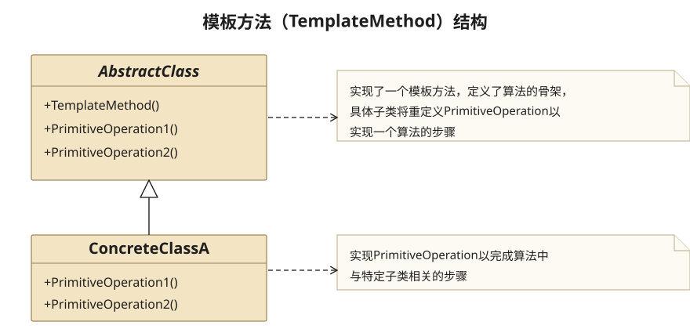
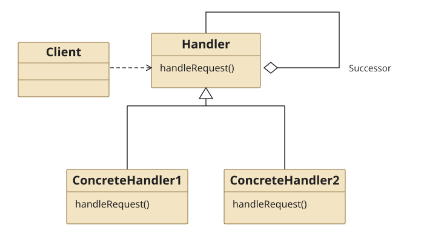
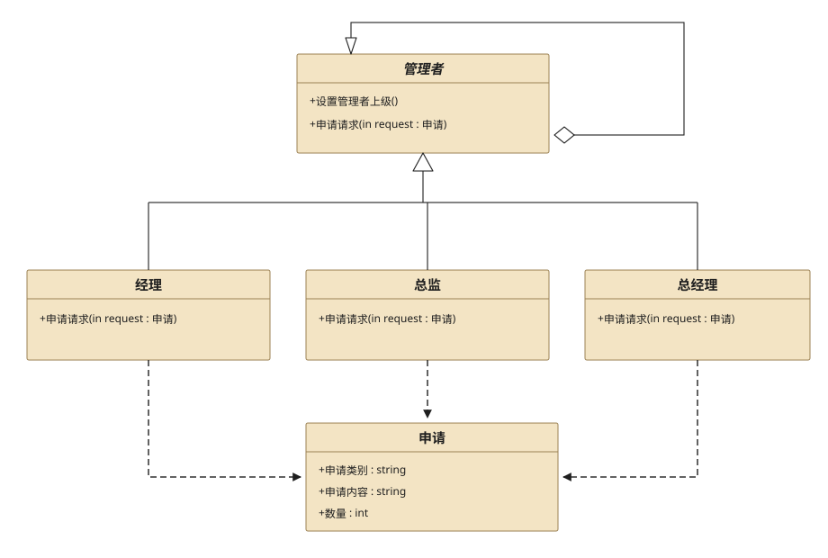

## 十、Template Method Pattern

### 10.1 Definition

　　**模板方法模式**把不变的代码部分移到父类中,将可变的代码用virtual留到子类重写.定义一个操作中的算法的骨架,而将一些步骤延迟到子类中.模板方法使得子类可以不改变一个算法的结构即可重定义该算法的某些特定步骤.

### 10.2 Structure



* AbstractClass

  是抽象类,其实也就是一个抽象模板,定义并实现了一个模板方法.这个模板方法一般是一个具体方法,它给出了一个顶级逻辑的框架,而逻辑的组成步骤在相应的抽象操作中,推迟到子类实现.顶级逻辑也有可能调用一些具体方法.

* ConcreteClass

  实现父类所定义的一个或多个抽象方法.每一个AbstractClass都可以有任意多个ConcreteClass与之对应,而每一个ConcreteClass都可以给出这些抽象方法（也就是顶级逻辑的组成步骤）的不同实现,从而使得顶级逻辑的实现各不相同.

### 10.3 Usage

　　当不变的和可变的行为在方法的子类实现中混合在一起的时候,不变的行为就会在子类中重复出现.我们通过模板方法模式,把这些行为搬移到单一的地方,这样帮助子类摆脱重复的不变行为的纠缠.

### 10.4 Example

**Src Downloads**  &rarr; [TemplateMethodPattern.h](design-pattern/TemplateMethodPattern.h) and [TemplateMethodPatternClient.cpp](design-pattern/TemplateMethodPatternClient.cpp)

```cpp
//============================
//TemplateMethodPattern.h
//============================
#ifndef TEMPLATEMETHODPATTERN_H
#define TEMPLATEMETHODPATTERN_H

#include <iostream>
using namespace std;

//AbstractClass,实现了一个模板,定义了算法的骨架,组成骨架的具体步骤放在子类中实现
class CTestPaper{
public:
    void testQuestion1(){
        cout<<"How many bits per byte"<<endl;
        cout<<"A. 8 B. 4 C. 2 D. 1"<<endl;
        cout<<"answer: "<<answer1()<<endl;
    }
    void testQuestion2(){
        cout<<"How many meters per kilometers"<<endl;
        cout<<"A. 8 B. 1000 C. 2 D. 1"<<endl;
        cout<<"answer: "<<answer2()<<endl;
    }
    void testQuestion3(){
        cout<<"How many grams per kilograms"<<endl;
        cout<<"A. 8 B. 4 C. 2 D. 1000"<<endl;
        cout<<"answer: "<<answer3()<<endl;
    }
protected:
    virtual string answer1() = 0;
    virtual string answer2() = 0;
    virtual string answer3() = 0;
};


//ConcreteClass,实现具体步骤
class CConcretePaperA : public CTestPaper{
protected:
    virtual string answer1(){ return "A"; }
    virtual string answer2(){ return "B"; }
    virtual string answer3(){ return "D"; }
};

//ConcreteClass,实现具体步骤
class CConcretePaperB : public CTestPaper{
protected:
    virtual string answer1(){ return "B"; }
    virtual string answer2(){ return "C"; }
    virtual string answer3(){ return "A"; }
};


#endif // TEMPLATEMETHODPATTERN_H
```

```cpp
//============================
//TemplateMethodPatternClient.cpp
//============================
#include "TemplateMethodPattern.h"

int main(){

    cout<<"Student A Papaer:"<<endl;
    CTestPaper *pStudentA = new CConcretePaperA();
    pStudentA->testQuestion1();
    pStudentA->testQuestion2();
    pStudentA->testQuestion3();
    cout<<endl;

    cout<<"Student B Papaer:"<<endl;
    CTestPaper *pStudentB = new CConcretePaperB();
    pStudentB->testQuestion1();
    pStudentB->testQuestion2();
    pStudentB->testQuestion3();
    return 1;
}
```

```cpp
Student A Papaer:
How many bits per byte
A. 8 B. 4 C. 2 D. 1
answer: A
How many meters per kilometers
A. 8 B. 1000 C. 2 D. 1
answer: B
How many grams per kilograms
A. 8 B. 4 C. 2 D. 1000
answer: D

Student BB Papaer:
How many bits per byte
A. 8 B. 4 C. 2 D. 1
answer: B
How many meters per kilometers
A. 8 B. 1000 C. 2 D. 1
answer: C
How many grams per kilograms
A. 8 B. 4 C. 2 D. 1000
answer: A
```

## 十一、Chain of Responsibility Pattern

### 11.1 Definition

　　**责任链模式**使多个对象都有机会处理请求,从而避免请求的发送者和接收者之间的耦合.将这个对象连成一条链,并沿着这条链传递该请求,直到有一个对象处理它为止.

### 11.2 Structure



* Handler

  定义一个处理请求的接口

* ConcreteHandler

  具体的处理请求的接口

### 11.3 Usage

1. 职责链模式的好处

   * 当客户提交一个请求时,请求时沿链传递直至有一个ConcreteHandler对象负责处理它

   * 接收者和发送者都没有对方的明确信息,且链中的对象自己也并不知道链的结构.结果是职责链可简化对象的相互连接,他们仅需要保持一个指向其后继者的引用,而不需要保持它所有的候选接收者的引用

   * 由于是在客户端来定义链的结构,所以用户可以随时地增加或者修改处理一个请求的结构.增强了给对象指派职责的灵活性.

2. 职责链模式的缺点

   一个请求极有可能到了链的末端都得不到处理,或者因为没有正确配置而得不到处理.

### 11.4 Example



**Src Downloads**  &rarr; [ChainOfResponsibility.h](design-pattern/ChainOfResponsibility.h) and [ChainOfResponsibilityClient.cpp](design-pattern/ChainOfResponsibilityClient.cpp)

```cpp
//============================
//ChainOfResponsibility.h
//============================
#ifndef CHAINOFRESPONSIBILITY_H
#define CHAINOFRESPONSIBILITY_H

#include <iostream>
using namespace std;


//请求类
class CRequest{
public:
    void setType(string strType){ mStrRequestType = strType; }
    string getType(){ return mStrRequestType; }

    void setContent(string strContent){ mStrRequestContent = strContent; }
    string getContent(){ return mStrRequestContent; }

    void setNumber(int nNumber){ mNumber = nNumber; }
    int getNumber(){ return mNumber; }
private:
    string mStrRequestType;
    string mStrRequestContent;
    int mNumber;
};


//Handler类抽象类,此处为Manager类
class CManager{
public:
    CManager(){}
    CManager(string strName):mStrName(strName),mpManager(nullptr){}
    virtual ~CManager(){}

    //设置继任者
    void setSuperior(CManager *pSuperior){ mpManager = pSuperior; }
    //处理请求的抽象方法
    virtual void hanldeRequest(CRequest *pRequest) = 0;
protected:
    string mStrName;
    CManager *mpManager;
};

//ConcreteHandler1:此处为经理CommonManager
class CCommonManager : public CManager{
public:
    CCommonManager(string strName):CManager(strName){}
    virtual void hanldeRequest(CRequest* pRequest){
        if( pRequest->getType() == "Ask For Leave" && pRequest->getNumber() <= 2 )
            cout<<mStrName<<":"<<pRequest->getContent()<<" Number:"<<pRequest->getNumber()<<" was Approved"<<endl;
        //自己处理不了,转移到下一位进行处理
        else
            mpManager->hanldeRequest(pRequest);
    }
};

//ConcreteHandler2:此处为总监,Majordomo
class CMajorDomo : public CManager{
public:
    CMajorDomo(string strName):CManager(strName){}
    virtual void hanldeRequest(CRequest* pRequest){
        if( pRequest->getType() == "Ask For Leave" && pRequest->getNumber() <= 5 )
            cout<<mStrName<<":"<<pRequest->getContent()<<" Number:"<<pRequest->getNumber()<<" was Approved"<<endl;
        //自己处理不了,转移到下一位进行处理
        else
            mpManager->hanldeRequest(pRequest);
    }
};

//ConcreteHandler3:此处为总经理,GeneralManager
class CGeneralManager : public CManager{
public:
    CGeneralManager(string strName):CManager(strName){}
    virtual void hanldeRequest(CRequest* pRequest){
        string strType = pRequest->getType();
        if( strType == "Ask For Leave" )
            cout<<mStrName<<":"<<pRequest->getContent()<<" Number:"<<pRequest->getNumber()<<" was Approved"<<endl;
        else if( strType == "Salary Increase" && pRequest->getNumber() <= 500 )
            cout<<mStrName<<":"<<pRequest->getContent()<<" Number:"<<pRequest->getNumber()<<" was Approved"<<endl;
        else if( strType == "Salary Increase" && pRequest->getNumber() > 500 )
            cout<<mStrName<<":"<<pRequest->getContent()<<" Number:"<<pRequest->getNumber()<<" was Rejected"<<endl;
        else
            cout<<mStrName<<":"<<pRequest->getContent()<<" Number:"<<pRequest->getNumber()<<" was Rejected"<<endl;
    }
};
#endif // CHAINOFRESPONSIBILITY_H
```

```cpp
//============================
//ChainOfResponsibilityClient.cpp
//============================

#include "ChainOfResponsibility.h"

int main(){

    CManager *pCommonManager = new CCommonManager("CommonManaer");
    CManager *pMajorDomo = new CMajorDomo("MajorDomo");
    CManager *pGeneralManager = new CGeneralManager("GeneralManager");

    //设置上级,完全可以按照实际需求来进行更改
    pCommonManager->setSuperior(pMajorDomo);
    pMajorDomo->setSuperior(pGeneralManager);

    //请求1:请假1天
    CRequest *pRequest = new CRequest();
    pRequest->setType("Ask For Leave");
    pRequest->setContent("Ask For Leave");
    pRequest->setNumber(1);
    //客户端的申请都是由“经理”发起,但实际谁来决策由具体管理类来处理,客户端不知道
    pCommonManager->hanldeRequest(pRequest);

    //请求2：请假4天
    pRequest->setNumber(4);
    pCommonManager->hanldeRequest(pRequest);

    //请求3:加薪500元
    pRequest->setType("Salary Increase");
    pRequest->setContent("Salary Increase");
    pRequest->setNumber(450);
    pCommonManager->hanldeRequest(pRequest);

    //请求4:加薪1000元
    pRequest->setNumber(1000);
    pCommonManager->hanldeRequest(pRequest);

    //请求5:升职
    pRequest->setType("Promotion");
    pRequest->setContent("Promotion");
    pRequest->setNumber(1);
    pCommonManager->hanldeRequest(pRequest);

    delete pRequest;
    delete pCommonManager;
    delete pMajorDomo;
    delete pGeneralManager;
    return 1;
}
```

```cpp
CommonManaer:Ask For Leave Number:1 was Approved
MajorDomo:Ask For Leave Number:4 was Approved
GeneralManager:Salary Increase Number:450 was Appr
oved
GeneralManager:Salary Increase Number:1000 was Rej
ected
GeneralManager:Promotion Number:1 was Rejected
```

