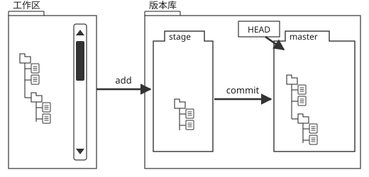

## 一、Install Git Tools

### 1.1 windows

* git-scm

  1. Download Portable version from <https://git-scm.com/>

  2. Run git-bash.exe/git-cmd.exe

* TortoiseGit

  因为TortoiseGit 只是一个程序壳,必须依赖一个 Git Core(git-scm)
Download from <https://tortoisegit.org/download/>

### 1.2 MacOS

* 系统自带git

* SourceTree

  需翻墙注册Atlassian,翻墙工具Free VPN,从App Store下载.

## 二、Repository Structure

Git是分布式版本控制系统

Git仓库有三个主要组成——工作目录,缓存区和提交历史.

Git和其他版本控制系统如SVN的一个不同之处就是有暂存区的概念.

### 2.1 Working Tree

工作区,就是你在电脑里能看到的目录,比如我的learngit文件夹就是一个工作区.

### 2.2 Repository

版本库,工作区有一个隐藏目录.git,这个不算工作区,而是Git的版本库

### 2.3 Stage/Index

Git的版本库里存了很多东西,其中最重要的就是称为stage(或者叫index)的暂存区,还有Git为我们自动创建的第一个分支master,以及指向master的一个指针叫HEAD.



## 三、Git Configuration

配置Git的时候,加上--global是针对当前用户起作用的,如果不加,那只针对当前的仓库起作用

### 3.1 Config Location

Type|Location
:---:|:---:
Global|`C:\Users\XXXX\.gitconfig`
Repository|`RepositoryFolder\.git\config`

### 3.2 Default Editor

```bash
//default editor:vim,路径中有空格,所以"\path""
git config [--global] core.editor "\"D:/Program Files/everedit/EverEdit.exe\""

//删除editor
git config --unset [--global] core.editor
```

### 3.3 Show Config

```bash
git config [--global] -l
```

### 3.4 Open Config

```bash
git config [--global] -e
```

### 3.5 User/Email

```bash
git config [--global] user.name XXXX
git config [--global] user.email XXX@YYY.com
```

### 3.6 HTTP PWD

**View** &rrarr;[More](https://git-scm.com/book/zh/v2/Git-%E5%B7%A5%E5%85%B7-%E5%87%AD%E8%AF%81%E5%AD%98%E5%82%A8)

```bash
//http方式,设置记住密码,文件位于`C:\Users\se0600\.git-credentials`
//默认15分钟
git config [--global] credential.helper cached
//长期存储
git config [--global] credential.helper store
//1小时
git config credential.helper 'cache --timeout 3600'
```

### 3.7 Alias

通过修改配置文件来简化命令

```bash
git config --global alias.st status
git config --global alias.co checkout
git config --global alias.ci commit
git config --global alias.br branch
git config --global alias.unstage 'reset HEAD'

//直接打开.git/config文件或global config
git config --global -e   //用editor打开global config
git config -e            //用editor打开当前仓库config
[alias]
  st = status
  cm = commit -m
  co = checkout
  st = status
  ci = commit
  br = branch
  df = diff
  ps = push
  pl = pull
  lo = log --oneline
  aa = add --all
```

配置Git的时候,加上--global是针对当前用户起作用的,如果不加,那只针对当前的仓库起作用.每个仓库的Git配置文件都放在.git/config文件中.而当前用户的Git配置文件放在用户主目录下的一个隐藏文件.gitconfig中,配置别名也可以直接修改这个文件.

## 四、Git Remote

一般采用http或者OPenSSH方式与远程仓库通信

### 4.1 HTTP(Recommends)

```bash
git clone https://gitee.com/easypr/EasyPR.git
git remote add https://gitee.com/easypr/EasyPR.git
git submodule add https://gitee.com/easypr/EasyPR.git
```

### 4.2 OPenSSH

1. **公钥与私钥**

   公钥是用户身份的一种认证方式,通过公钥与远程仓促仓库建立联系

   GIT服务器上存储的是公钥,本地存储的是私钥,当你push本地代码库到远程代码库,服务器会要求你出示私钥,并且用你出示的私钥和它的公钥配对来完成认证.由于使用的是不对称加密,所以公钥可以公开,只要保管好私钥就可以.

2. **生成ssh公钥与私钥**

   ```bash
   ssh-keygen -t rsa -C "youremail@example.com" //创建ssh key
   # Generating public/private rsa key pair...
   # 三次回车即可生成 ssh key
   ```

   如果一切顺利的话,可以在用户主目录(C:\Users\XXX\.ssh)里面有`id_rsa`和`id_rsa.pub`两个文件,这两个就是SSH Key的秘钥对,id_rsa是私钥,不能泄露出去,id_rsa.pub是公钥.

3. **添加到托管网站**

   1. 将公钥id_rsa.pub的内容添加到[码云(Gitee)](https://gitee.com/profile/sshkeys)的ssh key中.

   2. `ssh -T git@gitee.com  //测试是否添加成功`

      ```bash
      git clone git@gitee.com:easypr/EasyPR.git
      ```

## 五、gitignore

* 忽略某些文件时,需要编写.gitignore.

* .gitignore文件本身要放到版本库里,并且可以对.gitignore做版本管理！

* 配置语法

  * 以斜杠“/”开头表示目录.

  * *以星号“*”通配多个字符.

  * 以问号“?”通配单个字符

  * 以方括号“[]”包含单个字符的匹配列表.[Dd]ebug

  * 以叹号“!”表示不忽略(跟踪)匹配到的文件或目录.

  此外,git 对于 .ignore 配置文件是按行从上到下进行规则匹配的,意味着如果前面的规则匹配的范围更大,则后面的规则将不会生效.

* **AndroidStudio gitignore** &rarr;[Download](git-notes/androidstudio.gitignore)

## 六、TortoiseGit Settings

1. **linked Portable Git**

   Settings->Gernerl->Git for Windows->Git.exe Path

2. [**OPenSSH Settings**](https://www.cnblogs.com/podolski/p/4543023.html)

   Settings->Gernerl->network,将tortoisegitplink.exe改成git安装目录的下bin\ssh.exe

3. [**PuTTy**](//www.mamicode.com/info-detail-1993399.html)

   TortoiseGit会使用PuTTY(plink)作为默认的ssh方式,使用扩展名为ppk的密钥,而不是ssh-keygen生成的rsa密钥.因此需要用到TortoiseGit的putty key generator工具,来生成ppk密钥.

   1. **将id_rsa.pub转换为ppk**

      开始->所有程序->TortoiseGit->PuTTYGen->Conversion->Import key->选择id_rsa.pub->Save private key->保存为ppk文件

   2. **使用ppk文件**

      TortoiseGit->Settings->Remote->Putty Key

## 七、Reference sites

* [廖雪峰的网站](https://www.liaoxuefeng.com/wiki/0013739516305929606dd18361248578c67b8067c8c017b000)

* [ProGit English](https://git-scm.com/book/en/v2)

* [ProGit zh](https://git-scm.com/book/zh/v2)


