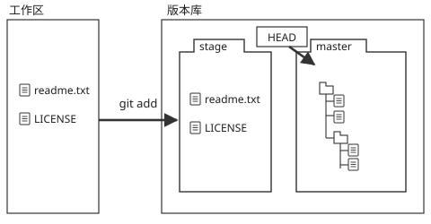
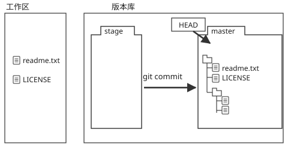

## 一、Create/Clone Repository

```bash
mkdir learngit
cd learngit
pwd
git init //创建版本库,生成.git文件夹
git clone git clone https://gitee.com/easypr/EasyPR.git //克隆
```

## 二、Add

```bash
git add readme.txt

git add .   //文件内容修改(modified)和新文件(new),不包括删除的文件
git add -u  //仅监控被add的文件,不会提交新文件(git add --update缩写)
git add -A  //上面两个功能的合集(git add --all的缩写)
git add -f XX//强行加入忽略的文件,.gitignore中被排除的文件添加
```

**git add将所有修改放入暂存区**



## 三、Commit

```bash
git commit -m "wrote a reademe file"

git commit -m 'initial commit'

git add forgotten_file

git commit --amend //撤销上一次提交并重新提交,用于提交后发现,忘记add某些文件
```

-m后面输入的是本次提交的说明,可以输入任意内容,当然最好是有意义的,这样你就能从历史记录里方便地找到改动记录.

**git commit将暂存区所有修改提交到分支,并清空暂存区**



## 四、log

日志为第一次提交,到当前版本的所有commit,已删除的commit无法显示

```bash
git log //多行
git log --pretty=oneline  //log单行显示
git log --oneline         //log单行显示
q                         //log超过一屏时,enter继续显示,q退出显示
```

你看到的一大串类似3628164...882e1e0的是commit id(版本号),和SVN不一样,Git的commit id不是1,2,3……递增的数字,而是一个SHA1计算出来的一个非常大的数字,用十六进制表示,而且你看到的commit id和我的肯定不一样,以你自己的为准.为什么commit id需要用这么一大串数字表示呢？因为Git是分布式的版本控制系统,后面我们还要研究多人在同一个版本库里工作,如果大家都用1,2,3……作为版本号,那肯定就冲突了.

## 五、reflog

```bash
git reflog
```

git reflog 可以查看所有分支的所有操作记录(包括commit和reset的操作),包括已经被删除的commit记录,git log则不能察看已经删除了的commit记录

## 六、Reset/Revert

### 6.1 HEAD指针

1. 在Git中,用HEAD表示当前版本,上一个版本就是`HEAD^`,上上一个版本就是`HEAD^^`,当然往上100个版本写100个^比较容易数不过来,所以写成`HEAD~100`.

2. 版本号没必要写全,前几位就可以了,Git会自动去找.

3. Git的版本回退速度非常快,因为Git在内部有个指向当前版本的HEAD指针,当你回退版本的时候,Git仅仅是把HEAD指向目的commit id

4. `HEAD^`在windows cmd中`^`属特殊字符,应输入`HEAD"^"`

### 6.2 reset

```bash
git reset [--soft | --mixed | --hard
git reset --soft HEAD^   //回退HEAD,会保留源码
git reset --mixed HEAD^  //回退HEAD和index(stage),会保留源码
git reset --hard HEAD^   //回退HEAD、index(stage)和源码
git reflog               //查看commit id
git reset --hard [commit id] //回到commit id版本
```

在未push以前,采用git reset回退.在push代码以后,也使用 reset --hard <commit...> 回退代码到某个版本之前,但是这样会有一个问题,你线上的代码没有变,线上commit,index都没有变,当你把本地代码修改完提交的时候你会发现全是冲突.或慎重使用`git push -f `

### 6.3 revert

* git revert用于反转提交,执行revert命令时要求工作树必须是干净的(index为空).

* git revert用一个新提交来消除一个历史提交所做的任何修改.

* revert 之后你的本地代码会回滚到指定的历史版本,这时你再 git push 既可以把线上的代码更新.(这里不会像reset造成冲突的问题)

```bash
git revert HEAD^          //回到前一个版本
git revert [commit id]    //回到指定commit id
```

### 6.4 reset和revert区别

1. git revert是用一次新的commit来回滚之前的commit,git reset是直接删除指定的commit.push到线上代码库, reset 删除指定commit以后,你git push可能导致一大堆冲突.但是revert 并不会.

2. 如果在日后现有分支和历史分支需要合并的时候,reset恢复部分的代码依然会出现在历史分支里.但是revert方向提交的commit并不会出现在历史分支里.

3. reset 是在正常的commit历史中,删除了指定的commit,这时 HEAD 是向后移动了,而 revert 是在正常的commit历史中再commit一次,只不过是反向提交,他的HEAD 是一直向前的.

## 七、status

```bash
git status
```

## 八、diff

查看文件在工作目录与暂存区的差别

```bash
git diff <filename>//比较两次修改的差异,不加参数默认比较工作区与暂存区
git diff --cached <filename/path> //比较暂存区与最新本地版本库(本地库中最近一次commit的内容)
git diff --cached <commit> <filename> //与指定版本文件比较
git diff <commit> <commit>            //两次commit比较
```

## 九、Undo(checkout)

```bash
git checkout -- readme.txt
```

git checkout -- file可以丢弃工作区的修改:

命令git checkout -- readme.txt意思就是,把readme.txt文件在工作区的修改全部撤销,这里有两种情况:

* 一种是readme.txt自修改后还没有被放到暂存区,现在,撤销修改就回到和版本库一模一样的状态.

* 一种是readme.txt已经添加到暂存区后,又作了修改,现在,撤销修改就回到添加到暂存区后的状态.

总之,就是让这个文件回到最近一次git commit或git add时的状态.

```bash
git reset HEAD file //可以把暂存区的修改撤销掉(unstage),重新放回工作区,也可以回退版本
```

## 十、rm

1. 从版本库删除

   ```bash
   git rm readme.txt
   git reset HEAD readme.txt // 版本回退
   git checkout -- readme.txt //恢复文件

   git rm -r folder //删除目录,交互式
   git rm -rf folder //强制删除,无交互
   ```

2. 误删除,可恢复

   ```bash
   rm readme.txt
   git checkout -- readme.txt
   ```

## 十一、remote/push/pull

```bash
git remote add origin git@server-name:path/repo-name.git//关联一个远程库
git push -u origin master	//第一次推送master分支的所有内容
git push -f                 //强制推送,会覆盖remote
git push origin master      //推送最新修改
git clone git@github.com:michaelliao/gitskills.git //克隆
git remote -v               //查看远程库信息
git push origin [branch name]   //推送其它分支
git pull                    //抓取分支
git fetch                   //拉取,git fetch这个命令会把远程的commits拉取到本地的repo中,但是,它不是直接把commits接在分支的最后面,而是从你最后一次push的那个commit节点,再拉取一个新的分支出来,
git pull = git fetch + merge to loacal
```

**push**&rarr;[MorePush](https://www.yiibai.com/git/git_push.html)

## 十二、Reference sites

* [廖雪峰的网站](https://www.liaoxuefeng.com/wiki/0013739516305929606dd18361248578c67b8067c8c017b000)

* [ProGit English](https://git-scm.com/book/en/v2)

* [ProGit zh](https://git-scm.com/book/zh/v2)


