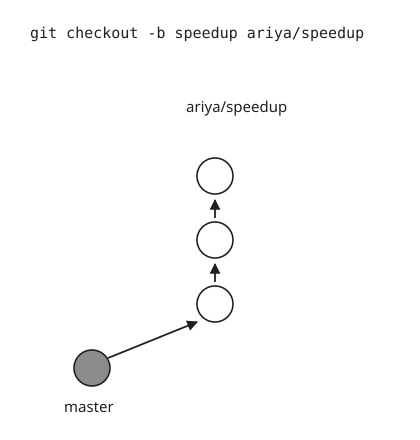
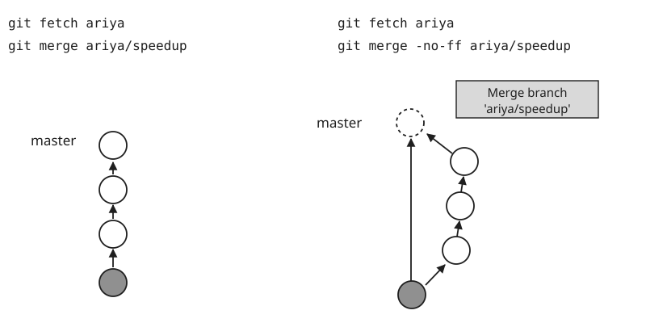
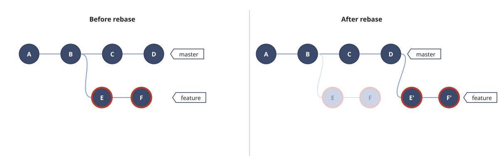

## 一、branch

```bash
git branch               //查看分支
git branch <name>        //创建分支
git checkout <name>      //切换分支
git checkout -b <name>   //创建+切换分支
git branch -d <name>     //删除分支,用于合并后删除
git branch -D <name>     //强行删除分支,用于未合并删除
```

### branch Strategy

1. master,主分支,有且仅有一个,用于发布或者部署正式版本.

2. dev,开发分支,用于日常开发.

3. feature,功能分支,用于添加新功能,临时性分支,用后删除

4. release,预发布分支,临时性分支,用后删除

5. hotfix,修补bug分支,临时性分支,用后删除.

## 二、merge/rebase

[**View More&larr;&larr;&larr;**](http://blog.csdn.net/wh_19910525/article/details/7554489)

### 2.1 merge

merge的两种模式

#### 2.1.1 Fast Forward模式

如果**创建分支后,master无新提交**,合并分支Git会默认用`Fast forward`模式,master HEAD指针移动到branch HEAD,此过程不会有新的commit.分支历史是线性的.这种模式是直接覆盖,不会产生冲突

#### 2.1.2 non Fast Forward模式

Git就会在merge时生成一个新的commit,从分支历史上就可以看出分支信息.分支历史是非线性的.merge 遇见冲突后会直接停止,等待手动解决冲突并重新提交 commit 后,才能再次 merge

#### 2.1.3 Fast Forward与non Fast Forward图解

* merge前,创建speedup分支并三次commit



* fast forward模式和普通模式合并,分支图对比



#### 2.1.4 merge 常用命令

```bash
git merge <name>                //合并某分支到当前分支
git merge --no-ff -m "merge with no-ff" dev //禁用Fast forward
git merge --no-commit dev      //合并但不提交
git merge --no-ff --no-commit dev //禁fast forward且不提交,建议这种方式merge
```

### 2.2 rebase

rebase(变基) 即重新定义分支的版本库状态,遇见冲突后会暂停当前操作,**不能在一个共享的分支上进行Git rebase操作**,所谓共享的分支,即是指那些存在于远端并且允许团队中的其他人进行Pull操作的分支,详见[**Git Rebase原理以及黄金准则**](https://segmentfault.com/a/1190000005937408)

#### 2.2.1 rebase常用命令

```bash
//如果产生冲突或有交互时(git rebase -i commitid)使用
git rebase <name>
git rebase --abort      //停止rebase,丢弃上一条的rebase操作
git rebase --continue   //继续rebase,保存上一条的rebase操作
git rebase --skip       //跳过,不解决冲突,直接覆盖
```

#### 2.2.2 rebase workflow



* master分支.

  在rebase时,按照commit时间排序整合到当前分支,**如果顺序改变,即产生新的提交,即使内容没有任何改变**

  如果F>E>D>C,在rebase时,F,E会产生新的提交id,C和D不变,如上图
  如果D>C>F>E,在rebase时,F,E会产生新的提交id,插入C和D前,分支图改变

* feature分支.

  Git rebase并不会删除老的提交

## 三、stash

git stash当前工作现场“储藏”起来,等以后恢复现场后继续工作,相当于栈

软件开发中,bug就像家常便饭一样.有了bug就需要修复,在Git中,由于分支是如此的强大,所以,每个bug都可以通过一个新的临时分支来修复,修复后,合并分支,然后将临时分支删除.

当你接到一个修复一个代号101的bug的任务时,很自然地,你想创建一个分支issue-101来修复它,但是,等等,当前正在dev上进行的工作还没有提交:

```bash
git stash
git checkout master
git checkout -b issue-101
...
git checkout master
git merge --no-ff -m "merged bug fix 101" issue-101
git branch -d issue-101
git checkout dev
git stash list
git stash pop   //stash恢复法一,恢复的同时删除stash内容
git stash apply //stash恢复法二,恢复后,stash内容并不删除
git stash drop  //stash恢复法二,删除stash内容
```

## 四、tag

发布一个版本时,我们通常先在版本库中打一个标签(tag),这样,就唯一确定了打标签时刻的版本.将来无论什么时候,取某个标签的版本,就是把那个打标签的时刻的历史版本取出来.所以,标签也是版本库的一个快照.commit id与tag捆绑,更易标识.

```bash
git tag v1.0    //默认打在最新提交的commit上
git tag         //查看所有标签,标签不是按时间顺序列出,而是按字母排序的.
git tag [tagname] [commit id] //为指定commit id打标签
git show <tagname>            //查看标签信息
git tag -a v0.1 -m "version 0.1 released" 3628164 //还可以创建带有说明的标签,用-a指定标签名,-m指定说明文字.
git tag -d <tagname>          //删除标签
git push origin <tagname>     //推送某个标签到远程.创建的标签都只存储在本地,不会自动推送到远程.所以,打错的标签可以在本地安全删除.
git push origin --tags         //一次性推送全部尚未推送到远程的本地标签
git push origin :refs/tags/<tagname> //删除一个远程标签
```

## 五、submodule/subtree

### 5.1 submodule

项目的版本库在某些情况下需要引用其他版本库中的文件,子模块可以有自己的版本管理,Git1.5以前管理子项目的方案

```bash
git submodule add <repos> <local>
git submodule add https://github.com/chaconinc/DbConnector
git submodule add ../ITMAX_PC //ITMAX_PC为git仓库,使用相对路径../XXX,指向目录无需指向.git

//git clone后,子模块目录为空
git submodule init
git submodule update --remote
```

执行以上命令后会生成.gitmodule的文件,文件存储子模块信息,如果本地修改子模块,在主仓库会显示子仓库有修改,可以一次提交多个子模块的修改到仓库

```bash
[submodule "ModuleA"]
    path = ModuleA
    url = http://sifan.liu@scm.ModuleB.com/bitbucket/scm/nic/ModuleB_backend_ModuleA.git
```

删除子模块

* 删除.gitsubmodule里相关部分

* 删除.git/config 文件里相关字段

* 删除子仓库目录.

### 5.2 subtree

经由 Git Subtree 来维护的子项目代码,对于父项目来说是透明的,所有的开发人员看到的就是一个普通的目录,原来怎么做现在依旧那么做,只需要维护这个 Subtree 的人在合适的时候去做同步代码的操作.每次只能push一个子树到仓库

```bash
git subtree add --prefix=sub(folder name) <git Repository> <branch>
git subtree add --prefix=Subtree "https://....git" master
git subtree add --prefix=Subtree "D:/.../.git" master //当前仓库必须commit至少一次
git subtree push --prefix=ModuleA ModuleA master
git subtree pull --prefix=ModuleA ModuleA ModuleA master
```

### 5.3 差异

git submodule类似于引用,而git subtree类似于拷贝,比如你在一篇博客中想用到你另一篇博客的内容,必须单独提交,git submodule是使用那篇博客的链接,而git subtree则是将内容完全copy过来,所有子模块可以一次提交.

## 六、rebase -i

将多次commit合并,只保留部分提交历史

1. git rebase -i交互式删除

   ```bash
   git rebase -i HEAD~4
   git rebase -i commitid
   ```

2. 出现交互窗口,按照提交时间排序

   ```bash
   pick fc73cc4 add br4
   pick 0319732 add br20
   pick 9de2201 add f1
   pick 5e71e98 add f2

   # Rebase c246868..5e71e98 onto c246868 (10 commands)
   #
   # Commands:
   # p, pick = use commit
   # r, reword = use commit, but edit the commit message
   # e, edit = use commit, but stop for amending
   # s, squash = use commit, but meld into previous commit
   # f, fixup = like "squash", but discard this commit's log message
   # x, exec = run command (the rest of the line) using shell
   # d, drop = remove commit
   #
   # These lines can be re-ordered; they are executed from top to
   ```

3. 修改交互文件

   `fixup`或`squash`代替pick,必须保留一个pick,否则HEAD失去方向

4. 保存或放弃

   ```bash
   git rebase --continue    //保存
   git rebase --abort       //停止
   git push -f              //强行推送并覆盖
   ```

## 七、git cherry-pick

直接摘取某次或某几次commit加到当前分支作为最新一次提交

假设我们有个稳定版本的分支,叫v2.0,另外还有个开发版本的分支v3.0,我们不能直接把两个分支合并,这样会导致稳定版本混乱,但是又想增加一个v3.0中的功能到v2.0中,这里就可以使用cherry-pick了

```bash
git cherry-pick commitid
git cherry-pick commitid1..commitidn
```

## 七、Reference sites

* [廖雪峰的网站](https://www.liaoxuefeng.com/wiki/0013739516305929606dd18361248578c67b8067c8c017b000)

* [ProGit English](https://git-scm.com/book/en/v2)

* [ProGit zh](https://git-scm.com/book/zh/v2)

