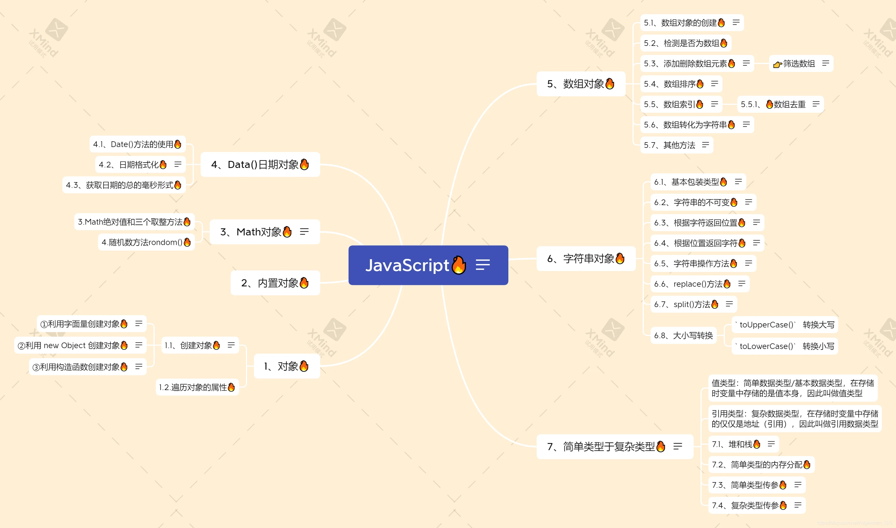

# 一、目录总览

JavaScript 中的对象分为3种：自定义对象 、内置对象、 浏览器对象



# 二、自定义对象

在 JavaScript 中，对象是一组无序的相关属性和方法的集合，所有的事物都是对象，例如字符串、数值、数组、函数等。

对象是由属性和方法组成的：

*   属性：事物的特征，在对象中用属性来表示（常用名词）
*   方法：事物的行为，在对象中用方法来表示（常用动词）

## (一) 创建对象

在 JavaScript 中，现阶段我们可以采用三种方式创建对象（object）：

1.  利用字面量创建对象
2.  利用 new Object创建对象
3.  利用构造函数创建对象

### 1. 利用字面量创建对象

对象字面量：就是花括号 { } 里面包含了表达这个具体事物（对象）的属性和方法

{ } 里面采取键值对的形式表示

*   键：相当于属性名
*   值：相当于属性值，可以是任意类型的值（数字类型、字符串类型、布尔类型，函数类型等）

```javascript
var star ={
    name : 'star',
    age : 20,
    sex : "female",
    say : function(){
        console.log("I am "+this.name);
    }
};
```

### 2. 利用 new Object创建对象

```javascript
var star = new Object();
star.name = 'star';
star.age = 20;
star.sex = "female";
star.say = function(){
    console.log("I am "+this.name);
};
```

### 3. 利用构造函数创建对象

构造函数 ：是一种特殊的函数，主要用来初始化对象，即为对象成员变量赋初始值，它总与 new 运算符一起使用。我们可以把对象中一些公共的属性和方法抽取出来，然后封装到这个函数里面。

*   构造函数用于创建某一类对象，其首字母要大写
*   函数内的属性和方法前面需要添加 this ，表示当前对象的属性和方法。
*   构造函数要和 new 一起使用才有意义

```javascript
function Star(name,age,sex){
    this.name = name;
    this.age = age;
    this.sex = sex;
    this.say = function(){
        console.log("I am "+this.name);
    }
}

var star = new Star('star',20,'female');
console.log(star.name);
star.say();
```

## (二) new

new 在执行时会做四件事:

1.  在内存中创建一个新的空对象。
2.  让 this 指向这个新的对象。
3.  执行构造函数里面的代码，给这个新对象添加属性和方法
4.  返回这个新对象（所以构造函数里面不需要return）

## (三) 对象的调用

1.  对象里面的属性调用 : `对象.属性名`
2.  对象里面属性的另一种调用方式 : `对象[‘属性名’]`，注意方括号里面的属性必须加引号
3.  对象里面的方法调用：`对象.方法名()`

```javascript
function Star(name,age,sex){
    this.name = name;
    this.age = age;
    this.sex = sex;
    this.say = function(){
        console.log("I am "+this.name);
    }
}

var star = new Star('star',20,'female');
console.log(star.name);
console.log(star['age']);
star.say();

/*
star
20
I am star
*/
```

## (四) 遍历对象的属性

### 1. for..in

```javascript
for(var attr in obj){
	console.log(attr); //属性名称
	console.log(obg[attr]); //属性值
}
```

```javascript
function Star(name,age,sex){
    this.name = name;
    this.age = age;
    this.sex = sex;
    this.say = function(){
        console.log("I am "+this.name);
    }
}

var star = new Star('star',20,'female');

for(var attr in star){
    console.log(attr);
    console.log(star[attr]);
    console.log("----------");
}
/*
name
star
----------
age
20
----------
sex
female
----------
say
[Function (anonymous)]
----------
*/
```

### 2. Object.keys()

```javascript
function Star(name,age,sex){
    this.name = name;
    this.age = age;
    this.sex = sex;
    this.say = function(){
       console.log("I am "+this.name);
    }
}

var ldh = new Star("刘德华",18,"男");
      
for(var attr in ldh){
  console.log(attr);
  console.log(ldh[attr]);
}

var ldhAttr = Object.keys(ldh);
var ldhValue = Object.values(ldh);

ldhAttr.forEach(function(value){
   console.log(value);
})
ldhValue.forEach(function(value){
   console.log(value);
})
```

# 三、内置对象

*   内置对象就是指 JS 语言自带的一些对象，这些对象供开发者使用，并提供了一些常用的或是最基本而必要的功能
*   JavaScript 提供了多个内置对象：Math、 Date 、Array、String等
*   内置对象查询文档 MDN<<https://developer.mozilla.org/zh-CN/>>

## (一) Math

Math 对象不是构造函数，它具有数学常数和函数的属性和方法。跟数学相关的运算（求绝对值，取整、最大值等）可以使用 Math 中的成员。

```javascript
// 返回圆周率
Math.PI
// 返回指定值的绝对值
Math.abs(-1)
// 返回最大整数
Math.ceil(3.2)
// 返回最小整数
Math.floor(3.2)
// 返回最接近的整数
Math.round(3.2)
// 返回随机数
Math.random()
// 返回给定参数的最大值
Math.max(1,2,3,4,5)
// 返回给定参数的最小值
Math.min(1,2,3,4,5)
// 返回x的y次方
Math.pow(2,3)
// 返回x的平方根
Math.sqrt(16)
// 返回x的正弦值
Math.sin(30*Math.PI/180)
// 返回x的余弦值
Math.cos(30*Math.PI/180)
// 返回x的正切值
Math.tan(30*Math.PI/180)
// 返回x的反正弦值
Math.asin(0.5)
// 返回x的反余弦值
Math.acos(0.5)
```

1.  封装自己的数学对象,包含PI,最大值和最小值.

    ```javascript
    var customMath = {
        PI : Math.PI,
        max : function(){
            var max = arguments[0];
            for(var i = 1;i<arguments.length;i++){
                if(arguments[i]>max){
                    max = arguments[i];
                }
            }
            return max;
        },
        min : function(){
            var min = arguments[0];
            for(var i = 1;i<arguments.length;i++){
                if(arguments[i]<min){
                    min = arguments[i];
                }
            }
            return min;
        }
    };

    console.log(customMath.PI);
    console.log(customMath.max(1,2,3,4,5));
    console.log(customMath.min(1,2,3,4,5));
    ```

2.  随机数方法random()的使用

    random() 方法可以随机返回一个小数，其取值范围是 \[0，1)，左闭右开 0 <= x < 1

    ```javascript
    function getRandom(min,max){
        return Math.floor(Math.random()*(max-min+1)+min);
    }

    var arr = [1,2,3,4,5,6,7,8,9,10];
    for(var i = 0;i<arr.length;i++){
        if(arr[i]%2==0){
            arr[i] = getRandom(1,10);
        }   
    }
    console.log(arr);

    /*
    [
      1, 10, 3, 1,  5,
      1,  7, 6, 9, 10
    ]
    */
    ```

## (二) Date

*   Date 对象和 Math 对象不一样，他是一个构造函数，所以我们需要实例化后才能使用
*   Date 实例用来处理日期和时间
*   如果括号里面有时间，就返回参数里面的时间,参数常用写法

    ```javascript
    //如果参数是数字型,用逗号分隔
    var date2 = new Date(2022,0,1,8,8,8);

    //如果参数是字符型
    var date1 = new Date('2022-01-01 8:8:8');
    ```
*   如果Date()不写参数，就返回当前时间

```javascript
var now = new Date();
console.log(now);
// 获取当前日期的年份
console.log('年份: ' + now.getFullYear());
// 获取当前日期的月份,[0~11]
console.log('月份: ' + now.getMonth() + 1);
// 获取当前日期的日期
console.log('日期: ' + now.getDate());
// 获取当前日期的星期
console.log('星期: ' + now.getDay());
// 获取当前日期的小时
console.log('小时: ' + now.getHours());
// 获取当前日期的分钟
console.log('分钟: ' + now.getMinutes());
// 获取当前日期的秒
console.log('秒: ' + now.getSeconds());
// 获取当前日期的毫秒
console.log('毫秒: ' + now.getMilliseconds());
//获取从1970年1月1日至今的毫秒数
console.log('时间戳(从1970年1月1日至今的毫秒数): ' + now.valueOf());
//从1970年1月1日至今的毫秒数
console.log('时间戳(从1970年1月1日至今的毫秒数): ' + now.getTime());

var date1 = new Date('2022-01-01 8:8:8');
console.log(date1); //2022-01-01T00:08:08.000Z

var date2 = new Date(2022,0,1,8,8,8);
console.log(date2); //2022-01-01T00:08:08.000Z
```

```javascript
//一个倒计时程序
//倒计时程序
function countDown(year,month,day){
    var now = new Date();
    var future = new Date(year,month,day);
    var interval = future.getTime() - now.getTime();
    if( interval < 0){
        console.log("时间已过");
        return;
    }
    var d = Math.floor(interval / (1000 * 60 * 60 * 24));
    var h = Math.floor(interval / (1000 * 60 * 60) % 24);
    var m = Math.floor(interval / (1000 * 60) % 60);
    var s = Math.floor(interval / 1000 % 60);
    console.log(d + "天" + h + "小时" + m + "分钟" + s + "秒");
}
countDown(2024,11,22);
//348天12小时43分钟12秒
```

## (三) 数组

[javascriptNotes04\_数组](https://note.youdao.com/s/ZTtNQT1N)

## (四) string对象

### 1. 基本包装类型

基本包装类型就是把简单数据类型包装成为复杂数据类型，这样基本数据类型就有了属性和方法。

```javascript
var str = 'andy';
console.log(str);
```

按道理基本数据类型是没有属性和方法的，而对象才有属性和方法，但上面代码却可以执行，这是因为 js 会把基本数据类型包装为复杂数据类型，其执行过程如下 ：

```javascript
//生成临时变量,把简单类型包装为复杂数据类型
var tmp = new String('andy');
//赋值给声明的字符变量
str = tmp;
//销毁临时变量
tmp = null;
```

### 2. 字符串值不可变

指的是里面的值不可变，虽然看上去可以改变内容，但其实是地址变了，内存中新开辟了一个内存空间。

```javascript
var str = 'abc';
str = 'hello';
//当重新给str赋值时,常量'abc'不会被修改,依然在内存中
//重新给字符串赋值,会重新在内存中开辟空间
//由于字符串不可变,大量拼接会有效率问题.
var str = '';
for(var i = 0; i < 10000; i++)
	str += i;
console.log(str);
//这个结果需要花费大量时间来显示,因为需要不断的开辟内存空间.
```

### 3. 查找字符索引

#### (1) indexOf

indexOf(‘要查找的字符’，开始的位置),返回指定内容在元字符串中的位置，如果找不到就返回-1，开始的位置是index索引号

#### (2) lastIndexOf()

lastIndexOf(‘要查找的字符’，开始的位置),从后往前找，只找第一个匹配的

```javascript

var str = '花开花落,人来人往';
console.log(str.indexOf('人',3)); //5
console.log(str.lastIndexOf('人',str.length - 1)); //7
```

### 4. 返回指定位置字符

#### (1) charAt(index)

返回指定位置的字符(index字符串的索引号)

#### (2) charCodeAt(index)

获取指定位置处字符的ASCII码(index索引号)

#### (3) str\[index]

获取指定位置处字符

```javascript
var str = 'javascript';
console.log(str.charAt(3)); // 输出: a
console.log(str.charCodeAt(3)); // 输出: 91
console.log(str[3]); // 输出: a
```

### 5. concat(str1,str2...)

concat() 方法用于连接两个或对各字符串。拼接字符串

### 6. substr(start,length)

从 start 位置开始(索引号), length 取的个数。

### 7. slice(start,end)

从 start 位置开始，截取到 end 位置 ，end 取不到 (两个都是索引号)

### 8. substring(start,end)

从 start 位置开始，截取到 end 位置 ，end 取不到 (基本和 slice 相同，但是不接受负)

```javascript
var str = 'andy';
console.log(str.concat('red')); //andyred

console.log(str); //andy

console.log(str.substr(1, 10)); //ndy

var str1 = str.slice(1, 3); 

console.log(str1); //nd

console.log(str); //andy

console.log(str.substring(0, 3)); //an
```

### 9. replace

replace() 方法用于在字符串中用一些字符替换另一些字符,默认只替换第一次出现的

其使用格式：replace(被替换的字符,要替换为的字符串)

```javascript
var str = 'andyandy';
console.log(str.replace('a', 'b')); //bndyandy
console.log(str); //andyandy

while(str.indexOf('a') !== -1){
    str = str.replace('a', 'b');
}
console.log(str); //bndybndy
console.log(str.replace(/a/g, 'b')); //正则表达式,bndybndy
```

### 10. split(separator)

split() 方法用于切分字符串，它可以将字符串切分为数组。在切分完毕之后，返回的是一个新数组。

```javascript
var str = 'andyandy';
console.log(str.split('')); //['a','n','d','y','a','n','d','y']

var str1 = 'red,blue,green,yellow';
console.log(str1.split(',')); //['red','blue','green','yellow']
console.log(str1.split(',',2)); //['red','blue']
/*[
    'r', 'e', 'd', ',', 'b',
    'l', 'u', 'e', ',', 'g',
    'r', 'e', 'e', 'n', ',',
    'y', 'e', 'l', 'l', 'o',
    'w'
  ]
  */
console.log(str1.split(''));

var str2 = 'redpinkbluegreenyellow';
//[ 'red', 'blue', 'green', 'yellow' ]
//[ 'red', 'bluegreenyellow' ]
console.log(str2.split('pink')); 
```

### 11. toUpperCase()

### 12. toLowerCase()

```javascript
var str = 'andyAndy';
console.log(str.toUpperCase()); //ANDYANDY
console.log(str.toLowerCase()); //andyandy

var str = '   hello world   '; //hello world
console.log(str.trim()); // 去除字符串两端的空格
```

### 13. trim

从一个字符串的两端删除空白字符,并不影响原字符串本身，它返回的是一个新的字符串

```javascript
var name = ' abc ';
console.log(name.trim()); // 输出 "abc"
console.log(name); // 输出 " abc "
```
