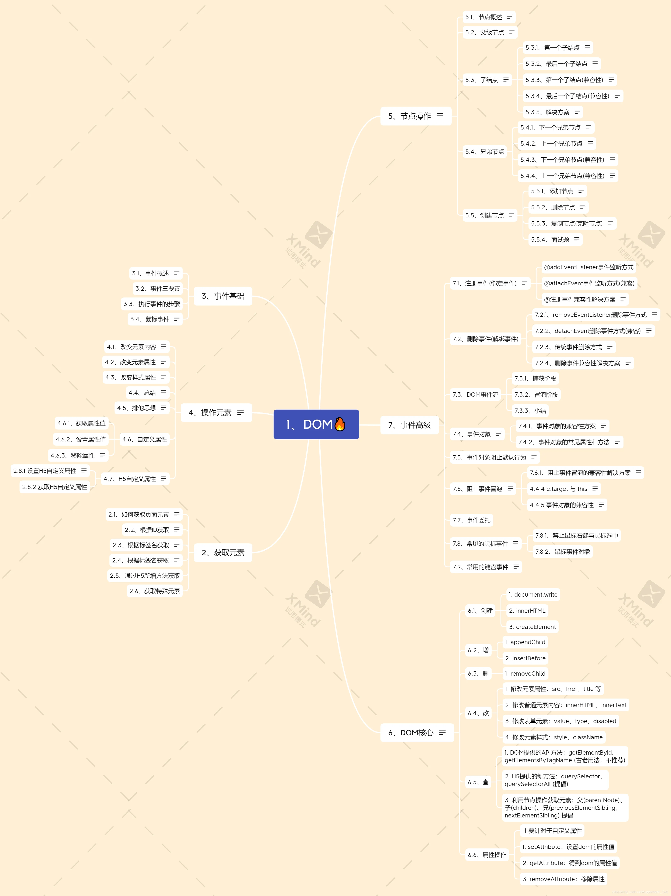
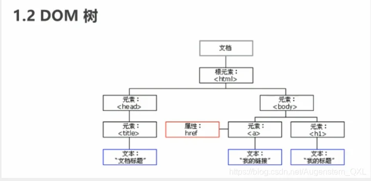
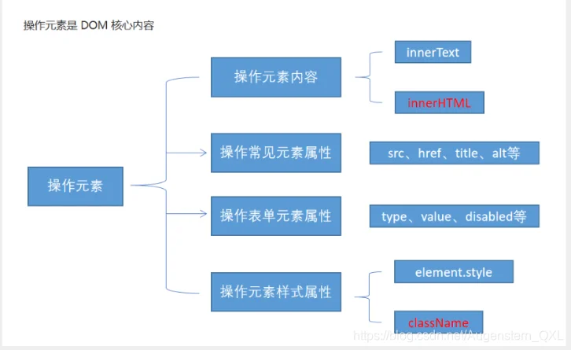

# 一、目录总览



# 二、DOM简介

文档对象模型（Document Object Model，简称 DOM），是 W3C 组织推荐的处理可扩展标记语言（HTML或者XML）的标准编程接口

W3C 已经定义了一系列的 DOM 接口，通过这些 DOM 接口可以改变网页的内容、结构和样式。



*   **<mark>文档</mark>**

    一个页面就是一个文档，DOM中使用doucument来表示

*   <mark>元素</mark>

    页面中的所有标签都是元素，DOM中使用 element 表示

*   <mark>节点</mark>

    网页中的所有内容都是节点（标签，属性，文本，注释等），DOM中使用node表示

DOM 把以上内容都看做是对象

# 三、获取元素

获取页面中的元素可以使用以下几种方式:

1.  根据 ID 获取
2.  根据标签名获取
3.  通过 HTML5 新增的方法获取
4.  特殊元素获取

```css
//demo中用到的css,保存为style.css
body {
    background: transparent; /* Make it white if you need */
    color: #fcbe24;
    padding: 0 24px;
    margin: 0;
    height: 100vh;
    display: flex;
    justify-content: center;
    align-items: center;
    font-family: -apple-system, BlinkMacSystemFont, 'Segoe UI', Roboto, Oxygen, Ubuntu, Cantarell, 'Open Sans', 'Helvetica Neue', sans-serif;
  }
```

## (一) 根据ID获取

使用 getElementByld() 方法可以获取带ID的元素对象

```javascript
document.getElementById('timer');
```

```html
<!DOCTYPE html>
<html lang="en">
  <head>
    <meta charset="UTF-8">
    <meta name="viewport" content="width=device-width, initial-scale=1.0">
    <link rel="stylesheet" href="style.css">
  </head>
  <body>
    <h1 id="header"></h1>
    <h2 id="timer"></h2>

    <!-- <script src="script.js"></script> -->
    <script>
      var timer = document.getElementById('timer');
      timer.innerText = '加载中...';
      timer.style.color = 'blue';
      console.log(timer);
      var header = document.getElementById('header');
      document.querySelector('h1').innerText = 'Hello, World!';
      document.querySelector('h1').style.color = 'red';
      console.log(header);
    </script>
  </body>
</html>
```

## (二) 根据标签名获取

根据标签名获取，使用 getElementByTagName() 方法可以返回带有指定标签名的对象的集合

```javascript
document.getElementByTagName('tagName');
```

*   因为得到的是一个对象的集合，所以我们想要操作里面的元素就需要遍历
*   得到元素对象是动态的
*   返回的是获取过来元素对象的集合，以伪数组的形式存储
*   如果获取不到元素，则返回为空的伪数组(因为获取不到对象)

```html
<!DOCTYPE html>
<html lang="en">
  <head>
    <meta charset="UTF-8">
    <meta name="viewport" content="width=device-width, initial-scale=1.0">
    <link rel="stylesheet" href="style.css">
  </head>
  <body>
    <h1 id="header"></h1>
    <ul>
      <li>列表项1</li>
      <li>列表项2</li>
      <li>列表项3</li>
    </ul>

    <!-- <script src="script.js"></script> -->
    <script>
      var lis = document.getElementsByTagName('li');
      for(var i = 0; i < lis.length; i++) //3
      {
        lis[i].style.color = 'blue';
      }
      console.log(lis);

      var uls = document.getElementsByTagName('ul');
      for(var i = 0; i < uls.length; i++) //1
      {
        uls[i].style.backgroundColor = 'yellow';
      }
      console.log(uls);

    </script>
  </body>
</html>
```

获取指定标签名的子元素

```javascript
var ul1 = document.getElementById('ul1');
// 获取ul1中所有li标签
var uil1Lis = ul1.getElementsByTagName('li');
```

```html
<!DOCTYPE html>
<html lang="en">
  <head>
    <meta charset="UTF-8">
    <meta name="viewport" content="width=device-width, initial-scale=1.0">
    <link rel="stylesheet" href="style.css">
  </head>
  <body>
    <h1 id="header"></h1>
    <ul id = 'ul1'>
      <li>列表项1</li>
      <li>列表项2</li>
      <li>列表项3</li>
    </ul>

    <ul id = 'ul2'>
      <li>列表项4</li>
      <li>列表项5</li>
      <li>列表项6</li>
    </ul>

    <!-- <script src="script.js"></script> -->
    <script>
      var lis = document.getElementsByTagName('li');
      for(var i = 0; i < lis.length; i++) // 遍历所有li标签6个
      {
        lis[i].style.color = 'blue';
      }
      console.log(lis);

      //将ul1中所有li标签的背景色设置为黄色
      var ul1 = document.getElementById('ul1');
      // 获取ul1中所有li标签
      var uil1Lis = ul1.getElementsByTagName('li');
      for(var i = 0; i < uil1Lis.length; i++)
      {
        uil1Lis[i].style.backgroundColor = 'yellow';
      }
      console.log(uil1Lis);

    </script>
  </body>
</html>
```

## (三) 通过H5新增方法获取

### 1. 根据类名返回元素对象合集

```javascript
document.getElementsByClassName('类名')
```

```html
<!DOCTYPE html>
<html lang="en">
  <head>
    <meta charset="UTF-8">
    <meta name="viewport" content="width=device-width, initial-scale=1.0">
    <link rel="stylesheet" href="style.css">
  </head>
  <body>
    <h1 id="header"></h1>
    <ul class = 'ul1'>
      <li class="child">列表项1</li>
      <li class="child">列表项2</li>
      <li class="child">列表项3</li>
    </ul>


    <!-- <script src="script.js"></script> -->
    <script>
      var u1 = document.getElementsByClassName('ul1');
      console.log(u1);
      var lis = u1[0].getElementsByClassName('child');
      console.log(lis);
      for (var i = 0; i < lis.length; i++) {
        lis[i].addEventListener('click', function() {
          this.style.backgroundColor = 'lightblue';
        });
      }

    </script>
  </body>
</html>
```

### 2. 根据指定选择器返回第一个元素对象

选择器需要加符号

*   类选择器.box
*   id选择器 #nav

```javascript
document.querySelector('选择器);

//类选择器
var firstBox = document.querySelector('.box');
//id选择器
var firstId = document.querySelector('#nav');
```

### 3. 根据指定选择器返回所有元素对象

```javascript
document.querySelectorAll('选择器');
```

```html
<!DOCTYPE html>
<html lang="en">
  <head>
    <meta charset="UTF-8">
    <meta name="viewport" content="width=device-width, initial-scale=1.0">
    <link rel="stylesheet" href="style.css">
  </head>
  <body>
    <h1 id="header"></h1>
    <ul class = 'ul1'>
      <li class="child">列表项1</li>
      <li class="child">列表项2</li>
      <li class="child">列表项3</li>
    </ul>


    <!-- <script src="script.js"></script> -->
    <script>

      //getElementsByClassName() 方法返回文档中所有指定类名的元素集合，作为 NodeList 对象。
      var u1s1 = document.getElementsByClassName('ul1');
      console.log(u1s1[0]);
      var lis = u1s1[0].getElementsByClassName('child');
      console.log(lis);
      for (var i = 0; i < lis.length; i++) {
        lis[i].addEventListener('click', function() {
          this.style.backgroundColor = 'lightblue';
        });
      }

      //querySelector() 方法返回文档中匹配指定选择器的一个元素。
      var u1s2 = document.querySelector('.ul1');
      console.log(u1s2);
      var header = document.querySelector('#header');
      console.log(header);

      //querySelectorAll() 方法返回文档中匹配指定选择器的所有元素。
      var u1s3 = document.querySelectorAll('.ul1');
      console.log(u1s3);
      var lis3 = u1s3[0].querySelectorAll('.child');
      console.log(lis3);

    </script>
  </body>
</html>
```

## (四) 获取特殊元素

### 1. 获取body元素

```javascript
document.body
```

### 2. 获取html元素

```javascript
document.documentElement
```

# 四、操作元素

## (一) 改变元素内容

*   element.innerText

    去除html标签，同时空格和换行也会去掉。

*   element.innerHTML

    保留HTML标签，同时保留空格和换行

```html
<!DOCTYPE html>
<html lang="en">
  <head>
    <meta charset="UTF-8">
    <meta name="viewport" content="width=device-width, initial-scale=1.0">
    <link rel="stylesheet" href="style.css">
  </head>
  <body>
    <button id="start">打开百度</button>
    <p>
      我是文字
      <span>123</span>
    </p>

    <!-- <script src="script.js"></script> -->
    <script>
      var startBtn = document.getElementById('start');
      startBtn.addEventListener('click', function() {
        if(startBtn.innerHTML === '打开百度')
          startBtn.innerHTML = '关闭百度';
        else
          startBtn.innerHTML = '打开百度';
      });
      var p = document.querySelector('p');
      //innerHTML可以识别html标签，保留空格和换行
      console.log(p.innerHTML);
      //innerText不能识别html标签，去掉空格和换行
      console.log(p.innerText);
    </script>
  </body>
</html>

 <!-- 
      我是文字
      <span>123</span>
    
我是文字 123
-->
```

## (二) 改变元素属性

```html
<!DOCTYPE html>
<html lang="zh">
  <head>
    <meta charset="UTF-8">
    <meta name="viewport" content="width=device-width, initial-scale=1.0">
    <link rel="stylesheet" href="style.css">
  </head>
  <body>
    <button id="start">打开百度</button>
    
    <input type="text" id="searchInput">
    <button id = "closeWindow">关闭窗口</button>
  
    <!-- <script src="script.js"></script> -->
    <script>
      var startBtn = document.getElementById('start');
      startBtn.addEventListener('click', function() {
        if(startBtn.innerHTML === '打开百度'){
          startBtn.innerHTML = '关闭百度';
          document.getElementById('baiduLogo').src = 'https://www.baidu.com/img/flexible/logo/pc/result.png';
        }
        else{
          startBtn.innerHTML = '打开百度';
          document.getElementById('baiduLogo').src = 'https://www.baidu.com/img/PCfb_5bf082d29588c07f842ccde3f97243ea.png';
        }
      });
      var searchInput = document.getElementById('searchInput');
      searchInput.onkeydown = function(e) {
        if (e.keyCode == 13) {
          document.getElementById('start').click();
        }
      };
      var closeWindowBtn = document.getElementById('closeWindow');
      closeWindowBtn.addEventListener('click', function
      () {
        window.close();
      });

    </script>
  </body>
</html>
```

## (三) 改变样式属性

1.  修改元素属性：src、href、title 等
2.  修改普通元素内容：innerHTML、innerText
3.  修改表单元素：value、type、disabled
4.  修改元素样式：style、className

### 1. element.style 行内样式操作

```html
<!DOCTYPE html>
<html lang="zh">
  <head>
    <meta charset="UTF-8">
    <meta name="viewport" content="width=device-width, initial-scale=1.0">
    <link rel="stylesheet" href="style.css">
  </head>
  <body>
    <button id="start">变为蓝色</button>
    <button id = "closeWindow">关闭窗口</button>
  
    <!-- <script src="script.js"></script> -->
    <script>
	  <!-- start按钮在蓝色/绿色间切换 -->
      <!-- closeWindow按钮页面 -->
      var startBtn = document.getElementById('start');
      startBtn.addEventListener('click',function(){
        if(startBtn.innerHTML === '变为蓝色'){
          startBtn.style.backgroundColor = 'blue';
          startBtn.style.color = 'white';
          startBtn.style.width = '200px';
          startBtn.innerHTML = '变为绿色';
        }
        else{
          startBtn.style.backgroundColor = 'green';
          startBtn.style.fontcolor = 'black';
          startBtn.style.color = 'white';
          startBtn.style.width = '100px';
          startBtn.innerHTML = '变为蓝色';
        }
      });

      var closeWindowBtn = document.getElementById('closeWindow');
      closeWindowBtn.addEventListener('click', function
      () {
        window.close();
      });

    </script>
  </body>
</html>
```

```html
<!DOCTYPE html>
<html lang="zh">
  <head>
    <meta charset="UTF-8">
    <meta name="viewport" content="width=device-width, initial-scale=1.0">
    <link rel="stylesheet" href="style.css">
  </head>
  <body>
    <h1 id = "radiobutton">单选按钮示例</h1>
    <button class="a">button1</button>
    <button>button2</button>
    <button>button3</button>
    <button>button4</button>
    <button>button5</button>

    
    <!-- <script src="script.js"></script> -->
    <script>
      // 调用JavaScript代码
      var btns = document.querySelectorAll('button');
      for (var i = 0; i < btns.length; i++) {
        btns[i].addEventListener('click', function(){
          for(var j = 0; j < btns.length; j++){
            btns[j].style.backgroundColor = '';
          }
          this.style.backgroundColor = 'lightblue';
        });
        }
    </script>
  </body>
</html>
```

### 2. element.className 类名样式操作

适合批量多属性统一修改

```css
  .startBlueState{
    background: blue;
    width: 200px;
    height: 200px;
    color : white;
  }
  .startGreenState{
    background: rgb(127, 196, 127);
    width: 100px;
    height: 100px;
    color : white;
  }
```

```html
<!DOCTYPE html>
<html lang="zh">
  <head>
    <meta charset="UTF-8">
    <meta name="viewport" content="width=device-width, initial-scale=1.0">
    <link rel="stylesheet" href="style.css">
  </head>
  <body>
    <button id="start" class="srcState">变为蓝色</button>
    <button id = "closeWindow">关闭窗口</button>

    
    <!-- <script src="script.js"></script> -->
    <script>
      var startBtn = document.getElementById('start');
      startBtn.addEventListener('click',function(){
        if(startBtn.innerHTML === '变为蓝色'){
          this.className = 'startBlueState';
          startBtn.innerHTML = '变为绿色';
        }
        else{
          this.className = 'startGreenState';
          startBtn.innerHTML = '变为蓝色';
        }
      });

      var closeWindowBtn = document.getElementById('closeWindow');
      closeWindowBtn.addEventListener('click', function
      () {
        window.close();
      });

    </script>
  </body>
</html>
```

## (四) 操作元素总结



# 五、自定义属性

## (一) 获取属性

*   获取内置属性

    ```javascript
    element.内置属性名
    ```

*   获取自定义属性

    ```javascript
    element.getAttribute('属性名')
    ```

## (二) 设置属性

*   设置内置属性

    ```javascript
    element.内置属性名 = '值';
    ```

*   设置自定义属性

    ```javascript
    element.setAttribute('属性名','值');
    ```

## (三) 移除属性

```javascript
element.removeAttribute('属性名');
```

```html
<!DOCTYPE html>
<html lang="zh">
  <head>
    <meta charset="UTF-8">
    <meta name="viewport" content="width=device-width, initial-scale=1.0">
    <link rel="stylesheet" href="style.css">
  </head>
  <body>
    <div id = "demo" index = "1" class="nav">自定义属性示例</div>

    
    <!-- <script src="script.js"></script> -->
    <script>
      // 调用JavaScript代码
      var div = document.getElementById("demo");

      // 获取自定义属性的值
      console.log(div.index); // index为自定义属性,输出 undefined
      console.log(div.getAttribute("index")); // 输出 "1"

      //设置自定义属性
      div.setAttribute("index", "2");
      console.log(div.getAttribute("index")); // 输出 "2"

      // 移除自定义属性
      div.removeAttribute("index");
      console.log(div.getAttribute("index")); // 输出 null
    </script>
  </body>
</html>
```

## (四) H5自定义属性

自定义属性目的：

*   保存并保存数据，有些数据可以保存到页面中而不用保存到数据库中
*   有些自定义属性很容易引起歧义，不容易判断到底是内置属性还是自定义的，所以H5有了规定
*   H5规定自定义属性 data-开头作为属性名并赋值

```javascript
//H5自定义属性获取/设置/移除等兼容通用方式
//新增获取方式
element.dataset.index
elelment.dataset['index']
```

```html
<!DOCTYPE html>
<html lang="zh">
  <head>
    <meta charset="UTF-8">
    <meta name="viewport" content="width=device-width, initial-scale=1.0">
    <link rel="stylesheet" href="style.css">
  </head>
  <body>
    <div id = "H5Attr" data-index = "2">H5自定义属性示例</div>
    
    <!-- <script src="script.js"></script> -->
    <script>
      // 调用JavaScript代码
      var div = document.getElementById("demo");

      // 获取H5自定义属性的值
      var H5Attr = document.getElementById("H5Attr");
      console.log(H5Attr.dataset.index); // 输出 "2"
      console.log(H5Attr.dataset['index']);// 输出 "2"
      console.log(H5Attr.dataset); // 输出 {index: "2"}

      //设置H5自定义属性
      H5Attr.dataset.index = "3";
      console.log(H5Attr.dataset.index); // 输出 "3"

      // 移除H5自定义属性
      delete H5Attr.dataset.index;
      console.log(H5Attr.dataset.index); // 输出 null
    </script>
  </body>
</html>
```
