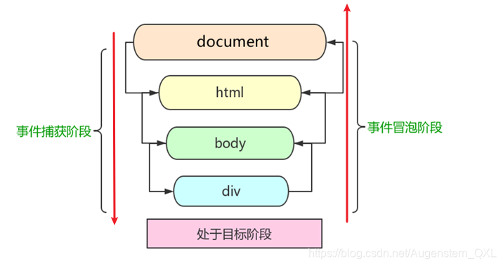

# 一、概述

网页中的每个元素都可以产生某些可以触发 JavaScript 的事件

## (一) 事件三要素

*   事件源
*   事件类型
*   事件处理程序

## (二) 常用鼠标事件

|     鼠标事件    |   触发条件   |
| :---------: | :------: |
|   onclick   | 鼠标点击左键触发 |
| onmouseover |  鼠标经过触发  |
|  onmouseout |  鼠标离开触发  |
|   onfocus   | 获得鼠标焦点触发 |
|    onblur   | 失去鼠标焦点触发 |
| onmousemove |  鼠标移动触发  |
|  onmouseup  |  鼠标弹起触发  |
| onmousedown |  鼠标按下触发  |

## (三) 常用键盘事件

|    键盘事件    |                   触发条件                   |
| :--------: | :--------------------------------------: |
|   onkeyup  |               某个键盘按键被松开时触发               |
|  onkeydown |               某个键盘按键被按下时触发               |
| onkeypress | 某个键盘按键被按下时触发，但是它不识别功能键，比如 ctrl shift 箭头等 |
|  e.keyCode |             返回该**键**值的ASCII值             |
|    e.key   |            返回该按钮的值'a'/'Enter'等           |

# 二、注册事件

给元素添加事件，称为<mark>注册事件</mark>或者<mark>绑定事件</mark>。

注册事件有两种方式：<mark>传统方式和方法监听注册方式</mark>

## (一) onclick

利用 on 开头的事件 onclick,

*   同一个元素同一个事件只能设置一个处理函数
*   最后注册的处理函数将会覆盖前面注册的处理函数

```javascript
<button onclick = "alter('hi')"></button>

btn.onclick = function(){
}
```

## (二) addEventListener

利用addEventListener,

```javascript
//useCapture,是否在捕获阶段响应事件,默认为false
eventTarget.addEventListener(type,listener,[useCapture])
```

*   w3c 标准推荐方式
*   IE9 之前的 IE 不支持此方法，可使用 attachEvent() 代替
*   同一个元素同一个事件可以注册多个监听器,按注册顺序依次执行

```html
<!DOCTYPE html>
<html lang="zh">
  <head>
    <meta charset="UTF-8">
    <meta name="viewport" content="width=device-width, initial-scale=1.0">
    <link rel="stylesheet" href="style.css">
  </head>
  <body>
    <button class="btn1">按钮1</button><br>
    <button class="btn2">按钮2</button><br>

    <script>

    var btn1 = document.querySelector('.btn1');
    btn1.onclick = function() {
      alert('按钮1被点击了！');
    }

    var btn2 = document.querySelector('.btn2');
    btn2.addEventListener('click', function() {
      alert('按钮2被点击了！');
    });

    </script>
  </body>
</html>
```

## (三) 兼容方案

```javascript
 function addEventListener(element, eventName, fn) {
      // 判断当前浏览器是否支持 addEventListener 方法
      if (element.addEventListener) {
        element.addEventListener(eventName, fn);  // 第三个参数 默认是false
      } else if (element.attachEvent) {
        element.attachEvent('on' + eventName, fn);
      } else {
        // 相当于 element.onclick = fn;
        element['on' + eventName] = fn;
 } 
```

# 三、删除注册事件

*   removeEventListener(type,listener,\[useCapture]);
*   btn.onclick = null;
*   detachEvent(type,listener);

```html
<!DOCTYPE html>
<html lang="zh">
  <head>
    <meta charset="UTF-8">
    <meta name="viewport" content="width=device-width, initial-scale=1.0">
    <link rel="stylesheet" href="style.css">
  </head>
  <body>
    <button class="btn1">按钮1</button><br>
    <button class="btn2">按钮2</button><br>
    <button class="btn3">按钮3</button><br>

    <script>

    // 添加按钮1注册事件
    var btn1 = document.querySelector('.btn1');
    btn1.onclick = function() {
      alert('按钮1被点击了！');
    }
    btn1.onclick = null; // 移除按钮1的点击事件
    btn1['onclick'] = null;

    // 添加按钮2注册事件
    var btn2 = document.querySelector('.btn2');
    function handleBtn2Click() {
      alert('按钮2被点击了！');
    }
    btn2.addEventListener('click', handleBtn2Click);
    btn2.removeEventListener('click', handleBtn2Click); // 移除按钮2的点击事件
    
    // 使用addEventListener添加事件处理程序
    var btn3 = document.querySelector('.btn3');
    btn3.addEventListener('click', function() {
      alert('按钮3被点击了！');
    });
    // 移除按钮3的点击事件
    btn3.removeEventListener('click', function() {
      alert('按钮3被点击了！');
    });
    </script>
  </body>
</html>
```

兼容性处理

```javascript
 function removeEventListener(element, eventName, fn) {
      // 判断当前浏览器是否支持 removeEventListener 方法
      if (element.removeEventListener) {
        element.removeEventListener(eventName, fn);  // 第三个参数 默认是false
      } else if (element.detachEvent) {
        element.detachEvent('on' + eventName, fn);
      } else {
        element['on' + eventName] = null;
 } 
```

# 四、事件流

*   <mark>事件流</mark>描述的是从页面中接收事件的顺序
*   <mark>事件</mark>发生时会在元素节点之间按照特定的顺序传播，这个<mark>传播过程</mark>即<mark>DOM事件流</mark>

DOM 事件流分为三个阶段

1.   捕获阶段
2.  当前目标阶段
3.  冒泡阶段



## (一) 捕获阶段

网景最早提出，由 DOM 最顶层节点开始，然后逐级向下传播到到最具体的元素接收的过程

`document -> html -> body -> father -> son`

先看 document 的事件，没有；再看 html 的事件，没有；再看 body 的事件，没有；再看 father 的事件，有就先执行；再看 son 的事件，再执行。

```html
<!DOCTYPE html>
<html lang="zh">
  <head>
    <meta charset="UTF-8">
    <meta name="viewport" content="width=device-width, initial-scale=1.0">
    <link rel="stylesheet" href="style.css">
  </head>
  <body>
    <div class = "father">
      <div class = "son">son盒子</div>
    </div>
    <script>
      // dom 事件流 三个阶段
      // 1. JS 代码中只能执行捕获或者冒泡其中的一个阶段。
      // 2. onclick 和 attachEvent（ie） 只能得到冒泡阶段。
      // 3. 捕获阶段 如果addEventListener 第三个参数是 true 那么则处于捕获阶段  document -> html -> body -> father -> son
      var son = document.querySelector('.son');
      son.addEventListener('click', function(e){
        alert('son');
      },true);

      var father = document.querySelector('.father');
      father.addEventListener('click', function(e){
        alert('father');
      },true);

      document.addEventListener('click', function(e){
        alert('document');
      },true);
    </script>
  </body>
</html>
```

我们点击子盒子，会先弹出document,再弹出 father，之后再弹出 son

## (二) 冒泡阶段

IE 最早提出，事件开始时由最具体的元素接收，然后逐级向上传播到到 DOM 最顶层节点的过程。

son -> father ->body -> html -> document

```html
<!DOCTYPE html>
<html lang="zh">
  <head>
    <meta charset="UTF-8">
    <meta name="viewport" content="width=device-width, initial-scale=1.0">
    <link rel="stylesheet" href="style.css">
  </head>
  <body>
    <div class = "father">
      <div class = "son">son盒子</div>
    </div>
    <script>
      // 事件冒泡：当一个元素上的事件被触发后，该事件会向父级元素传递。
      var son = document.querySelector('.son');
      son.addEventListener('click', function(e){
        alert('son');
      },false);

      var father = document.querySelector('.father');
      father.addEventListener('click', function(e){
        alert('father');
      },false);

      document.addEventListener('click', function(e){
        alert('document');
      },false);
    </script>
  </body>
</html>
```

我们点击子盒子，会弹出 son、father、document

## (三) 事件对象

```javascript
eventTarget.onclick = function(event) {
   // 这个 event 就是事件对象，我们还喜欢的写成 e 或者 evt 
} 
eventTarget.addEventListener('click', function(event) {
   // 这个 event 就是事件对象，我们还喜欢的写成 e 或者 evt  
})
```

```html
<!DOCTYPE html>
<html lang="zh">
  <head>
    <meta charset="UTF-8">
    <meta name="viewport" content="width=device-width, initial-scale=1.0">
    <link rel="stylesheet" href="style.css">
  </head>
  <body>
    <div class = "father">
      <div class = "son">son盒子</div>
    </div>
    <script>
      // 事件冒泡：当一个元素上的事件被触发后，该事件会向父级元素传递。
      var son = document.querySelector('.son');
      son.addEventListener('click', function(e){
        console.log(e.type); // 输出：click
        console.log(e.target); // 输出：<div class="son">son盒子</div>
        console.log(e.this); // 输出：<div class="son">son盒子</div>
        console.log(this); // 输出：<div class="son">son盒子</div>
        e.stopPropagation(); // 阻止事件冒泡
		e.preventDefalt();//阻止默认行为
      },false);
    </script>
  </body>
</html>
```

<mark>e.target</mark> 和 <mark>this</mark> 的区别：

*   this 是事件绑定的元素， 这个函数的调用者（绑定这个事件的元素）
*   e.target 是事件触发的元素。

```html
<!DOCTYPE html>
<html lang="zh">
  <head>
    <meta charset="UTF-8">
    <meta name="viewport" content="width=device-width, initial-scale=1.0">
    <link rel="stylesheet" href="style.css">
  </head>
  <body>
    <div>123</div>
    <ul>
        <li>abc</li>
        <li>def</li>
        <li>qkr</li>
    </ul>
    <script>
      var div = document.querySelector('div');
      div.addEventListener('click', function(e) {
          console.log(e.target); // 指向我们点击的对象 div
          console.log(this); // 指向事件绑定对象 div
          console.log(e.currentTarget); // 指向事件绑定对象

      });
      var ul = document.querySelector('ul');
      ul.addEventListener('click', function(e) {
        console.log(this); // 指向事件绑定对象 ul
        console.log(e.currentTarget); // 指向事件绑定对象 ul

        // e.target 指向我们点击的那个对象 谁触发了这个事件 我们点击的是li e.target 指向的就是li
        console.log(e.target); // 指向我们点击的那个对象 li
        console.log(e.target.innerHTML); // 获取我们点击的li中的内容 abc

      });
    </script>
  </body>
</html>
```

## (四) 事件委托

不是每个子节点单独设置事件监听器，而是事件监听器设置在其父节点上，然后利用冒泡原理影响设置每个子节点

如上使用ul注册点击事件后,使用e.target获取点击对象.即将li的事件委托给ul处理.

## (五) 鼠标对象事件

```html
<!DOCTYPE html>
<html lang="zh">
  <head>
    <meta charset="UTF-8">
    <meta name="viewport" content="width=device-width, initial-scale=1.0">
    <link rel="stylesheet" href="style.css">
  </head>
  <body>
    <div>123</div>
    <ul>
        <li>abc</li>
        <li>def</li>
        <li>qkr</li>
    </ul>
    <script>
      var div = document.querySelector('div');
      div.addEventListener('click', function(e) {
        console.log(e.clientX);// 输出点击位置相对于浏览器窗口左上角的X坐标
        console.log(e.clientY);// 输出点击位置相对于浏览器窗口左上角的Y坐标
        console.log(e.pageX);// 输出点击位置相对于文档左上角的X坐标（包括滚动距离）
        console.log(e.pageY);// 输出点击位置相对于文档左上角的Y坐标（包括滚动距离）
        console.log(e.screenX);// 输出点击位置相对于屏幕左上角的X坐标
        console.log(e.screenY);// 输出点击位置相对于屏幕左上角的Y坐标
        console.log(e.offsetX);// 输出点击位置相对于事件源元素左上角的X坐标
        console.log(e.offsetY);// 输出点击位置相对于事件源元素左上角的Y坐标
        console.log(e.target);// 输出触发事件的DOM元素
      }); 
    </script>
  </body>
</html>
```

## (六) 键盘对象事件

*   `onkeydown`和 `onkeyup` 不区分字母大小写，`onkeypress` 区分字母大小写。
*   在我们实际开发中，我们更多的使用keydown和keyup， 它能识别所有的键（包括功能键)
*   `Keypress` 不识别功能键，但是`keyCode`属性能区分大小写，返回不同的ASCII值

```html
<!DOCTYPE html>
<html lang="zh">
  <head>
    <meta charset="UTF-8">
    <meta name="viewport" content="width=device-width, initial-scale=1.0">
    <link rel="stylesheet" href="style.css">
  </head>
  <body>
    <div>123</div>
    <ul>
        <li>abc</li>
        <li>def</li>
        <li>qkr</li>
    </ul>
    <script>
      document.addEventListener('keydown',function(e){
        console.log(e.keyCode);
        // 利用keycode返回的ASCII码值来判断用户按下了那个键
        if(e.keyCode === 13){
          alert('你按下了回车键');
        }
        else if(e.key === 'Alt')
          alert('你按下了Alt键');
        else if(e.key === 'a')
          alert('你按下了a键');
        else if (e.key === 'B')
          alert('你按下了B键');
        else
          alert('你按下的键不是回车键或a键或B键');
      });
    </script>
  </body>
</html>
```

## (七) 小结

1.  `onclick` 和 `attachEvent`只能得到冒泡阶段
2.  `addEventListener(type,listener[,useCapture])`第三个参数如果是 true，表示在事件捕获阶段调用事件处理程序；如果是 false (不写默认就是false),表示在事件冒泡阶段调用事件处理程序
3.  实际开发中我们很少使用事件捕获，我们更关注<mark>事件冒泡</mark>。
4.  有些事件是没有冒泡的，比如 onblur、onfocus、onmouseenter、onmouseleave
