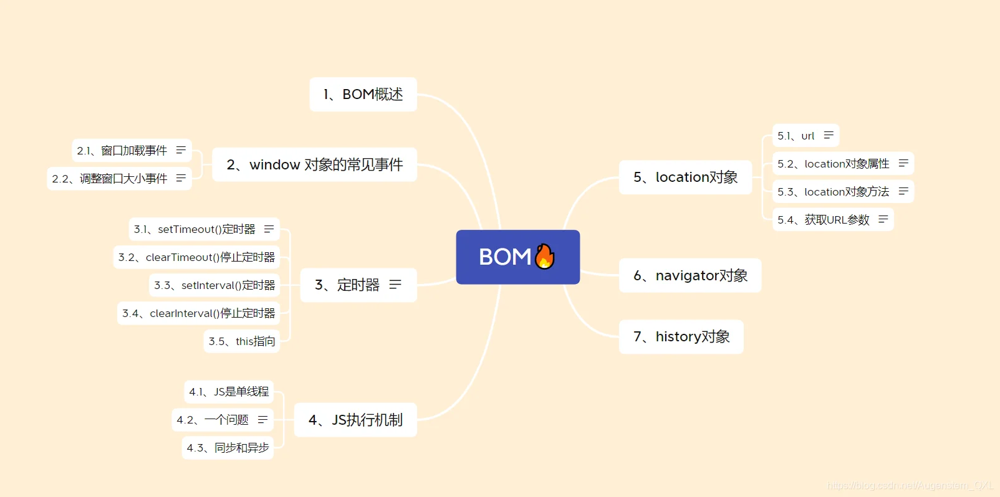
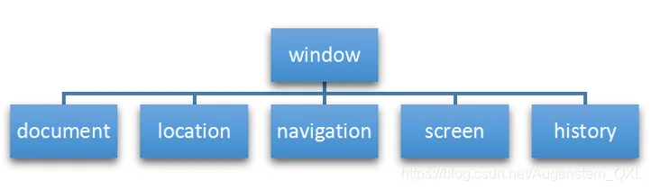
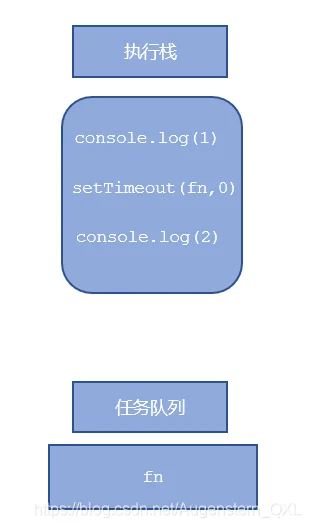
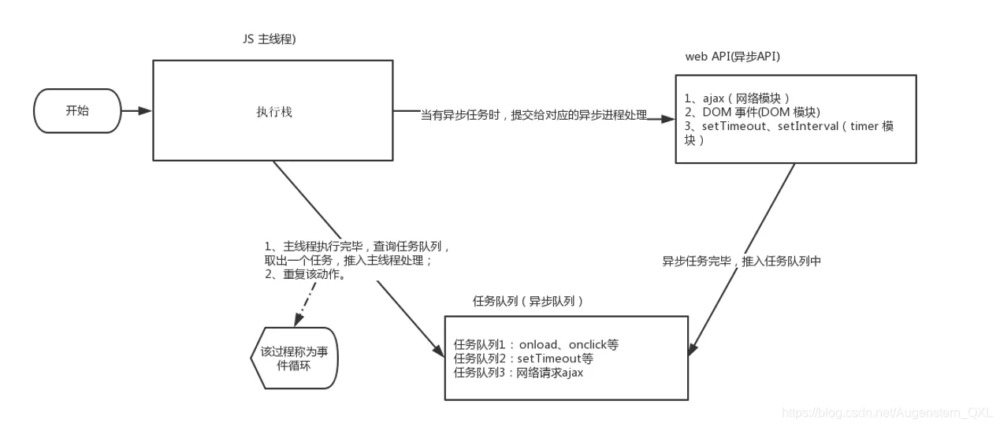

# 一、BOM概述

## (一) 目录总览



## (二) 概述

*   BOM(Browser Object Model) 浏览器对象模型,它提供了与浏览器进行交互的对象,核心对象是 window
*   BOM 由一系列相关的对象构成，并且每个对象都提供了很多方法与属性
*   BOM 缺乏标准，JavaScript 语法的标准化组织是 ECMA, DOM 的标准化组织是 W3C, BOM最初是Netscape 浏览器标准的一部分

|          DOM         |             BOM            |
| :------------------: | :------------------------: |
|        文档对象模型        |           浏览器对象模型          |
| DOM 就是把 文档 当作一个对象来看待 |       把 浏览器当作一个对象来看待       |
|  DOM 的顶级对象是 document |      BOM 的顶级对象是 window     |
|   DOM 主要学习的是操作页面元素   |    BOM 学习的是浏览器窗口交互的一些对象    |
|    DOM 是 W3C 标准规范    | BOM 是浏览器厂商在各自浏览器上定义的，兼容性较差 |

## (三) BOM构成



# 二、window常见事件

window 对象是浏览器的顶级对象,它是一个全局对象。定义在全局作用域中的变量、函数都会变成 window 对象的属性和方法,在调用的时候可以省略 window，前面学习的对话框都属于 window 对象方法，如 `alert()、prompt()`等。

## (一) 窗口加载事件

### 1. `onload`

窗口（页面）加载事件，当文档内容完全加载完成会触发该事件（包括图像，脚本文件，CSS文件等），就调用的处理函数。

```javascript
window.onload = function() {
    var div = document.querySelector('div');
    div.style.backgroundColor = 'red';
}
window.addEventListener('load', function()
{
     var ul = document.querySelector('ul');
     ul.style.backgroundColor = 'blue';
});
```

有了`window.onload`就可以把JS代码写到页面元素的上方.因为`onload`是等页面内容全部加载完毕，再去执行处理函数

### 2. `DOMContentLoaded`

如果页面的图片很多的话, 从用户访问到onload触发可能需要较长的时间.交互效果就不能实现，必然影响用户的体验，此时用 `DOMContentLoaded`事件比较合适<mark>DOMCountentLoaded事件触发时，仅当DOM加载完成，不包括样式表，图片，flash等等,</mark>加载速度比load更快一些

```javascript
window.addEventListener('load', function()
{
   alert('load');
});

window.addEventListener('DOMContentLoaded', function()
{
  alert('DOMContentLoaded');
});
```

## (二) 调整窗口大小

`window.onresize`

```html
<!DOCTYPE html>
<html lang="zh">
  <head>
    <meta charset="UTF-8">
    <meta name="viewport" content="width=device-width, initial-scale=1.0">
    <link rel="stylesheet" href="style.css">
  </head>
  <body>
    <div>123</div>
    <ul>
        <li>abc</li>
        <li>def</li>
        <li>qkr</li>
    </ul>
    <script>
        // 在这里编写你的JavaScript代码
        window.addEventListener('load', function()
        {
            var div = document.querySelector('div');
            div.textContent = '页面加载完成';
            div.style.color = 'red';

            window.addEventListener('resize', function()
            {
                var width = window.innerWidth;
                div.textContent = '窗口宽度：' + width;

                if (width < 768)
                {
                    div.style.fontSize = '20px';
                }
                else
                {
                    div.style.fontSize = '16px';
                }
            });
        });
    </script>
  </body>
</html>
```

# 三、定时器

window 对象给我们提供了两个定时器

*   `setTimeout()`
*   `setInterval()`

## (一) setTimeout()

用于设置一个定时器，该定时器在定时器到期后执行调用函数

```javascript
window.setTimeout(调用函数,[延迟的毫秒数]);
```

## (二) clearTimeout()

取消先前通过调用 `setTimeout()`建立的定时器

```javascript
window.clearTimeout(timeoutID);
```

## (三) setInterval()

重复调用一个函数，每隔这个时间，就去调用一次回调函数

```javascript
window.setInterval(回调函数,[间隔的毫秒数]);
```

## (四) clearInterval()

取消先前通过调用 `setInterval()` 建立的定时器

```javascript
setInterval(intervalID); 
```

```html
<!DOCTYPE html>
<html lang="zh">
  <head>
    <meta charset="UTF-8">
    <meta name="viewport" content="width=device-width, initial-scale=1.0">
    <link rel="stylesheet" href="style.css">
  </head>
  <body>
    <div>123</div>
    <ul>
        <li>abc</li>
        <li>def</li>
        <li>qkr</li>
    </ul>
    <style>
      .startBlue{
        background: blue;
        width: 200px;
        height: 200px;
        color : white;
      }
    </style>
    <script>
      // 在这里编写你的JavaScript代码
      var t1 = setTimeout(function() {
        document.querySelector('div').textContent = 'Hello, World!';
        document.querySelector('li:nth-child(2)').textContent = 'New Text';
      }, 2000);

      var div = document.querySelector('div');
      div.addEventListener('click', function() {
        clearTimeout(t1);
      });

      // 添加一个定时器来改变ul的背景颜色
      var intervalID = setInterval(function() {
        document.querySelector('ul').classList.toggle('startBlue');
      }, 1000);

      var ul = document.querySelector('ul');
      ul.addEventListener('click', function() {
        clearInterval(intervalID);
      });
    </script>
  </body>
</html>
```

# 四、location对象

window 对象给我们提供了一个 `location`属性<mark>用于获取或者设置窗体的url，并且可以解析url</mark>。因为这个属性返回的是一个对象，所以我们将这个属性也称为 location 对象。

## (一) URL

统一资源定位符（uniform resouce locator）是互联网上标准资源的地址。互联网上的每个文件都有一个唯一的 URL，它包含的信息指出文件的位置以及浏览器应该怎么处理它。

url 的一般语法格式为

    protocol://host[:port]/path/[?query]#fragment
    例如:
    http://www.itcast.cn/index.html?name=andy&age=18#link

|    组成    |                        说明                        |
| :------: | :----------------------------------------------: |
| protocol |              通信协议 常用的http,ftp,maito等             |
|   host   | 主机(域名) [www.itheima.com](http://www.itheima.com) |
|   port   |                      端口号，可选                      |
|   path   |                路径 由零或多个'/'符号隔开的字符串               |
|   query  |               参数 以键值对的形式，通过&符号分隔开来               |
| fragment |                 片段 #后面内容 常见于链接 锚点                |

## (二) location对象属性

|    location对象属性   |                      返回值                      |
| :---------------: | :-------------------------------------------: |
|   location.href   |    超文本引用（hypertext reference,超链接获取或者设置整个URL   |
|   location.host   | 返回主机（域名）[www.baidu.com](http://www.baidu.com) |
|   location.port   |                返回端口号，如果未写返回空字符串               |
| location.pathname |                      返回路径                     |
|  location.search  |                      返回参数                     |
|   location.hash   |               返回片段 #后面内容常见于链接 锚点              |

```html
<!DOCTYPE html>
<html lang="zh">
  <head>
    <meta charset="UTF-8">
    <meta name="viewport" content="width=device-width, initial-scale=1.0">
    <link rel="stylesheet" href="style.css">
  </head>
  <body>
    <button>点击后5秒打开网站</button>
    <div></div>
    <script>
      // 在这里编写你的JavaScript代码
      var button = document.querySelector('button');
      var div = document.querySelector('div');
      var timer = 5;
      button.addEventListener('click', function() {
        setInterval(function() {
          if (timer == 0)
            location.href = 'https://www.baidu.com';
          else{
            div.innerHTML = '您将在' + timer + '秒后进入网站';
            timer--;
          }
        },1000);
        button.disabled = true;
      });
    </script>
  </body>
</html>
```

## (三) location对象方法

|    location对象方法    |                     返回值                     |
| :----------------: | :-----------------------------------------: |
|  location.assign() |           跟href一样，可以跳转页面（也称为重定向页面）          |
| location.replace() |           替换当前页面，因为不记录历史，所以不能后退页面           |
|  location.reload() | 重新加载页面，相当于刷新按钮或者 f5 ，如果参数为true 强制刷新 ctrl+f5 |

## (四) 获取URL参数

写一个登录框，点击登录跳转到 main.html

```html
<!DOCTYPE html>
<html lang="zh">
  <head>
    <meta charset="UTF-8">
    <meta name="viewport" content="width=device-width, initial-scale=1.0">
    <link rel="stylesheet" href="style.css">
  </head>
  <body>
    <form action = main.html>
        用户名 : <input type="text" name="username" required><br>
        密码 : <input type="password" name="password" required><br>
        <input type="submit" value="登录">
        <input type="reset" value="重置">
        <input type="button" value="返回" onclick="history.back()">
        <input type="button" value="刷新" onclick="location.reload()">
    </form>
    <script>
    </script>
  </body>
</html>
```

```html
<!DOCTYPE html>
<html lang="zh">
  <head>
    <meta charset="UTF-8">
    <meta name="viewport" content="width=device-width, initial-scale=1.0">
    <link rel="stylesheet" href="style.css">
  </head>
  <body>
    <div></div>
    <script>
      console.log(location.search);

      var params = new URLSearchParams(location.search);
      console.log(params.get('username'));
      console.log(params.get('password'));

      var div = document.querySelector('div');
      div.innerText = 'name=' + params.get('username') + ' password=' + params.get('password');
    </script>
  </body>
</html>
```

# 五、navigator对象

navigator 对象包含有关浏览器的信息,我们常用的是`userAgent`,该属性可以返回由客户机发送服务器的`user-agent`头部的值

```javascript
if((navigator.userAgent.match(/(phone|pad|pod|iPhone|iPod|ios|iPad|Android|Mobile|BlackBerry|IEMobile|MQQBrowser|JUC|Fennec|wOSBrowser|BrowserNG|WebOS|Symbian|Windows Phone)/i))) {
    window.location.href = "";     //手机
 } else {
    window.location.href = "";     //电脑
 }

```

```html
<!DOCTYPE html>
<html lang="zh">
  <head>
    <meta charset="UTF-8">
    <meta name="viewport" content="width=device-width, initial-scale=1.0">
    <link rel="stylesheet" href="style.css">
  </head>
  <body>
    <button>5秒后打开网站</button>
    <div></div>
    <script>
      // 用户代理字符串
      console.log(navigator.userAgent);
      //Mozilla/5.0 (Windows NT 10.0; Win64; x64) AppleWebKit/537.36 (KHTML, like Gecko) HeadlessChrome/120.0.2210.133 Safari/537.36 HeadlessEdg/120.0.2210.133
      // 浏览器平台
      console.log(navigator.platform);  // Win32
      // 浏览器是否在线
      console.log(navigator.onLine); // true
      // 浏览器语言
      console.log(navigator.language); // en-US
      // 浏览器硬件环境
      console.log(navigator.hardwareConcurrency); // 8
      // 地理位置信息
      console.log(navigator.geolocation);  // Geolocation {getCurrentPosition: ƒ, watchPosition: ƒ, clearWatch: ƒ}
       // 是否启用cookie
      console.log(navigator.cookieEnabled); // true
       // 是否启用Do Not Track
      // 0: 表示拒绝任何追踪行为
      console.log(navigator.doNotTrack); // 0
    </script>
  </body>
</html>
```

# 六、history对象

与浏览器历史记录进行交互

```html
<!DOCTYPE html>
<html lang="zh">
  <head>
    <meta charset="UTF-8">
    <meta name="viewport" content="width=device-width, initial-scale=1.0">
    <link rel="stylesheet" href="style.css">
  </head>
  <body>
    <button>5秒后打开网站</button>
    <div></div>
    <script>
      //回退
      history.back();
      //前进
      history.forward();
      //跳转到指定页面
      history.go(-2); //后退两页
      //跳转到指定页面
      history.go(2); //前进两页
      //跳转到指定页面
      history.go('www.baidu.com'); //跳转到百度
      //获取历史记录的数量
      console.log(history.length);
    </script>
  </body>
</html>
```

# 七、this

`this`的指向在函数定义的时候是确定不了的，只有函数执行的时候才能确定`this`到底指向谁

*   全局作用域或者普通函数中`this`指向全局对象`window`(注意定时器里面的this指向window)
*   方法调用中指向调用方法的对象
*   构造函数中`this`指向构造函数实例对象

```html
<!DOCTYPE html>
<html lang="zh">
  <head>
    <meta charset="UTF-8">
    <meta name="viewport" content="width=device-width, initial-scale=1.0">
    <link rel="stylesheet" href="style.css">
  </head>
  <body>
    <script>
      //1.全局作用域或者普通函数中this指向全局对象window（ 注意定时器里面的this指向window）
      console.log(this); //Window
      function fn() {
        console.log(this); //Window
      }
      fn();

      //2.方法调用中谁调用this指向谁
      const o = {
        sayThis: function() {
          console.log(this); //o
        }
      }
      o.sayThis();

      //3.构造函数中this指向构造函数的实例
      function Fun() {
        console.log(this); //Fun的实例
      }
      const fun = new Fun();

      //4.apply call bind
      function fn(x, y) {
        console.log(this); //Window
        console.log(x + y);
      }
      //call可以改变this的指向，此时this指向第一个参数所指向的对象，fn函数执行
      fn.call({name: 'andy'}, 1, 2); //{name: 'andy'} 3
      //apply可以改变this的指向，此时this指向第一个参数所指向的对象，fn函数执行
      fn.apply({name: 'lily'}, [1, 2]); //{name: 'lily'} 3
    </script>
  </body>
</html>
```

# 八、JS执行机制

*   JavaScript 语言的一大特点就是单线程，也就是说，同一个时间只能做一件事。这是因为 Javascript 这门脚本语言诞生的使命所致——JavaScript 是为处理页面中用户的交互，以及操作 DOM 而诞生的。比如我们对某个 DOM 元素进行添加和删除操作，不能同时进行。 应该先进行添加，之后再删除。
*   单线程就意味着，所有任务需要排队，前一个任务结束，才会执行后一个任务。这样所导致的问题是： 如果 JS 执行的时间过长，这样就会造成页面的渲染不连贯，导致页面渲染加载阻塞的感觉。

```html
  <head>
    <meta charset="UTF-8">
    <meta name="viewport" content="width=device-width, initial-scale=1.0">
    <link rel="stylesheet" href="style.css">
  </head>
  <body>
    <script>
      console.log("1");
      setTimeout(function() {
        console.log("3");
      }, 0);
      console.log("2");
    </script>
  </body>
</html>
```

输出1 2 3,可以看出先执行后面的语句后,在执行计时器回调.为了解决这个问题，利用多核 CPU 的计算能力，HTML5 提出 Web Worker 标准，允许 JavaScript 脚本创建多个线程

## (一) 同步

 前一个任务结束后再执行后一个任务,同步任务都在主线程上执行，形成一个 <mark>执行栈</mark>

## (二) 异步

做这件事的同时，你还可以去处理其他事情,JS中的异步是通过回调函数实现的

异步任务有以下三种类型

*   普通事件，如`click`,`resize`等
*   资源加载，如`load`,`error`等
*   定时器，包括`setInterval`,`setTimeout`等

## (三) 事件循环

异步任务相关<mark>回调函数</mark>添加到<mark>任务队列</mark>中



1.  先执行<mark>执行栈中的同步任务</mark>
2.  异步任务(回调函数)放入任务队列中
3.  一旦执行栈中的所有同步任务执行完毕，系统就会按次序读取<mark>任务队列</mark>中的异步任务，于是被读取的异步任务结束等待状态，进入执行栈，开始执行



同步任务放在执行栈中执行，异步任务由异步进程处理放到任务队列中，执行栈中的任务执行完毕会去任务队列中查看是否有异步任务执行，由于主线程不断的重复获得任务、执行任务、再获取任务、再执行，所以这种机制被称为<mark>事件循环</mark>（ event loop）。
