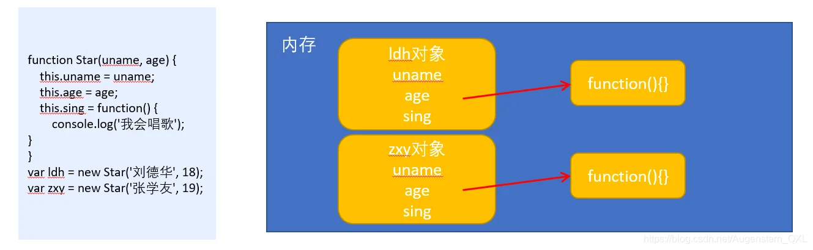
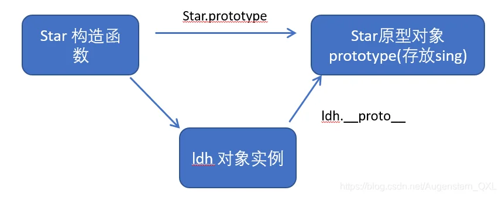
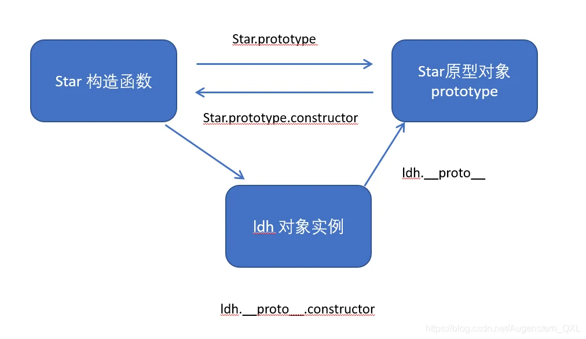
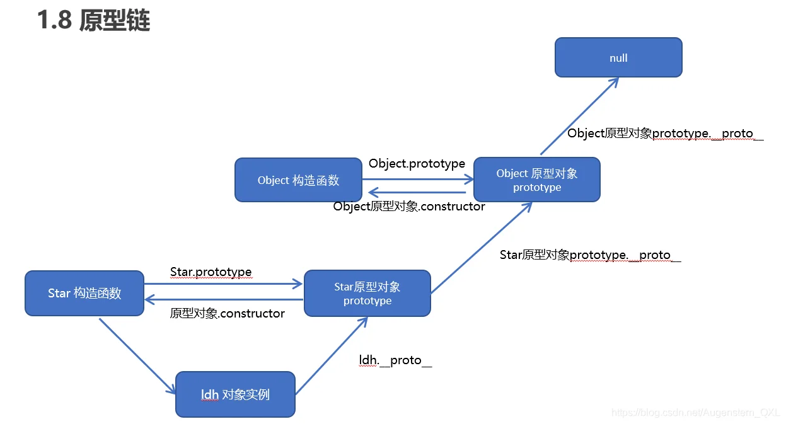

# 一、类的创建

在 ES6 中新增加了类的概念，可以使用 class 关键字声明一个类，之后以这个类来实例化对象。

<mark>constructor()</mark> 方法是类的构造函数(默认方法)，<mark>用于传递参数,返回实例对象</mark>，通过 new 命令生成对象实例时，自动调用该方法。如果没有显示定义, 类内部会自动给我们创建一个<mark>constructor()</mark>

*   类必须使用`new` 实例化对象,在执行时会做四件事

    1.  在内存中创建一个新的空对象。
    2.  让 this 指向这个新的对象。
    3.  执行构造函数里面的代码，给这个新对象添加属性和方法。
    4.  返回这个新对象（所以构造函数里面不需要 return ）。
*   类的共有属性放到`constructor` 里面
*   类里面的函数都不需要写 `function` 关键字

```html
<!DOCTYPE html>
<html lang="zh">
  <head>
    <meta charset="UTF-8">
    <meta name="viewport" content="width=device-width, initial-scale=1.0">
    <link rel="stylesheet" href="style.css">
  </head>
  <body>
    <script>
      class Rectangle {
        constructor(height, width) {
          this.height = height;
          this.width = width;
        }
        getWidth() {
          return this.width;
        }
        getHeight() {
          return this.height;
        }
      }

      var rect = new Rectangle(5, 10);
      console.log(rect.getHeight()); // 输出 5
      console.log(rect.width); // 输出 10

    </script>
    <h1>这是一个Square的示例</h1>
    <p>Square是Rectangle的子类。</p>

  </body>
</html>
```

注意事项:

1.  在ES6中类没有变量提升，所以必须先定义类，才能通过类实例化对象
2.  类里面的<mark>共有属性和方法</mark>一定要加 `this`使用
3.  类里面的`this`指向：

    *   constructor 里面的 `this`指向实例对象
    *   方法里面的`this`指向这个方法的调用者

# 二、类的继承

```javascript
// 父类
class Father {
    
}
// 子类继承父类
class Son extends Father {
    
}
```

```html
<!DOCTYPE html>
<html lang="zh">
  <head>
    <meta charset="UTF-8">
    <meta name="viewport" content="width=device-width, initial-scale=1.0">
    <link rel="stylesheet" href="style.css">
  </head>
  <body>
    <script>
      class Rectangle {
        constructor(height, width) {
          this.height = height;
          this.width = width;
        }
        getArea() {
          return this.height * this.width;
        }
      }
      class Square extends Rectangle {
        constructor(length) {
		  //调用父类构造函数
          super(length, length);
        }
        getArea() {
	      //调用父类普通函数
          return super.getArea();
        }
      }
      const mySquare = new Square(5);
      console.log(mySquare.height); // 输出 5
      console.log(mySquare.getArea()); // 输出 25
      // 输出 true，因为 Square 是一个子类，继承自 Rectangle 类
      console.log(mySquare instanceof Square); // true

    </script>
    <div>
      <h1>这是一个Square的示例</h1><br>
      <h2>Square是Rectangle的子类。</h2>
    </div>
  </body>
</html>
```

*   `super` 关键字用于访问和调用对象父类上的函数，<mark>可以调用父类的构造函数，也可以调用父类的普通函数</mark>
*   **类在构造函数中使用super,必须放到this前面（必须先调用父类的构造方法，在使用子类构造方法）**

# 三、静态成员和实例成员

## (一) 静态属性

在构造函数/类本身上添加的成员为静态成员，只能由构造函数/类本身来访问

*   类内使用static添加

    ```javascript
    class Square{
       constructor(length){
          Square.counter++; 
       }
       static counter = 0; 
    }
    ```

*   使用类本身添加

    ```javascript
    Square.counter = 0;
    Square.counter++;
    ```

*   在构造函数本身添加

    ```javascript
    function Star(name,sex){
       this.name = name;
       this.sex = sex;
    }
    star.age = 18;
    ```

## (二) 成员属性

在构造函数内部创建的对象成员称为实例成员，只能由实例化的对象来访问

```html
//构造函数内部创建的属性
function Star(name,sex){
  this.name = name;
  this.sex = sex;
}

//类构造创建的属性
class Rectangle {
   constructor(height, width) {
      this.height = height;
      this.width = width;
   }
}
```

## (三) 静态方法和成员方法

*   类内使用static添加

    ```javascript
    class Rectangle {
      constructor(height, width) {
        this.height = height;
        this.width = width;
        Rectangle.counter += 1;
      }
       //类的静态方法定义方式1
       static getCountFromInner() {
          console.log('Inner Func ' + Rectangle.counter);
       }
    }
    ```

*   使用类本身添加

    ```javascript
    //类的静态方法定义方式2
    Rectangle.getCountFromOuter = function(){
      console.log('Outer Func ' + Rectangle.counter);
    }

    ```

*   在构造函数本身添加

    ```javascript
    function Star(name,sex){
       //成员属性
       this.name = name;
       this.sex = sex;
       //成员方法
       this.say = function(){
          console.log(this.name + " say hello");
       }
    }
    //静态方法
    Star.sing = function(){
      console.log("Star sing a song");
    }
    ```

```html
<!DOCTYPE html>
<html lang="zh">
  <head>
    <meta charset="UTF-8">
    <meta name="viewport" content="width=device-width, initial-scale=1.0">
    <link rel="stylesheet" href="style.css">
  </head>
  <body>
    <script>

      //1.构造函数静态成员和实例成员的定义
      function Star(name,sex){
        //成员属性
        this.name = name;
        this.sex = sex;
        //成员方法
        this.say = function(){
          console.log(this.name + " say hello");
        }
      }
      //静态属性
      Star.age = 18;
      //静态方法
      Star.sing = function(){
        console.log("Star sing a song");
      }
      var ldh = new Star("刘德华","男");
      ldh.say(); //刘德华 say hello
      //实例对象不能访问静态方法
      //ldh.sing(); //TypeError: ldh.sing is not a function

      //静态属性和方法只能被Star本身调用
      Star.sing(); //Star sing a song


      //2. 类的静态成员和实例成员的定义
      class Rectangle {
        constructor(height, width) {
          this.height = height;
          this.width = width;
          Rectangle.counter += 1;
        }
        //类的静态方法定义方式1
        static getCountFromInner() {
          console.log('Inner Func ' + Rectangle.counter);
        }
        //类的静态成员定义方式1
        static counter = 0;
      }

      //类的静态方法定义方式2
      Rectangle.getCountFromOuter = function(){
        console.log('Outer Func ' + Rectangle.counter);
      }

      //类的静态成员定义方式2
      Rectangle.x = 3;

      var rect = new Rectangle(10, 20);
      //实例对象不能访问静态方法
      //rect.getCountFromInner(); //TypeError: getCountFromInner is not a function
      
      //静态属性和方法只能被Rectangle类本身调用
      Rectangle.getCountFromInner();
      Rectangle.getCountFromOuter();

    </script>
    <div>
      <h1>这是一个Square的示例</h1><br>
      <h2>Square是Rectangle的子类。</h2>
    </div>
  </body>
</html>
```

# 四、原型对象(prototype)

构造函数方法很好用，但是<mark>存在浪费内存的问题</mark>。



**所有的对象使用同一个函数，这样就比较节省内存**

## (一) 作用

1.  构造函数通过原型分配的函数是所有对象所共享的,这样就解决了内存浪费问题
2.  JavaScript 规定，每一个构造函数都有一个\_\_ proto \_\_属性，指向prototype对象，注意这个prototype就是一个对象，这个对象的所有属性和方法，都会被构造函数所拥有
3.   我们可以把那些不变的方法，直接定义在prototype 对象上，这样所有对象的实例就可以共享这些方法

```html
<!DOCTYPE html>
<html lang="zh">
  <head>
    <meta charset="UTF-8">
    <meta name="viewport" content="width=device-width, initial-scale=1.0">
    <link rel="stylesheet" href="style.css">
  </head>
  <body>
    <script>

      function Star(name,sex){
        //公共属性放到构造函数里
        this.name = name;
        this.sex = sex;
        this.say = function(){
          console.log("你好，我是" + this.name);
        }
      }
      //公共方法放到原型对象里
      Star.prototype.sing = function(){
        console.log(this.name + " sing");
      }
      var ldh = new Star("刘德华","男");
      var zxy = new Star("张学友","男");
      ldh.say(); //你好，我是刘德华
      ldh.sing(); //刘德华 sing

      zxy.say(); //你好，我是张学友
      zxy.sing(); //张学友 sing

      //处在不同内存中,每个内存中都有say方法
      console.log(ldh.say == zxy.say); //false
      //指向同一个方法,节省内存空间
      console.log(ldh.sing == zxy.sing); //true

    </script>
  </body>
</html>
```

<mark>一般情况下,我们的公共属性定义到构造函数里面, 公共的方法我们放到原型对象身上,成为共享方法</mark>

## (二) 对象原型\_\_ proto \_\_

1.  对象都会有一个属性 *proto* 指向构造函数的prototype原型对象，之所以我们对象可以使用构造函数prototype 原型对象的属性和方法，就是因为对象有\_proto\_原型的存在。
2.  \_proto\_对象原型和原型对象 prototype 是等价的
3.   \_proto\_对象原型的意义就在于为对象的查找机制提供一个方向，或者说一条路线，但是它是一个非标准属性，因此实际开发中，不可以使用这个属性，它只是内部指向原型对象 prototype



`Star.prototype 和 ldh._proto_` 指向相同

## (三) 原型对象赋值

如果有多个对象的方法，我们可以给原型对象`prototype`采取对象形式赋值，但是这样会覆盖构造函数原型对象原来的内容，这样修改后的原型对象`constructor`就不再指向当前构造函数了。此时，我们可以在修改后的原型对象中，添加一个`constructor`指向原来的构造函数

```html
<!DOCTYPE html>
<html lang="zh">
  <head>
    <meta charset="UTF-8">
    <meta name="viewport" content="width=device-width, initial-scale=1.0">
    <link rel="stylesheet" href="style.css">
  </head>
  <body>
    <script>

      function Star(name,sex){
        this.name = name;
        this.sex = sex;
      }
      Star.prototype = {
        //如果我们修改了原来的原型对象,给原型对象赋值的是一个对象,
        //则必须手动的利用constructor指回原来的构造函数
        constructor : Star,
        sing : function(){
          console.log(this.name + " sing");
        }
      }

      var ldh = new Star("刘德华","男");
      var zxy = new Star("张学友","男");
      ldh.sing(); //刘德华 sing
      zxy.sing(); //张学友 sing

      //指向同一个方法
      console.log(ldh.sing == zxy.sing); //true

    </script>
  </body>
</html>
```

## (四) 构造函数/实例/原型对象关系



## (五) 原型链

1.  当访问一个对象的属性(包括方法)时，首先查找这个对象自身有没有该属性
2.  如果没有就查找它的原型(也就是\_proto\_指向的prototype原型对象)
3.  如果还没有就查找原型对象的原型(Object的原型对象) 依次类推一直找到Object为止(null)
4.  \_proto \_对象原型的意义就在于为对象成员查找机制提供一个方向，或者说一条路线。



```html
<!DOCTYPE html>
<html lang="zh">
  <head>
    <meta charset="UTF-8">
    <meta name="viewport" content="width=device-width, initial-scale=1.0">
    <link rel="stylesheet" href="style.css">
  </head>
  <body>
    <script>

      function Star(name,sex){
        this.name = name;
        this.sex = sex;
      }
      Star.prototype.sing = function(){
        console.log(this.name + " sing");
      };

      var ldh = new Star("刘德华","男");
      ldh.sing(); //刘德华 sing

      console.log(Star.prototype);//{sing: ƒ, constructor: ƒ}
      console.log(Star.__proto__);//ƒ ()
      console.log(Star.prototype.constructor == Star); //true
      console.log(Star.prototype.__proto__ == Object.prototype); //true


    </script>
  </body>
</html>
```

## (六) 原型对象this指向

构造函数中的 `this` 指向我们的实例对象，<mark>原型对象</mark>里面放的是方法，这个方法<mark>里面的 `this`</mark> 指向实例对象。

```html
<!DOCTYPE html>
<html lang="zh">
  <head>
    <meta charset="UTF-8">
    <meta name="viewport" content="width=device-width, initial-scale=1.0">
    <link rel="stylesheet" href="style.css">
  </head>
  <body>
    <script>

      function Star(name,sex){
        this.name = name;
        this.sex = sex;
      }
      var prototypeThis;
      Star.prototype.sing = function(){
        console.log(this.name + " sing");
        prototypeThis = this;
      };

      var ldh = new Star("刘德华","男");
      ldh.sing(); //刘德华 sing

      console.log(prototypeThis === ldh); //true

    </script>
  </body>
</html>
```

## (七) 扩展内置对象

可以通过原型对象，对原来的内置对象进行扩展自定义的方法

```html
<!DOCTYPE html>
<html lang="zh">
  <head>
    <meta charset="UTF-8">
    <meta name="viewport" content="width=device-width, initial-scale=1.0">
    <link rel="stylesheet" href="style.css">
  </head>
  <body>
    <script>
      //(0) [constructor: ƒ, at: ƒ, concat: ƒ, copyWithin: ƒ, fill: ƒ, …]
      console.log(Array.prototype); 
	  //增加sum为Array内置方法
      Array.prototype.sum = function() {
        let sum = 0;
        for (let i = 0; i < this.length; i++) {
          sum += this[i];
        }
        return sum;
      };
      const arr = [1, 2, 3, 4, 5];
      console.log(arr.sum()); // 输出15
      //(0) [sum: ƒ, constructor: ƒ, at: ƒ, concat: ƒ, copyWithin: ƒ, …]
      console.log(Array.prototype);

    </script>
  </body>
</html>
```

数组和字符串内置对象不能给原型对象覆盖操作`Array.prototype = {}`，只能是`Array.prototype.xxx = function(){}`的方式

# 五、组合继承

ES6 之前并没有给我们提供`extends`继承,可以通过<mark>构造函数+原型对象</mark>模拟实现继承，被称为<mark>组合继承</mark>

## (一) call

修改函数运行时的 this 指向

```javascript
//thisArg：当前调用函数 this 的指向对象
//arg1,arg2： 传递的其他参数
fun.call(thisArg,arg1,arg2,......)
```

```html
<!DOCTYPE html>
<html lang="zh">
  <head>
    <meta charset="UTF-8">
    <meta name="viewport" content="width=device-width, initial-scale=1.0">
    <link rel="stylesheet" href="style.css">
  </head>
  <body>
    <script>
      function fn(x,y){
        console.log(this.name);
        console.log(x+y);
      }
      var add1 = {
        name:'add1'
      }

      var add2 = {
        name:'add2'
      }

      fn.call(add1,1,2); //add1 3
      fn.call(add2,3,4); //add2 7


    </script>
  </body>
</html>
```

## (二) 组合继承的实现

*   使用构造函数继承父类型属性
*   使用原型对象继承父类型方法

```html
<!DOCTYPE html>
<html lang="zh">
  <head>
    <meta charset="UTF-8">
    <meta name="viewport" content="width=device-width, initial-scale=1.0">
    <link rel="stylesheet" href="style.css">
  </head>
  <body>
    <script>
      function Father(name,age){
        this.name = name;
        this.age = age;
      }
      Father.prototype.sayName = function()
      {
        console.log('My name is ' + this.name);
      }

      function Son(name,age,grade){
        //使用构造函数继承父类型属性
        Father.call(this,name,age);
        this.grade = grade;
      }
      //直接赋值会有问题,如果修改了子原型对象,父原型对象也会跟着一起变化
      //Son.prototype = Father.prototype;

      //使用原型对象继承父类型方法,方法1
      Son.prototype = new Father();
      Son.prototype.constructor = Son;
      Son.prototype.sayGrade = function()
      {
        console.log('I am in grade ' + this.grade);
      }

      //使用原型对象继承父类型方法,方法2
      //Son.prototype = {
      //  constructor:Son,
      //  sayGrade:function()
      //  {
      //    console.log('I am in grade ' + this.grade);
      //  }
      //} 

      var son = new Son('Tom',10,'3');
      son.sayName(); //My name is Tom
      son.sayGrade(); //I am in grade 3
      console.log(son.name); //Tom
      console.log(son.age); //10
      console.log(son.grade);//3
    </script>
  </body>
</html>
```

# 六、类的本质

1.  class 本质还是 function
2.  类的所有方法都定义在类的 prototype属性上
3.  类创建的实例，里面也有\_proto\_指向类的prototype原型对象
4.  所以 ES6 的类它的绝大部分功能，ES5都可以做到，新的class写法只是让对象原型的写法更加清晰、更像面向对象编程的语法而已。
5.  所以 ES6 的类其实就是语法糖 语法糖：语法糖就是一种便捷写法
