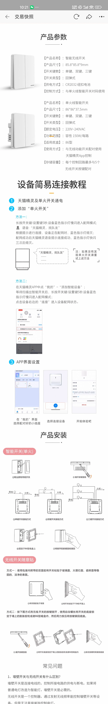
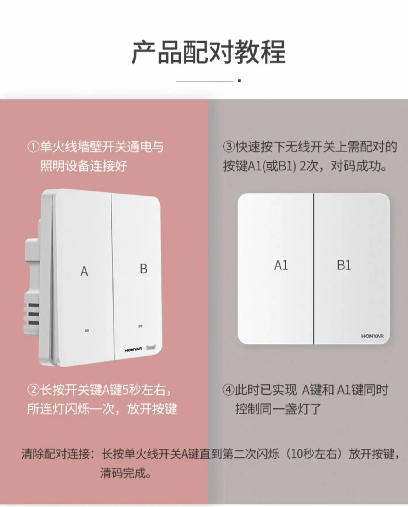

# 一、产品说明

天猫精灵单火版及随意贴

随意贴需安装**CR2032**纽扣电池

## (一) 安装位置

餐厅灯、客厅灯

## (二) 配网视频教程

[QQ 空间 · 配网视频教程](https://user.qzone.qq.com/550794016?ADUIN=550794016&ADSESSION=1790724974&ADTAG=CLIENT.QQ.6067_MyInfo_PersonalInfo.0&ADPUBNO=27440&source=namecardstar)

# 二、配对说明

## (一) 与天猫精灵配对

1. 长按开关 5 秒左右，所有灯闪烁三次，进入配网状态
2. 说「天猫精灵，找队友」，或在 App 中添加设备

## (二) 随意贴与主开关配对

1. **主键**：单击需配对的主开关，长按 5 秒，该开关连接的灯闪烁一次，进入配对状态
2. **随意贴**：单击随意贴，即可配对成功

# 三、产品参数 · 配对 · 安装教程

# 四、随意贴配对教程

