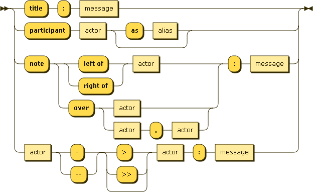
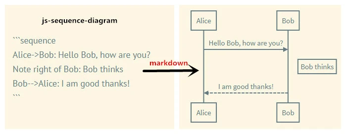
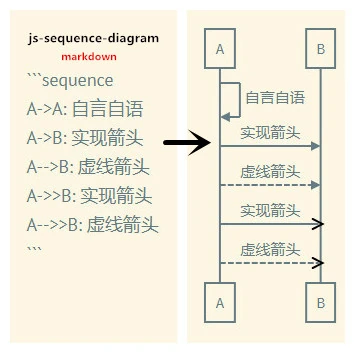
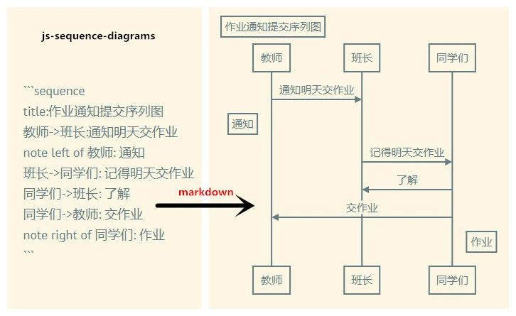
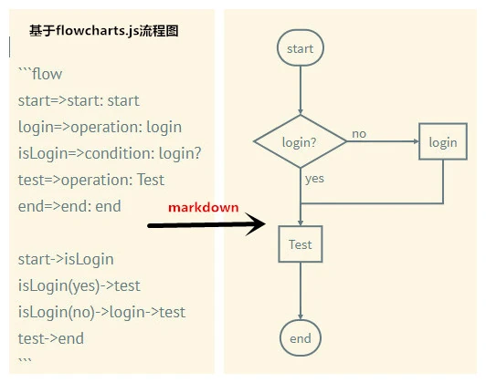
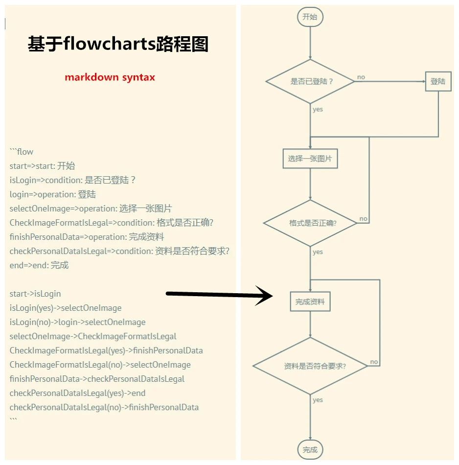

## 一、Tables

　　Markdown使用管线图的方式实现表格,表格里面可以使用强调、链接等行内格式.

* **Syntax**:

  ```markdown
    heading|heading
    ---|---
    item|item
    item|item
  ```

  or

  ```markdown
    |heading|heading|
    |---|---|
    |item|item|
    |item|item|
  ```

* **Alignment**

  *  left :  ` :--- `

  *  Mid: : ` :---: `

  *  right: ` ---: `

* **Sample**:

  ```markdown
  Day       | Meal      | Price
  :---      | ---:      | :---:
  Monday    | pasta     | $6
  Tuesday   | chicken   | $8
  ```

  Day       | Meal      | Price
  :---      | ---:      | :---:
  Monday    | pasta     | $6
  Tuesday   | chicken   | $8

## 二、Definition Lists

```markdown
Term 1
Term 2
:   Definition A
:   Definition B

Term 3

:   Definition C

:   Definition D

> part of definition D
```

## 三、Footnotes

* **Syntax**:

  ```markdown
  Create footnotes like this[^Footnote].
  [^Footnote]: Here is the *text* of the **footnote**
  ```

* **Output**:

  Create footnote like this[^Footnote1].

  [^Footnote1]: Here is the *text* of the **footnote**


## 四、Table of Content

Insert a table of contents using the marker

　　`[TOC]`

## 五、UML Diagrams

**Markdown绘图有两种方式**

* **基于[js-sequence-diagrams](//support.typora.io/Draw-Diagrams-With-Markdown/)**

* **[mermaid](//blog.csdn.net/wangyaninglm/article/details/52887045)**:类似于markdown的脚本语言

以下是基于js-sequence-diagrams实现

### 5.1 sequence Diagram

<pre><code>
```sequence
Alice->Bob: Hello Bob, how are you?
Note right of Bob: Bob thinks
Bob-->Alice: I am good thanks!
```
</code></pre>

### 5.2 Syntax Diagram



* **Sample01**:

  *Input*:

  <pre><code>
  ```sequence
  Alice->Bob: Hello Bob, how are you?
  Note right of Bob: Bob thinks
  Bob-->Alice: I am good thanks!
  ```
  </code></pre>

  *Output*:



* **Sample02**:

  *Input*:

  <pre><code>
  ```sequence
  A->A: 自言自语
  A->B: 实现箭头
  A-->B: 虚线箭头
  A->>B: 实现箭头
  A-->>B: 虚线箭头
  ```
  </code></pre>

  *Output*:



* **Sample03**:

  *Input*:

  <pre><code>
  ```sequence
  title:作业通知提交序列图
  教师->班长:通知明天交作业
  note left of 教师: 通知
  班长->同学们: 记得明天交作业
  同学们->班长: 了解
  同学们->教师: 交作业
  note right of 同学们: 作业
  ```
  </code></pre>

  *Output*:



> **Detail**  : < //bramp.github.io/js-sequence-diagrams/>


### 5.3 Flow Charts

Markdown基于flowchart.js实现流程图

* **Syntax**:

  <pre><code>
  ```flow
  flow code(与上一行的反斜杠对齐)
  ```
  </code></pre>

* **Flow Chart  Syntax**:

  * **节点定义**:

     ` 节点名称 => 节点类型 : 提示文本 `

  * **节点名称**:

     节点名称可随意起,甚至支持中文.提示文本可以为英文,可以为中文,也可以为空使用默认值.

     ```markdown
     st=>start:start
     or
     kaishi=>start:开始
     or
     起点=>start:起点
     or
     start=>start
     ```

  * **节点类型**:

     节点类型有start、operation、condition、end等

     ```markdown
     start=>start: 开始
     login=>operation: 登陆
     isLogin=>condition: 是否已登陆？
     test=>operation: 进行测试
     end=>end: 结束
     ```

  * **节点连接**:

     ```markdown
     一般节点连接：
     节点->节点
     条件判断节点连接：
     条件节点(yes)->正确应答节点
     条件节点(no)->错误应答节点
     ```

     Sample:

       ```markdown
       start->isLogin
       isLogin(yes)->test
       isLogin(no)->login->test
       test->end
       ```

* **Sample01**:

  *Input*:

  <pre><code>
  ```flow
  start=>start: start
  login=>operation: login
  isLogin=>condition: login?
  test=>operation: Test
  end=>end: end

  start->isLogin
  isLogin(yes)->test
  isLogin(no)->login->test
  test->end
  ```
  </code></pre>

  *Output*:
  ```



* **Sample02**:

  *Input*:

  <pre><code>
  ```flow
  start=>start: 开始
  isLogin=>condition: 是否已登陆？
  login=>operation: 登陆
  selectOneImage=>operation: 选择一张图片
  CheckImageFormatIsLegal=>condition: 格式是否正确?
  finishPersonalData=>operation: 完成资料
  checkPersonalDataIsLegal=>condition: 资料是否符合要求?
  end=>end: 完成

  start->isLogin
  isLogin(yes)->selectOneImage
  isLogin(no)->login->selectOneImage
  selectOneImage->CheckImageFormatIsLegal
  CheckImageFormatIsLegal(yes)->finishPersonalData
  CheckImageFormatIsLegal(no)->selectOneImage
  finishPersonalData->checkPersonalDataIsLegal
  checkPersonalDataIsLegal(yes)->end
  checkPersonalDataIsLegal(no)->finishPersonalData
  ```
  </code></pre>

  *Output*:
  ```



## 六、引用

* [**FedFun**](//blog.csdn.net/whqet/article/details/44281463)

* [**Markdown Syntax Cheat Sheet**](//markable.in/file/aa191728-9dc7-11e1-91c7-984be164924a.html)


